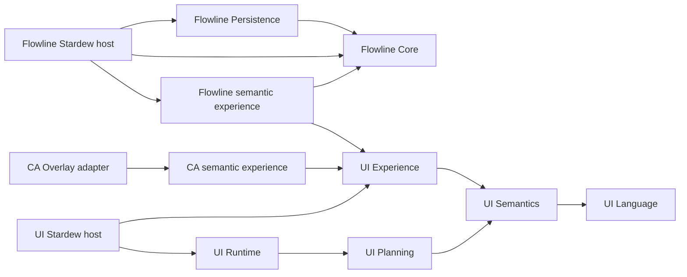

# Архитектура Hatifect

## Общая база и границы

UI, Flowline и CA Overlay находятся в одном репозитории. `Hatifect.slnx` — полный перечень проектов; незарегистрированный проект или отсутствующая зависимость считаются ошибкой. Доменные библиотеки и семантическая модель собираются без игры. Stardew и сторонние API допускаются только в игровых адаптерах.

Стрелки означают зависимости. Схема описывает основные роли; точный граф `ProjectReference`/локальных UI packages проверяется из исходников.

## Семантический UI

Consumer задаёт смысл, состояние, команды и возможности через Experience и семантическую модель. Planning выбирает представление; Runtime управляет layout, вводом, состоянием и отрисовкой; Stardew host связывает это с игрой. Presentation policy принадлежит framework. Доменные правила не должны попадать в renderer или отдельные контролы.

`UiEnvironment` в Semantics хранит immutable снимок viewport в логических UI units, scale, input mode, locale, theme ID и accessibility preferences с происхождением каждого значения. `UiHostContext.InEnvironment` и `UiInvocationService.InvokeInEnvironment` передают этот снимок в Planning; прежний вызов с явно выбранным profile сохраняется. Planner проверяет покрытие всех обязательных capabilities, объясняет ограниченный набор альтернатив и отказывает без частичного плана, если допустимого представления нет. Захват игровых значений и доставка изменений через host принадлежат Stardew adapter; U04 foundation сама по себе не означает завершённое native wiring.

Experience хранит optional immutable `UiLocalizedText` для display name/element labels/action titles и typed `FormatText<T>` для read-only значений. Runtime фиксирует locale из окружения до чтений, захватывает publications и материализует подписи/текст в Scene; render и accessibility используют те же строки. Исходные ID, aliases, source/action objects и fallback labels сохраняются. Нет глобального переключения культуры или локализации доменных значений в renderer; consumer форматирует уже захваченные факты. Ошибка formatter/measurement не заменяет принятую сцену. Editable values, внутренние подписи форм/коллекций, Terminal descriptors и native Flow item-name lookup сохраняют отдельные контракты; см. [text projection](docs/UI_TEXT_PROJECTION.md).

Публичная граница игрового consumer — `IUiSemanticSurfaceApi` v1 в `Hatifect.UI.Experience`. Её текущий исходный контракт сохранён в `Hatifect UI/PUBLIC_API_BASELINE.json`; изменение требует явного review совместимости. Runtime Terminal hosts являются частью текущего семантического framework.

`UiSemanticGraph` и `UiDataType` принадлежат Semantics: immutable identity/alias/label, nominal types/nullability, capabilities, projection inputs и семь relation kinds проверяются до activation. Experience связывает этот контракт с CLR sources и существующими action instances. `Sources` содержит все наблюдаемые источники, а `Elements` — только явно предъявленные planner элементы; auxiliary selection/filter/action metadata не создаёт виджет. Tooling сохраняет graph в schema v2 без зависимости от Experience и продолжает строгий v1 import/export для canonical legacy context. Runtime использует прежние planner/scene/host, а visual role разрешается по alias независимо от локализованного label. Graph не исполняет доменную projection; async lifecycle относится к U03.

`UiPublication` в Experience хранит один committed набор typed sources. Consumer подготавливает batch, framework проверяет его и заменяет immutable view до notifications. Capture сохраняет source versions, collection order/selection и lookup; Runtime захватывает publication до построения сцены, включая nested form inputs. Selection requests продолжают обращаться к owning source, а draw/layout читают захваченные значения. Collection deltas ограничены 128 операциями и 64 retained batches; при пропущенной истории доступен полный Reset. CA публикует mode/category/status/handoff и обе collections атомарно, а request facades проверяют lifecycle/reentry до provider effects. Legacy UiState/collections сохраняют прежние setters и получают монотонные версии; их отдельные notifications не становятся общей транзакцией. Flow ParcelExperience использует ту же publication для backing snapshot и всех связанных полей; command result публикуется вместе с моделью на следующем Pump. NetworkExperience атомарно публикует полный read model, history/details, route/recovery, cached inventory и validation через request facades. Его supplementary reads проверяются по session/revision/state и notification epoch; pending ввод ограничен последним значением каждого из пяти полей. Runtime сохраняет focused item по stable ID вне viewport; удаление переносит focus по прежнему индексу, пустая selectable collection получает положительный focusable container, refill возвращает focus на первый item. Pointer press не переносится на замену. Uniform/adaptive scroll сохраняет stable anchor и local offset; удаление использует ближайшего surviving predecessor из одного retained immutable capture либо первый новый item. Явная navigation раскрывает logical target, passive wheel не возвращает focus в viewport. Поиск удалённого predecessor выполняется только на revision transition; draw использует готовый frame. При reuse layout renderer и accessibility берут selection из текущей захваченной коллекции; renderer разрешает текущие Hover/Focused/Pressed после interaction reconciliation через scene-owned policy с максимум 16 combinations. Policy захватывает конкретные theme/profile/host/visual, не source или mutable composer. Focus border рисуется и без заливки, включая empty container; render-only states не меняют geometry. Update-only batch валидирует каждую операцию и проецирует только final values затронутых индексов. Immutable storage состоит из private блоков по128 элементов: новый capture копирует массив ссылок и затронутые блоки, сохраняя прежний index map; цепочек предыдущих snapshots нет. Supporting metadata хранит количество непустых supporting texts. Краткоживущий prepared token связывает source, точный validated base и candidate; повторная проверка неизменной registered schema/всех payloads не требуется. Token не хранится после commit. Reset/structural changes сохраняют полную подготовку; смена общей formatter/locale policy требует Reset/Replace.

CA Overlay получает UI через NuGet packages с точной версией из `Hatifect.UI.Packages.props`. `Hatifect.UI.Packages.json` задаёт состав и зависимости. Локальная проверка создаёт пакеты из текущих исходников, а проверка изоляции собирает consumer в каталоге без исходников UI. UI runtime DLL поставляются одним модулем UI; адаптер не распространяет собственные копии.

## Flowline

`Hatifect.Flow.Core` владеет транспортным состоянием и правилами dispatch, routing и recovery. `Hatifect.Flow.Persistence` зависит от Core и сохраняет модель с идентичностью сейва. Игровой host управляет загрузкой, сохранением и окончанием сессии. Core и Persistence не зависят от UI, SMAPI или CA.

Сохранены текущие десять инкрементов Flowline: модель, очереди и операции, deterministic execution с fake provider, восстановление и изоляция сейвов. Существующие версии envelope относятся к этой реализации и остаются частью совместимости persistence.

`Hatifect.Flow.UI.Semantic` содержит live `ParcelExperience` и владеет opaque surface session из UI Experience. Host открывает его над существующим игровым меню. Первый реальный адаптер поддерживает целые стопки и выбранное количество обычных объектов, а также обычные/большие сундуки одиночного игрока. NetworkExperience использует IFlowNetworkApplication для станций, связей, предпросмотра маршрутов, отправки, диагностики и страниц истории. Host владеет захваченным физическим target и проверкой fingerprint слота; Core остаётся независимым от игры. Multiplayer отключён и не входит в первый MVP утверждённой roadmap.

`FlowGameSession` владеет игровыми item payloads и записывает station bindings + Core checkpoint + payloads в один aggregate через SMAPI WriteSaveData на Saving. Физические inventories сохраняются в том же поколении игрового сейва. `SaveBoundCargoPort` хранит логическую custody/journal проекцию, не восстанавливает историческое содержимое сундука. Неоднозначный physical callback сохраняет recovery fence и запрещает автоматический replay после reload. Независимый DurableFlowSession с fake-provider файлами остаётся отдельным диагностическим механизмом.

## Как развивать системы согласованно

Изменение семантики проходит одним PR через owning layer, affected consumer и их контрактные тесты. Новая возможность UI становится доступной consumer через обновлённый общий контракт или пакет. Consumer явно использует эту возможность; Git не переносит код между подсистемами автоматически.

Связь Flowline с UI реализует публичный `IFlowApplication` в Core: immutable cached snapshots, типизированные команды с session ID/expected revision и уведомления после изменения проекции. UI объединяет уведомления и перечитывает snapshot один раз за pump; renderer не читает persistence и не изменяет Core напрямую. Host обновляет проекцию после обработки операций, а не на пустых тиках; закрытые сессии отзывают команды. Общий owner-operation guard блокирует команды из inventory callbacks до первого побочного эффекта. Пауза/recovery сохраняют видимость груза и отключают обычные действия; reconciliation с Missing receipt запрещён на границе реального save host.

Предлагаемая модернизация UI и последовательность интеграции описаны в [roadmap](docs/ROADMAP.md). Минимальный semantic-v2 и первый Flow consumer развиваются согласованно; будущие Quick/View/Exact authoring API, generations и transactional reload сохраняют направление к одному IR/runtime. Конкретная совместимость публичного API и границы Exact требуют решения в соответствующих задачах; roadmap не меняет действующие контракты.

Ветки `codex/<feature>` создаются от `develop` и живут до объединения законченного изменения. Для параллельных задач используются отдельные worktree. Изменение общего контракта включает обновление всех затронутых consumer в одном PR. Отдельные постоянно расходящиеся ветки для UI, Flowline и CA не нужны.

## Проверки и поставка

Общая логика CI и локальных проверок находится в `tools/validation.py`; GitHub Actions вызывает её. Проверяются замкнутость графа, направление зависимостей, отсутствие старых подсистем, публичная UI-граница, Python tooling tests и все выбранные .NET suites. Успешный exit code без выполненных тестов не принимается.

`Hatifect.Release.json` задаёт три runtime-модуля: UI, Flowline, CA Overlay. Пакет содержит 14 DLL: 8 UI, 4 Flowline и 2 CA. Сборка архива проверяет состав, manifest, зависимости и единственного владельца UI DLL. Это не публикация и не runtime acceptance.
