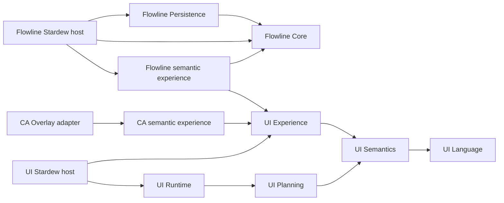

# Архитектура Hatifect

## Общая база и границы

UI, Flowline и CA Overlay находятся в одном репозитории. `Hatifect.slnx` — полный перечень проектов; незарегистрированный проект или отсутствующая зависимость считаются ошибкой. Доменные библиотеки и семантическая модель собираются без игры. Stardew и сторонние API допускаются только в игровых адаптерах.

Стрелки означают зависимости. Схема описывает основные роли; точный граф `ProjectReference`/локальных UI packages проверяется из исходников.

## Семантический UI

Consumer задаёт смысл, состояние, команды и возможности через Experience и семантическую модель. Planning выбирает представление; Runtime управляет layout, вводом, состоянием и отрисовкой; Stardew host связывает это с игрой. Presentation policy принадлежит framework. Доменные правила не должны попадать в renderer или отдельные контролы.

Публичная граница игрового consumer — `IUiSemanticSurfaceApi` v1 в `Hatifect.UI.Experience`. Её текущий исходный контракт сохранён в `Hatifect UI/PUBLIC_API_BASELINE.json`; изменение требует явного review совместимости. Runtime Terminal hosts являются частью текущего семантического framework.

CA Overlay получает UI через NuGet packages с точной версией из `Hatifect.UI.Packages.props`. `Hatifect.UI.Packages.json` задаёт состав и зависимости. Локальная проверка создаёт пакеты из текущих исходников, а проверка изоляции собирает consumer в каталоге без исходников UI. UI runtime DLL поставляются одним модулем UI; адаптер не распространяет собственные копии.

## Flowline

`Hatifect.Flow.Core` владеет транспортным состоянием и правилами dispatch, routing и recovery. `Hatifect.Flow.Persistence` зависит от Core и сохраняет модель с идентичностью сейва. Игровой host управляет загрузкой, сохранением и окончанием сессии. Core и Persistence не зависят от UI, SMAPI или CA.

Сохранены текущие десять инкрементов Flowline: модель, очереди и операции, deterministic execution с fake provider, восстановление и изоляция сейвов. Существующие версии envelope относятся к этой реализации и остаются частью совместимости persistence.

`Hatifect.Flow.UI.Semantic` содержит live `ParcelExperience` и владеет opaque surface session из UI Experience. Host открывает его над существующим игровым меню. Первый реальный адаптер поддерживает целые стопки обычных объектов и обычные/большие сундуки одиночного игрока. NetworkExperience использует IFlowNetworkApplication для станций, связей, предпросмотра маршрутов, отправки, диагностики и страниц истории. Host владеет захваченным физическим target и проверкой fingerprint слота; Core остаётся независимым от игры. Multiplayer отключён и не входит в первый MVP утверждённой roadmap.

`FlowGameSession` владеет игровыми item payloads и записывает station bindings + Core checkpoint + payloads в один aggregate через SMAPI WriteSaveData на Saving. Физические inventories сохраняются в том же поколении игрового сейва. `SaveBoundCargoPort` хранит логическую custody/journal проекцию, не восстанавливает историческое содержимое сундука. Неоднозначный physical callback сохраняет recovery fence и запрещает автоматический replay после reload. Независимый DurableFlowSession с fake-provider файлами остаётся отдельным диагностическим механизмом.

## Как развивать системы согласованно

Изменение семантики проходит одним PR через owning layer, affected consumer и их контрактные тесты. Новая возможность UI становится доступной consumer через обновлённый общий контракт или пакет. Consumer явно использует эту возможность; Git не переносит код между подсистемами автоматически.

Связь Flowline с UI реализует публичный `IFlowApplication` в Core: immutable cached snapshots, типизированные команды с session ID/expected revision и уведомления после изменения проекции. UI объединяет уведомления и перечитывает snapshot один раз за pump; renderer не читает persistence и не изменяет Core напрямую. Host обновляет проекцию после обработки операций, а не на пустых тиках; закрытые сессии отзывают команды. Общий owner-operation guard блокирует команды из inventory callbacks до первого побочного эффекта. Пауза/recovery сохраняют видимость груза и отключают обычные действия; reconciliation с Missing receipt запрещён на границе реального save host.

Ветки `codex/<feature>` создаются от `develop` и живут до объединения законченного изменения. Для параллельных задач используются отдельные worktree. Изменение общего контракта включает обновление всех затронутых consumer в одном PR. Отдельные постоянно расходящиеся ветки для UI, Flowline и CA не нужны.

## Проверки и поставка

Общая логика CI и локальных проверок находится в `tools/validation.py`; GitHub Actions вызывает её. Проверяются замкнутость графа, направление зависимостей, отсутствие старых подсистем, публичная UI-граница, Python tooling tests и все выбранные .NET suites. Успешный exit code без выполненных тестов не принимается.

`Hatifect.Release.json` задаёт три runtime-модуля: UI, Flowline, CA Overlay. Пакет содержит 14 DLL: 8 UI, 4 Flowline и 2 CA. Сборка архива проверяет состав, manifest, зависимости и единственного владельца UI DLL. Это не публикация и не runtime acceptance.
