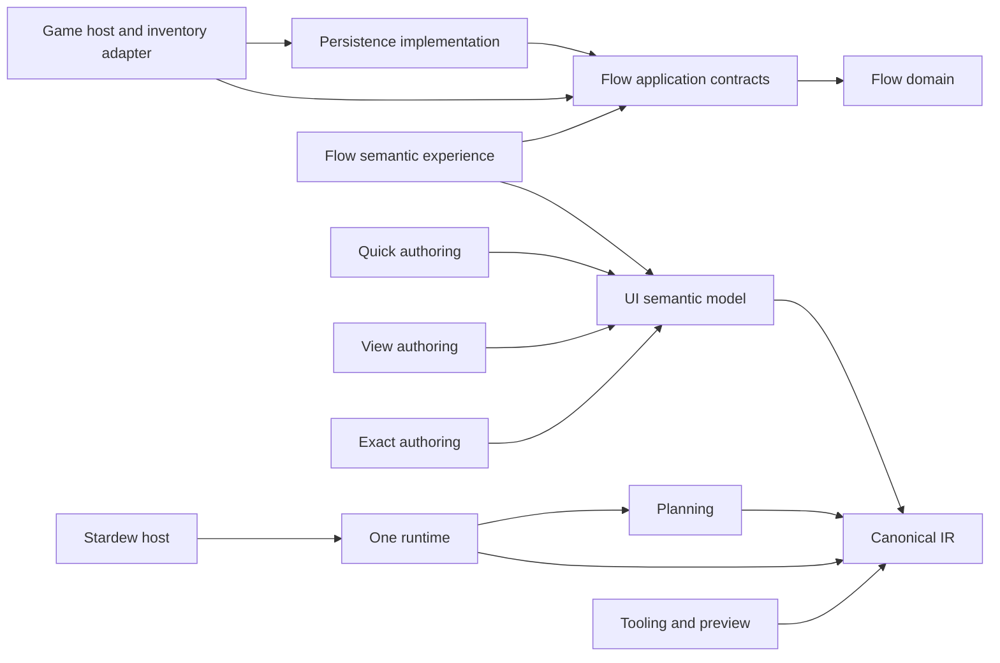
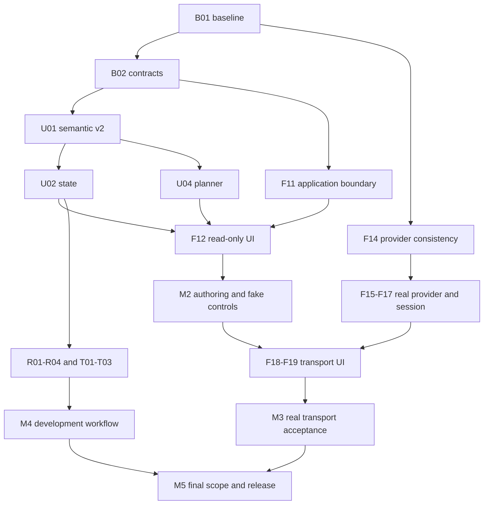

# Roadmap Hatifect: UI, Flowline и инструменты разработки

Дата: **2026-09-05**. Исходная база: `2f08a4f4db36ef0b1ba58e385fc0ab5044cae867` в монорепозитории Hatifect.

Это полный предлагаемый порядок развития сохранённой базы: от ближайшего сквозного изменения до модернизированного UI framework и первой ограниченной поставки реальных перевозок. Документ фиксирует направление и зависимости. Он не объявляет будущие API реализованными и не меняет действующие публичные контракты, форматы persistence, acceptance-файлы или настройки Codex. Такие изменения входят в явно поставленные задачи соответствующего этапа.

Roadmap утверждена пользователем для последовательной реализации до всех acceptance criteria. Переходы между срезами уже разрешены. На 2026-09-06 `B01` — **DONE**, commit `de766c5`: [аудит текущей базы](ROADMAP_BASELINE.md), C gate `artifacts/validation/run-u7blhl0v/summary.json` PASS (947 .NET + 296 Python). `B02` — **DONE**, commit `1fd9d57`: [минимальный semantic-v2 / D01](SEMANTIC_V2.md), C gate `artifacts/validation/run-vion_3x9/summary.json` PASS (947 .NET + 296 Python). `U01` — **DONE**, commit `856ff52`: typed graph, explicit identity/alias/label, v1/v2 wire и реальные Flow/CA fixtures; C 1 097 .NET + 301 Python, U 439, G 1 251 .NET + 301 Python, финальный P 81 CA tests на восьми alpha.32 packages. Evidence и границы в [ROADMAP-STATUS.md](ROADMAP-STATUS.md). `U02` — **DONE**, commit `356e52e`, alpha.36: atomic multi-source publication и CA/Parcel/Network consumers, bounded typed deltas/reset/history, current selection/focus/scroll rendering и Update-only preparation подтверждены C/U/G/P/PERF. Стоимость structural/cold Reset остаётся O(N), root copy Update — O(N/128); это явно измеренные ограничения. Итоговые evidence и implementation commit приведены в [ROADMAP-STATUS.md](ROADMAP-STATUS.md#u02-e-bounded-update-preparation-and-u02-acceptance). `F11` — **DONE**, integration commit `5f2d10c`: C 1 014 .NET + 301 Python, G 1 174 .NET + 301 Python, свежий `flow.chest.roundtrip` PASS 8 (`7336456e-5400-4a77-aed6-4109aedc7c9f`); подробности в [отчёте Flow](ROADMAP-STATUS.md). `F12` — **DONE** на общем source `08ecdb9`: [read-only Flow acceptance](F12_ACCEPTANCE.md), C/F/U/G/P и native15/7,19 rendered states, U04 dependency закрыта; `U03` — **DONE** на source `9b6028c` ([typed actions acceptance](U03_ACCEPTANCE.md); общая публикация и новая build-identity проблема отдельно); `U04` — **DONE** (owner source `04def9e`, итоговая [приёмка](U04_ACCEPTANCE.md); общая alpha47 acceptance отдельно); `U05` — **IN_PROGRESS** у задачи UI, общая приёмка её новых срезов ещё не выполнена; остальные UI ID пока **PLANNED**; Flow foundation `cdf9d2e` и оставшаяся acceptance F11–F20 перечислены в [отчёте Flow](ROADMAP-STATUS.md). Наличие частичной основы не означает DONE. Статус DONE появляется только со ссылкой на итоговый commit/PR и выполненную проверку. Календарные обещания и количество PR пока не установлены.

## Приоритет первой альфы M3/Q02 — 2026-09-08

F13 RU75 diagnostic fix: после PASS G2168/P101/prepare14 и EN75(13checks) на `d881782` RU75 `e5751f10` обнаружил nested-clip первого Result. Перенесены точные два source-файла `6fdb045`: local-origin layout accumulation и проверяемый bounded maximum root offset; Reveal/Intersect и критерии видимости неизменны. Final affected78PASS проверены по actualTRX/SHA; прежние1049 относятся к предыдущему варианту. Общий pre-existing float associativity gap остаётся открытым, полного reviewPASS нет. [Причина, проверки и остаточный риск](UI_FRACTIONAL_LAYOUT.md). Следующий шаг — common G/P/prepare и свежий RU75; Q02/F13 не завершены.

Интеграция F13 visual profiles поверх U05 `83703ee`: восемь exact сценариев полного Network Window EN/RU×75/100/125/150, каждый сохраняет исходные11 checks и добавляет применение/восстановление профиля. Ordinary-input13 и прежние registry rows неизменны. Исправлен захват переходного original scale: обе leases ждут fresh settled native frame до записи настроек. Owner `run-ulqg9mb1` — 1020 PASS (771+249), tooling `run-jkdahian` — 393 PASS; root проверил actual outcomes,12 source SHA/preimages; UI повторный review PASS. Common G/P/prepare и восемь native rows — PENDING; normalized actions не доказывают физический ввод. Evidence: `artifacts/f13-root-common/flow-profiles-review/`. Следующий шаг: общий фиксированный кандидат, EN75 → RU75, затем остальные профили и исходная Q02.

Интеграция частичного U05: перенесены точные четыре файла owner commit `5253782a3641e984fc6f226d2786351ba96bf4d8` (immutable children и scene-owned structural index, четыре регрессии). Owner RED воспроизвёл два дефекта; GREEN `run-zqiuuyd6` — 1040 PASS / 7 actual TRX. Root сверил все outcomes, SHA исходников и preimages. Allocation одного successive Compare: 323064 → 236904 B; cold Compare: 323112 → 354448 B. Это частичный результат, не завершение U05 и не игровой PERF. Common G/P/prepare/runtime для нового состава — PENDING. Evidence: `artifacts/f13-root-common/u05-structural-review/{green-evidence-audit,integration-preflight}.json`. Следующий шаг: соединить проверенные Flow visual profiles и выполнить общую приёмку; исходные критерии Q02 сохраняются.

Итог кандидата `027273a`: **G2136/392/13, P101, prepare14 и CI34257864644 — PASS**. Native ordinary-input `edb6540e` — **FAIL** после NewDay и неожиданного Saving/Saved во время ожидания входа; raw K/SMAPI events/entry attempts остались нулевыми при активной игре без suppression. Cleanup и689 source/14 DLL проверены; старый запрос физической K завершён вместе с тестовой игрой. Подготовлен и проверен по составу архив кандидата21файл/14DLL, но Q02/первая установка не приняты. [Полный результат, SHA архива и ограничения](Q02_INPUT_027273A.md). Следующий готовый шаг: интеграция частичного UI U05 после owner RED/GREEN (1040 PASS, семь actual TRX; source/evidence проверены root) и отдельные точные профили полного Network EN/RU×75/100/125/150; ordinary input сохраняется открытым.

Следующий отдельный кандидат ввода после `71db76f`: один harness-файл `FlowPlayerNativeInputCapture.cs` добавляет bounded pre-window telemetry активности игры, raw K, SMAPI state/suppression, ButtonsChanged и configured keybind. Приёмка и production guards не меняются; инжекции нет. Owner `run-q9mwh1hk` — PASS992 (771+221), два actual TRX и SHA `40117901…` проверены. Root review: без блокирующих замечаний; native **PENDING**. Evidence: `artifacts/f13-root-common/input-telemetry-final/review.json`. Следующий шаг — общий G/prepare и свежий `flow.ui.player.input`, чтобы установить причину отсутствия ordinary-entry event.

Обновление общей приёмки `57a9bb6`: **G/P/prepare и исходная chest-матрица PASS** — 2136 .NET +392 Python +13 metadata, P101, 11 native сценариев/116 обязательных checks +2 budget checks. Сверены 688 source SHA, все14 runtime DLL и восемь package DLL; crash/restart, cancellation/return, save isolation и Flow PERF прошли на одном составе. CI34253211868 attempt2 — SUCCESS. [Точные request IDs, метрики и ограничения](Q02_RUNTIME_57A9BB6.md). Обычный ввод f681231f — **BLOCKED**, причина недоставленного события ещё не установлена. Следующий шаг — отдельная pre-window telemetry, затем свежий ordinary-input игровой путь. Полная Q02, UI locale/scale/controller/coexistence и устанавливаемая поставка остаются открыты.

По обновлённой авторизации пользователя ближайшая поставка — проверенная устанавливаемая одиночная альфа: обычный игровой вход → две поддерживаемые станции на сундуках → маршрут через UI → выбор и отправка реальных предметов → видимый результат и допустимое recovery → сохранение и продолжение после перезапуска. Полная модернизация остаётся в этой roadmap для следующих поставок; исходные acceptance criteria не сокращаются.

Критический путь: закрыть F13 (видимые результаты Network, масштаб75, ввод и свежая игровая приёмка), затем соединить UI **U05 → U06 → U07** с Flow **F18 → F19** и выполнить **Q02** с зависимостями I01/Q01. U08–U10, оставшийся R01–R04 и T02–T03 до альфы выполняются только при необходимости для этого пути или для исправления выявленного блокирующего дефекта. Q02 требует исходной adapter failure/save/restart/save-switch матрицы, coexistence с CA, EN/RU/input/scale, видимости на экране и PERF; semantic observations не заменяют визуальную или физическую проверку.

GQ владеет общей интеграцией, фиксированным составом кандидата и итоговой поставкой; UI — framework, отображением и вводом; FLOWLINE — игровым сценарием, доменом и адаптером. Общий контракт сохраняет одного владельца. Следующие изменения готовятся отдельно от принимаемого кандидата. Evidence переиспользуется только при неизменных относящихся к проверке исходниках, файлах сборки и среде. Тяжёлые сборки согласуются между задачами; во время игры/PERF другие потоки работают с кодом, ревью или документацией.

Выход Q02 включает устанавливаемый архив, точный inventory/dependencies, инструкцию первого запуска, известные ограничения, evidence для фактических DLL и проверенную изолированную установку. Текущий `hatifect-release-check` проверяет boot/title, fake Flow и UI/CA; его PASS сам по себе не покрывает реальный путь F18/F19 и всю приёмку Q02. Полная готовность альфы пока **не подтверждена**.

Общий F13 source `866b1d0` исправляет lifetime диагностического native menu при смене масштаба. Scoped187, G2048 .NET +390 Python +13 metadata, P101 и свежий isolation15 прошли; все19 composed PNG просмотрены, включая масштаб75 без прежнего выхода за границу. Actions11 и видимые результаты Network относятся к предыдущему source `4a7d710`. Физический ввод и полная игровая приёмка остаются открыты; **F13 IN_PROGRESS**. [Точные результаты, идентичность DLL и ограничения](F13_ACCEPTANCE.md#общая-приёмка-isolation-на-866b1d0).

F18 обычный игровой вход, актуальная цель-сундук и standalone Window интегрированы в `d03b736` поверх UI Window `da0061d`. Общий source `2a007f2` также включает Observation gate и исправление канонической локали: G `run-vh7meisw` — PASS2078 .NET +390 Python +13 metadata, P `hatifect-ui-ca-isolated.hpscocgd` — PASS101,8 packages,47 projection files. Source опубликован; [CI `34240493430`](https://github.com/ihatectf/Hatifect/actions/runs/34240493430) завершился SUCCESS на точном `2a007f26d42ac8dcb00d2c5df87cab91834d2993`. Native Observation10 на owner `42c7f66` относится к overlay, а не обычному Flow Window. F18 остаётся **IN_PROGRESS**: целостный сценарий открытия, ввода двух станций и маршрута, реального груза и сохранения ещё не выполнен; UI готовит наблюдение standalone host через существующие optional facets.

F19-a интегрирован отдельно в `d0ce245`: typed send сохраняет точные RouteUnavailable/RouteSearchLimit из одного поиска маршрута до inventory admission. Owner scoped `run-0126k_jc` — PASS964 (771 Flow +193 Stardew), actual TRX и3 source hashes сверены; новый тест проверяет stale priority, два отказа без изменения snapshot/XML и успешную доставку после восстановления связи. Owner дополнительно усилил тест проверками внутренних payload/cargo/shipments/pending/custody/receipts, физических вызовов и количества поисков маршрута; test-only diff интегрирован после повторного owner scoped `run-8ozn014q` — PASS964. Проверены все964 individual TRX results, SHA двух TRX и трёх исходных файлов; production F19 не изменён. Прежний `run-0126k_jc` относится к первоначальной версии теста. Общие проверки этого следующего состава и native видимость EN/RU причин остаются открыты. Усиленный тест закреплён отдельным коммитом `582048c`. Полный F19 и Q02 не закрыты. Аудиты обоих составов находятся в `artifacts/f13-root-common/`; текущие файлы сборки нельзя считать прошедшими старый runtime только по неизменному поведению исходников.

Локальный F19-b candidate `acb1279` сохраняет через typed Network/Send точные `StationLimit`, `LifetimeLinkLimit` и `RetainedCargoLimit` вместо общего `ActionUnavailable`; semantic UI имеет точные EN/RU объяснения. Flow tests PASS797 и Stardew adapter tests PASS249 с ненулевыми actual results: тесты насыщают все32 станции,128 lifetime links и256 retained cargo, проверяют отсутствие revision/inventory/custody side effects, сохранение lifetime-link отказа после reload и прежние прямые `FlowResourceLimitException`/diagnostic counters. Публичный enum расширен только добавлением значений; Core/Persistence и формат сейва не изменены, public API baseline PASS. Общий G/P/prepare, exact native видимость этих причин и оставшиеся real-provider failures ещё не проверены; F19/Q02 остаются **IN_PROGRESS**. Следующий шаг — зафиксировать состав с GQ, выполнить объединённую проверку и пройти физический/native сценарий вместе с исходной матрицей. Ветка и коммиты остаются только в локальном Git.

Общий кандидат `3ba57ab` объединяет F19, игровой driver `ca60214` и hosted Window observation/actions `1b6e161`; комментарии API сверены без изменения сигнатур, обновлены две SHA baseline. G `run-xtx8d3yb` — PASS2094 .NET +391 Python +13 metadata, сверены 676 source SHA. P `hatifect-ui-ca-isolated.6_28gm7m` — PASS101, восемь пакетов, 47 projection files; prepare `run-afbf0v4s` — PASS, все14 установленных DLL совпали с producer и сохранены. Первый `flow.ui.player` request `0a7f36d7-156f-4ea9-b08f-66ad519463f1` — **FAIL**: через один native composite proxy созданы две реальные станции и маршрут, но Reveal результата после создания маршрута вернул false; до отправки и сохранений сценарий не дошёл (loads1, saving0, saved0). Просмотрены пять composed PNG; видимость результатов регистрации подтверждена. Cleanup проверен по исходным SHA настроек и отсутствию рабочей копии сейва. Полная приёмка F13/F18/F19/Q02 остаётся открытой; следующий готовящийся шаг — owning UI исправление Reveal и свежий полный повтор сценария. Prepared forms/normalized actions не доказывают обычный K-вход или физический ввод. Evidence: `artifacts/f13-root-common/native-player-first-audit.json`, `combined-3ba57ab-run-xtx8d3yb-audit.json`, `prepare-3ba57ab-audit.json`.

Диагностический follow-up `ecd7ddf` (owner `84c13cd`): четыре файла добавляют bounded failure trace без изменения критериев clipping, owner guards и лимита64 inputs. Проверены семь actual TRX /1027 PASS и exact source SHA. Prepare `run-q1w8ls3y` — PASS,677 source SHA и14 deployed-to-producer DLL сверены. Свежий `flow.ui.player` request `5f906fea-81f8-4a74-9900-07f5b34d7826` — **FAIL**: `root-input-point-unavailable` после3 inputs; offset392.8 при maximum702.89996, Result Y810.10004/H40 полностью ниже viewport bottom696. Исчерпание максимальной прокрутки этим trace не подтверждается; следующий owning UI шаг — выбор root input point и regression, затем свежий повтор. Сохранены29 файлов, process exit0/cleanup и фактические SHA восстановленных настроек проверены. В этом диагностическом прогоне PNG отдельно не оценивались. Evidence: `artifacts/f13-root-common/native-player-trace-audit.json`, `prepare-ecd7ddf-audit.json`. CI34244678273 предыдущего `d34730f` завершён SUCCESS. Отдельная граница поставки: восемь DLL из P на `3ba57ab` не совпали с подготовленными runtime DLL; причины и бинарная эквивалентность не доказаны. Следующую пакетную и runtime сборку проверять с одинаковым явно выбранным SDK и сравнением SHA. Полные F13/F18/F19/Q02 сохраняют IN_PROGRESS.


Reveal gap fix `b38b483` (owner `cb9158d`) — **PASS в bounded native сценарии**. После causal RED `run-x1v0x5dk` (605 PASS/1 точный root-input-point-unavailable) interval sweep находит свободный root-input промежуток между коллекциями; прежние девять probes, clipping, owner guards и budgets сохранены. UI scoped `run-lcwfmpf6` — PASS1028, семь actual TRX и два source SHA проверены. Prepare `run-81unfob2` отказал на NuGet NU1301 в sandbox; разрешённый повтор `run-f_271v8o` — PASS. Native `flow.ui.player` request `d3a0deaf-c028-4a25-a3ff-0f47f9f1ebd9` на runtime source `b38b483` — PASS11: две станции/маршрут, целый груз8 и частичный5 с остатком8, два Saving/Saved и три загрузки, повторное окно Delivered без дубликатов. Все10 composed PNG просмотрены, включая actual last Result после создания маршрута;38 файлов сохранены,677 source SHA/14 DLL и cleanup проверены. Это EN100, prepared forms/selection и normalized Tab/Enter; обычный K-вход, физический ввод, полный restart/failure/save-switch, RU/scale/PERF и текущие G/P/Q02 остаются открыты. В reopened PNG обнаружена устаревшая console-target подсказка; Flow готовит обычную игровую подсказку отдельно. Следующий шаг — общий G/P на согласованном SDK и отдельный `flow.ui.player.input` через production keybind с CUA/SMAPI evidence. [Черновик первого запуска](FLOWLINE_ALPHA_QUICKSTART.md). Evidence: `artifacts/f13-root-common/native-player-gap-fixed-audit.json`, `prepare-b38b483-audit.json`, `reveal-gap-integration-audit.json`.

Общие проверки source `cf0915c` после Reveal fix — **G/P PASS**: G `run-9j9nkm0a` — 2097 .NET +391 Python +13 metadata; P `hatifect-ui-ca-isolated.l1ealxc6` — 101 CA tests,8 packages и47 projection files. Проверены677 source SHA и individual TRX, сохранены1332 файла изолированной проверки. Это evidence указанного состава; native PASS11 выше относится к runtime `b38b483`. Аудиты: `artifacts/f13-root-common/combined-cf0915c-run-9j9nkm0a-audit.json`, `p-combined-cf0915c-hatifect-ui-ca-isolated.l1ealxc6-audit.json`.

Следующий кандидат F13/M3 — [ordinary Window input observation](UI_WINDOW_INPUT_OBSERVATION.md), owner `c00266f`: шесть UI-файлов интегрированы с сохранением existing actions scenario; пять postimages совпадают точно, controller получил только дополнительный bypass. Проверены семь actual TRX /1036 PASS, включая11 новых input-gate cases, и SHA всех шести исходников. Root evidence: `artifacts/f13-root-common/window-input-c00266f/verified-owner.json`, `integration.json`. Наблюдатель не вводит данные и не открывает окно: следующий шаг — соединить Flow production-keybind fixture, выполнить общий G/P/prepare и свежий K/CUA сценарий. Ввод через ОС (`os-injected`) не доказывает аппаратное происхождение или controller acceptance. Общие и native проверки нового состава **PENDING**; F13/U05/U06/U07/Q02 не закрыты.

Flow ordinary-input candidate интегрирован поверх `0ee3841`: ровно16 файлов по `artifacts/f13-root-common/player-input-final/owner-manifest.json`, preimage/postimage SHA сверены. Production keybind сохраняет authority/free/menu/session guards; только exact harness подставляет журнал команд и наблюдение успешного Show. Новая подсказка выбора сундука не требует консоли. `flow.ui.player.input` сохраняет восемь исходных roundtrip checks и добавляет пять checks обычного входа, ввода, действий, видимых результатов и повторного окна; исходная Q02 матрица11 сценариев/116 checks не изменена. Owner scoped `run-tik3mwji` — **991 PASS**, два actual TRX,22 reader cases, включая strict float-edge containment без epsilon; прежний `run-tsk1iay9` — FAIL983/8 из-за неполной схемы test bounds и сохранён отдельно. Общие G/P/prepare и native input нового состава **PENDING**. Evidence: `artifacts/f13-root-common/player-input-run-tik3mwji/actual-results.json`, `player-input-final/integration.json`. Следующий шаг — зафиксировать общий состав и пройти G/P/prepare, затем K/CUA: source probe/register → destination register → empty-target reopen/route/whole8/partial5 → прежние сохранения/загрузки и видимый Delivered. Полная Q02 и аппаратный/controller ввод остаются открыты.

Follow-up к `c75de6e`: независимый review обнаружил, что UI action boundary может перехватить exception журнала и последующие пять Applied-команд скрывают предыдущую ошибку. Пять owning harness-файлов сохраняют первое исключение, проверяют его каждый tick/при admission/reopen/terminal и через две retired session captures. Доменные Rejected/Conflict остаются допустимыми. Owner scoped `run-vqx6l9sd` — **992 PASS** (771 Flow +221 Stardew;22 reader и6 journal cases), actual TRX и reviewed5 SHA сверены; evidence `artifacts/f13-root-common/player-input-sticky-final/integration-audit.json`. Общие G на `c75de6e` завершились **FAIL до .NET suites**: `run-e6vpofgd` restore NU1301 в sandbox; разрешённый повтор `run-h1epb2l9` build NU1900, сохранённый в UI Stardew assets/cache. Python392 и metadata13 в повторе прошли; эти результаты не означают G PASS. CI [34252112116](https://github.com/ihatectf/Hatifect/actions/runs/34252112116) на exact `c75de6e` — SUCCESS. Следующий шаг — принудительный restore проблемного проекта с включённым NuGet audit, затем G/P/prepare и native на исправленном общем составе. Native `c75de6e` не запускался; Q02 остаётся открытым.

Диагностика Accessibility-блокировки на `6a02ee3` (worktree `roadmap-skills-integration-b53685`, GUI-агент Claude Code, не Codex): свежий `hatifect-live-prepare` (`run-5in4hofi`, кандидат `31a86077...`, runtime `e201e7ba...`) и `save.bootstrap` (`f5a4eb25-abd2-42ac-901e-9a1637b07f89`) прошли PASS. Первый `flow.ui.player.input` (`690da531...`, затем повтор `f1ee2090...`) — **BLOCKED**: `semantic-test-agent` немедленно отказывал с `CGPreflightPostEventAccess()=false` для процесса-агента, запущенного из этой GUI-сессии. Трассировка дерева процессов показала, что shell этой сессии — потомок вложенного `~/Library/Application Support/Claude/claude-code/2.1.260/claude.app`, отдельного от `/Applications/Claude.app` bundle; выдача Accessibility основному `Claude.app`, а затем вложенному `claude.app`, не устранила блокировку (`ce98946d...`). Автономная проверка `CGPreflightPostEventAccess()` из настоящего Terminal.app вернула `true`, подтвердив, что причина — в идентичности процесса-инициатора, а не в самом Python или проекте. Пользователь выполнил `hatifect-smoke flow.ui.player.input` напрямую из Terminal.app против уже поднятого этой сессией runtime executor (`Ready`, `checkoutSha=6a02ee3`); на следующем worker generation (executor переиспользует одного долгоживущего supervisor, но перезапускает worker на новый request) Accessibility-проверка прошла: запрос `ff9fa26d-e344-4c36-89f2-5605a944a7a6` выполнил реальный `move-pointer` на `(671,414)` и физический `key K`, подтверждённые в `artifacts/runtime/ff9fa26d.../diagnostics/semantic-test-agent.json`. Это первое задокументированное разделение причин: TCC/Accessibility и raw-K delivery — независимые блокеры.

Тот же запрос `ff9fa26d...` остановился на шаге `wait-source-opening` (timeout 20s): `diagnostics/flow-player-input-progress.json` показывает `entryAttempts:[]`, `openings:[]`, `inputTelemetry.latest={RawKDown:false, SmapiKSuppressed:false}`, `kPressedTotal:0/kReleasedTotal:0` при `GameActive:true` — синтетический `CGEventPost` keyboard-down не долетел до raw-состояния клавиатуры в игре, хотя тот же механизм успешно доставил pointer-move. Это воспроизводит ранее задокументированный (`edb6540e`, `f681231f` и др.) разрыв независимо от Accessibility permission, что сужает его причину до low-level доставки клавиатуры (вероятно, MonoGame/SDL на macOS читает keyboard state через путь, отдельный от того, которым идёт синтетический pointer-move) и исключает TCC как причину именно этого разрыва. `smapi.log` не показывает игрового краша до отмены запроса harness'ом; финальные Steam-teardown ошибки в логе относятся к принудительному завершению процесса при `.cancel-requested`, а не к самостоятельному падению игры. Полный сценарий отменён (`state=Cancelled status=BLOCKED`); Q02/F13/F18/F19 остаются открытыми. Runtime executor этой диагностики остановлен штатно. Следующий готовый шаг — исследование low-level HID-пути клавиатуры на стороне MonoGame/SMAPI adapter (в т.ч. альтернативные API инъекции, например `IOHIDPostEvent` вместо `CGEventPost`); pointer-only сценарии (например F13 visual-profile матрица) Accessibility-блокировкой больше не ограничены и могут проверяться независимо.

Найден источник расхождения с историческим `b38b483` ("PASS11", реальный ввод K сработал): этот commit не является предком `develop` (`git merge-base --is-ancestor b38b483 HEAD` → `no`), он живёт только на отдельных `codex/*` ветках (`codex/merge-all-20260909` и др.), общий предок с `develop` — `54ed9e9`. Текущая `develop` заново реализовала автоматизацию ввода начиная с `f475132` ("Automate ordinary Flow Window input on macOS", #22) новым внешним semantic-model движком (`macos_native_input_driver.py` + `semantic_test_agent.py`), а не унаследовала C#-side механизм `UiNativeInputGate.cs`/`UiAutomatedAcceptanceController.NativeInput.cs` со старой ветки. Это осознанный архитектурный выбор нового движка: `SEMANTIC_MODEL_AUTOTESTS.md` явно запрещает "Hatifect action-automation APIs или эквивалентные product backdoors" — то есть возврат к in-process инъекции не рассматривается как решение, только легитимный внешний OS-level ввод.

Разбор нового движка нашёл конкретный пробел: до открытия первой семантической UI (шаг `open-source-window`, `key K`) сценарий выполняет только `move` (перемещение указателя без клика) — в протоколе не было ни одного примитива для настоящего клика по абсолютной экранной точке до появления первого семантического элемента (`click`/`activate` резолвят через selector, которому ещё неоткуда взяться). Обычный игрок к моменту нажатия K уже кликал/взаимодействовал с окном игры, получив реальный OS-level key-window focus; полностью автоматизированный сценарий этого никогда не делает. Добавлен новый примитив `clickPoint` (op на уровне `source`/`path`, как у `move`, но выполняющий калиброванный клик через новый `Controller.click_local` в `macos_native_input_driver.py`) и шаг `click-source-window` перед `open-source-window` в `flow.ui.player.input.json`. Статически проверено: `python3 -m unittest discover -s tools/tests` — 458/458 PASS (включая все 10 кейсов `test_semantic_test_agent.py`, `test_workflow_is_semantic_not_coordinate_or_timing_playback` подтверждает отсутствие сырых координат в спеке), `./tools/hatifect-check` — PASS (1762 .NET + 458 Python), C#-код не менялся. Живая проверка гипотезы — **BLOCKED**: три последовательные попытки (`27c24ddf...`, `d45dc8fa...`, `745a54d4...`) на новом, отдельно поднятом runtime executor снова упёрлись в тот же `CGPreflightPostEventAccess()=false`, хотя ранее (см. выше, `ff9fa26d`) тот же механизм у другого экземпляра supervisor однажды успешно прошёл проверку. Гипотеза "перезапуск worker достаточен" не подтвердилась стабильно — Accessibility-грант для этой GUI-сессии, по всей видимости, привязан к экземпляру supervisor-процесса, а не к стабильной identity бандла; конкретный триггер пока не установлен. `clickPoint`/`click_local` остаются непроверенными живым прогоном. Следующий шаг — либо стабилизировать Accessibility-грант для этой сессии независимо (внешний Terminal-путь уже подтверждён рабочим), либо повторить проверку из среды с уже подтверждённым доверием.

Локальный Window capture-retention кандидат `b23f54c96aee60a8a27f4ec73bb006e9d58a873a` (документирующий HEAD `eeed8f358473d1293c4aab275e77ee24fe0deb4f`) устраняет отдельный дефект evidence после фактически завершённого пути `7470e72d...`: обязательные пять probe phases и пять action-result публикаций получают резерв в bounded истории128, результаты двух Register различаются surface epoch, ожидающее действие переживает потерю focus до следующей accepted scene, а необязательные stable frames не выполняют Result scan. Public API, wire format, Flow semantics и hard capacity не изменены. Focused Stardew suite на точном code source — **PASS107/107**; `git diff --check` чист. Exact platform `run-0u3u38v3` подтвердил agent/architecture/public API,503 Python tests, UI packages, restore и игровые references, затем остановился на недоступном NuGet audit endpoint: `NU1900` повышен до build error даже после разрешённого повтора через `rtk proxy`; это **BLOCKED**, а не PASS. Полный G `run-vi9q00y4` (2316 .NET +503 Python), normalized player11, chest roundtrip8 и native Accessibility-block `a8624e82...` относятся к predecessor `756369c` и не переносятся на новый source. Native текущего кандидата — **NOT_PROVEN**; F13/F18/F19/Q02 остаются **IN_PROGRESS**. Следующий готовый шаг: обеспечить `CGPreflightPostEventAccess()=true` для `/Library/Frameworks/Python.framework/Versions/3.14/bin/python3`, повторить G/P/prepare на неизменном локальном кандидате и выполнить `flow.ui.player.input` с `failure == null`, не более128 captures, всеми пятью phase и пятью action-result evidence и финальным Delivered, после чего повторить исходную EN/RU/scale/controller/CA/save/restart/save-switch матрицу. Remote Git остаётся неизменным по явному ограничению пользователя.

Общий локальный checkpoint `c5174a8` соединяет этот UI source с F19 resource feedback `acb1279`. G `run-0rgtui7v` — **PASS** 2 329 .NET + 503 Python; применимый P — **PASS** 101 CA tests / восемь UI packages / 47 projection files; prepare `run-4llj99cx` — **PASS**. Production Window `flow.ui.player` прошёл 11/11 normalized assertions, а исходная chest-матрица — 116/116 обязательных checks плюс два budget assertions; все 12 PASS-runs привязаны к точному SHA, восстановили runtime options и тестовые сейвы и завершились без teardown errors. Exact `flow.ui.player.input` request `521bde15...` остаётся **BLOCKED** до первого шага из-за `CGPreflightPostEventAccess()=false`; он не проверил новое retention-поведение. [Полная матрица и границы evidence](Q02_RUNTIME_C5174A8.md). F13/F18/F19/Q02 остаются **IN_PROGRESS**. Следующий шаг: выдать Accessibility указанному Python runtime, повторить physical-input на неизменном кандидате, затем закрыть EN/RU/scale/controller/CA и собрать/проверить installable archive. Git остаётся только локальным.

## 1. Результат, к которому идём

**Для автора мода:** типобезопасно описать состояние, действия и смысл интерфейса; быстро собрать простой диалог; при необходимости управлять композицией или точной геометрией; получить единые ввод, focus, lifecycle, темы и диагностику. Один semantic IR и один runtime обслуживают все способы авторства.

**Для игрока:** пользоваться предсказуемым интерфейсом на EN/RU, при разных масштабах и размерах окна, с мышью, клавиатурой и контроллером. Flowline показывает состояние транспорта, объясняет недоступные действия и позволяет управлять перевозками в пределах подтверждённых возможностей provider.

**Для разработчика Hatifect:** менять общий контракт вместе с владельцем и consumer; получать воспроизводимые проверки, preview и объяснение planner; обновлять UI с контролируемым переносом состояния; диагностировать отказ без потери принадлежности груза или смешивания сейвов.

Расширенная цель UI включает semantic-v2, несколько authoring API, общую библиотеку компонентов, transactional hot reload, editor tooling и документированный extension contract. Первый реальный маршрут Flowline может выйти раньше полного набора этих возможностей: точная компоновка, большой каталог компонентов и полноценный editor не являются предпосылкой двухстанционной перевозки.

## 2. Что уже есть и чего ещё нет

Текущие исходники, [архитектура](../ARCHITECTURE.md), [руководство разработки](DEVELOPMENT.md) и исполняемые проверки имеют приоритет над историческими планами. Таблица ниже описывает исходную базу `2f08a4f`; актуальные отличия `55b8360` и доказательства для каждого ID приведены в [B01](ROADMAP_BASELINE.md). В частности, уже появились optional standalone host API, публичная collection metadata, typed forms, три темы, парный live reload и расширенный LSP server; это не закрывает полный semantic-v2 и соответствующие acceptance criteria.

| Область | Сохранённая база | Следующее развитие |
|---|---|---|
| UI pipeline | Language → Semantics → Experience; Planning, Runtime, Stardew host, Tooling/Server и DevTools | Согласованный semantic-v2 и его использование всеми способами авторства |
| Данные UI | `IUiSemanticSource<T>`, `UiState<T>`, stable IDs; collection state с внутренней revision, replacement и сохранением selection | Публично определённая модель версий/дельт, типизированные связи, согласованное чтение нескольких источников |
| Действия UI | Синхронные `UiActionDefinition`, `CanExecute`, `TryExecute` | Типизированные вход/результат, ошибки, выполнение, отмена и защита от устаревшего завершения |
| Planning | Профили, capabilities, deterministic planning, provenance | Явные отношения, environment facets, проверка покрытия семантики и структурированное объяснение решений |
| Runtime | Layout, scenes/reconciliation, focus/input, portals, виртуализация, runtime Terminal hosts | Инкрементальная обработка нового контракта без повторного создания этих подсистем |
| Hot reload | `UiAssetSlot<TDefinition>`: атомарный Last Known Good для одного Presentation/Visual asset | Подготовка согласованного bundle, перенос состояния, переключение всех участвующих hosts и rollback |
| Публичный UI host | `IUiSemanticSurfaceApi` v1: overlay над конкретным активным native menu | Явно выбранный способ размещения самостоятельного Flowline UI; текущий overlay не объявляется универсальным window API |
| CA Overlay | Внешний consumer точных UI NuGet packages; отдельный адаптер стороннего API | Проверка и миграция consumer при развитии UI, сохранение package isolation |
| Flowline | Десять инкрементов Core/Persistence/host с deterministic fake provider и save isolation | Application boundary, рабочий UI, реальные inventory adapters и production session |
| UI Flowline | Отдельный read-only `ParcelExperience`, непосредственно проецирующий `Parcel` через constant sources | Snapshot projection, lifecycle, уведомления и команды через application boundary |
| Поставка | Три модуля, 13 runtime DLL: UI 8, Flowline 3, CA 2 | Явное обновление состава/зависимостей при включении Flow semantic UI |

В Flowline сохранены: (1) транспортная модель и deterministic scheduling; (2) atomic fake ports, cargo identity и receipts; (3) checkpoints и writer lease; (4) durable provider и журнал intent/receipt; (5) admission; (6) station registration; (7) cargo provisioning; (8) capacity updates; (9) host lifecycle и logical clock; (10) привязка сейва к PairId/NetworkId и fencing старой сессии. Продолжение нумеруется `F11`–`F20`; это новые работы, а не утверждение об их завершении.

Низкоуровневые `Revision`/`ProviderRevision` уже существуют. Недостаёт общего application contract для consumer. Наличие fake-provider recovery не доказывает согласованность произвольного игрового inventory с игровым сейвом после crash.

Опорные исходники и тесты:

- [Состояние и типизированные источники UI](<../Hatifect UI/Hatifect.UI.Experience/State/UiSemanticSource.cs>), [коллекции](<../Hatifect UI/Hatifect.UI.Experience/State/UiSemanticCollectionSource.cs>), [действия](<../Hatifect UI/Hatifect.UI.Experience/Actions/UiActionDefinition.cs>), [semantic builder](<../Hatifect UI/Hatifect.UI.Experience/UiExperienceBuilder.cs>).
- [Публичная игровая UI-граница](<../Hatifect UI/Hatifect.UI.Experience/Hosting/UiSemanticSurfaceContracts.cs>), [planner tests](<../Hatifect UI/tests/Hatifect.UI.Planning.Tests/PresentationPlannerTests.cs>), [Last Known Good slot](<../Hatifect UI/Hatifect.UI.Runtime/HotReload/UiAssetSlot.cs>).
- [Flow host](<../Hatifect Flow/Hatifect.Flow.Persistence/DurableFlowHost.cs>), [durable session](<../Hatifect Flow/Hatifect.Flow.Persistence/DurableFlowSession.cs>), [save isolation tests](<../Hatifect Flow/tests/Hatifect.Flow.Tests/DurableSaveSessionStoreTests.cs>), [host tests](<../Hatifect Flow/tests/Hatifect.Flow.Tests/DurableFlowHostTests.cs>), [ParcelExperience](<../Hatifect Flow/Hatifect.Flow.UI.Semantic/ParcelExperience.cs>).
- [UI package authority](../Hatifect.UI.Packages.json), [runtime inventory](../Hatifect.Release.json), [performance budgets](<../Hatifect UI/PERFORMANCE_BUDGETS.json>), [host acceptance](<../Hatifect UI/HOST_ACCEPTANCE_REQUIREMENTS.json>).

Исторические UI+CA runtime-отчёты относятся к прежнему имени и сборке. Они полезны как список сценариев, но не дают PASS новой поставке. Физический ввод, ручная визуальная приёмка и итоговый performance report должны подтверждаться для конкретного кандидата. Старые Storage/Bootstrap, отдельный продуктовый Terminal и pipe runtime в этот план не возвращаются; runtime Terminal hosts нынешнего UI сохраняются.

## 3. Архитектура следующего этапа

### Владельцы и направление зависимостей

| Владелец | Что ему принадлежит | Граница с соседями |
|---|---|---|
| Flow Core / Application | Доменные правила, запросы, результаты команд и immutable read model | Не зависит от UI, SMAPI, Stardew или CA |
| Flow Persistence | Durable execution, envelopes, recovery, save identity и lease | Реализует сохранение/восстановление; UI не получает доступ к journal/runtime mutation callbacks |
| Flow game host / adapters | Игровые события, main-thread access, inventory capabilities, начало/окончание сессии | Переводит игровой мир в domain/application contract |
| Flow semantic experience | Выбор данных, пользовательские намерения и локальное состояние представления | Читает snapshots, вызывает команды; не задаёт частные размеры/цвета для исправления framework |
| UI Language / Semantics / Experience | Идентичность, типы, источники, отношения, действия и authoring | Все способы авторства понижаются в общий IR |
| UI Planning / Runtime | Представление, visual policy, layout, input, focus, lifecycle, rendering | Один набор правил для Flowline, CA и сторонних consumer |
| UI Stardew host | Native menu/window/overlay integration, ресурсы платформы | Наружу выдаёт capability и непрозрачную session handle |
| Tooling / DevTools | Metadata, diagnostics, preview, объяснение planner, измерения | Использует тот же compiler/IR и не содержит второй реализации семантики |
| CA adapter | Совместимость CA, подписки и handoff native menu | Сторонний API остаётся в адаптере; UI поставляется отдельно |

Сначала расширяем существующие owning projects. Новый assembly нужен только при доказанной границе зависимости, поставки или публичного API. Не создаём отдельный проект для каждого DTO или команды.



Стрелка означает «использует». Схема показывает целевые логические зависимости, а не новый список `ProjectReference`. Application contracts принадлежат существующей Flow application-области, а не UI. Точный граф assemblies остаётся в solution и architecture checks.

### Связь Flowline и UI

Предлагаемый контракт `F11` должен определить следующие свойства; конкретные C# имена выбираются в его дизайне:

1. Snapshot содержит идентичность сессии/сейва, revision, необходимые представлению immutable значения, capabilities и причины недоступности действий. Вложенная коллекция `IReadOnlyList<T>` не считается глубоко immutable, если `T` изменяется после публикации.
2. Команда имеет типизированные параметры, адресата, идентичность сессии и определённое правило проверки ожидаемой revision. Политика повторного запроса зависит от эффекта: operation/request ID и durable idempotency вводятся там, где это требуется, а не имитируются флагом UI.
3. Результат различает выполненное действие, доменный отказ, конфликт/устаревшую сессию и инфраструктурный сбой. Snapshot/revision после действия отражает согласованное состояние владельца; pending intent не изображается как законченная перевозка.
4. Revision notification означает «доступно новое состояние». Подписка имеет владельца и освобождается при закрытии. Контракт исключает потерю обновления между initial read и subscribe: согласованная подписка со snapshot либо subscribe → read → recheck.
5. Изменения могут объединяться до одного UI update. Пропущенная дельта восстанавливается полным snapshot; очередь уведомлений ограничена. UI не сканирует весь persistence на каждом draw.
6. Save switch, fault и dispose делают старый session token недействительным. Старые callbacks и завершения команд не меняют новый экран. Ошибка UI observer не откатывает успешно сохранённую доменную операцию и не вызывает reentrant mutation.

Различаем три понятия: **Flow session/revision** определяют доменное состояние; **UI source version** определяет изменение проекции; **UI generation** определяет экземпляр runtime/bundle. Их нельзя объединять в один счётчик или переносить из старого сейва в новый.

### Миграция UI

`UiQuick`, `UiView`, `UiExact` и расширенный `UiExperience` — рабочие названия предложенных authoring-поверхностей. Сегодняшний `UiExperienceBuilder` и `IUiSemanticSurfaceApi` v1 остаются исходной точкой совместимости.

В `B02` сравниваем additive evolution и явно версионированный breaking contract. Предпочтительно сохранять рабочий consumer через ограниченный compatibility bridge в общий IR. Если bridge скрывает неоднозначность или размножает runtime, выбираем явную миграцию в одном сквозном изменении. Срок и условие удаления bridge фиксируются сразу; новые consumer не строятся на заведомо уходящей форме API.

Для `UiExact` требуется отдельное решение: текущие [UI instructions](<../Hatifect UI/AGENTS.md>) оставляют геометрию/visual policy framework и запрещают частную стилизацию в consumer C#. Предлагаемый exact authoring должен быть явным framework contract с общими input, hit testing, scale и accessibility правилами. До решения `D02` это направление не разрешает обойти действующую границу.

## 4. Вехи и порядок

Веха означает проверяемый результат. Работы одного потока могут идти параллельно независимому потоку, но зависимые изменения общего контракта интегрируются последовательно.

| Веха | Результат | Работы и условие выхода |
|---|---|---|
| M0 — согласованная основа | Есть актуальная карта поведения и решение о минимальном v2 | B01, B02; Q01 начинает новый runtime baseline |
| M1 — живой read-only Flow UI | Открытие экрана, актуальные данные и безопасное закрытие/смена сейва | U01, U02, U04, F11, F12; выполнен сценарий на новом build |
| M2 — удобное авторство и управление fake flow | Базовые Quick/View, общие компоненты, actions; CA работает на обновлённом контракте | U03, U05–U07, F13, I01; fake provider явно обозначен |
| M3 — ограниченная реальная перевозка | Две станции и один поддерживаемый provider; настройка, отправка, наблюдение и recovery | F14–F19, Q02; выбранные D03/D04, failure matrix и свежая runtime-приёмка |
| M4 — полный цикл разработки UI | Prepare/reload/rollback, перенос состояния, preview и editor feedback | R01–R04, T01–T03; может развиваться параллельно M3 |
| M5 — расширенный framework и готовая поставка | Exact, согласованный каталог и extension contract, подтверждённые эксплуатационные ограничения | U08–U10, F20, Q03; объём выбран через D02/D05/D06 |

**Ближайшая последовательность:** B01 → B02 → U01 → U02/U04 → F12, причём F11 начинается после B02 и становится второй обязательной входной зависимостью F12. Это первый сквозной результат, после которого уточняются удобство authoring и стоимость дальнейшей миграции. F14 можно исследовать после B01; реализация реальных inventory не блокирует M1.



Диаграмма укрупнённая; точные предпосылки находятся в таблице работ. Если работает один implementer, это очередь с возможностью переключения на независимый готовый пакет. Если работают несколько — у общего контракта один integration owner, пользовательские задачи живут в отдельных worktree. Постоянные ветки UI/Flowline не нужны.

## 5. Каталог работ

В таблице `D/I/R` — рекомендуемый reasoning для design, implementation и review. `M` = medium, `H` = high, `X` = xhigh. Проверки обозначены в разделе 7. Зависимость означает завершённый контракт/результат, пригодный для интеграции; само появление черновика не разблокирует production implementation.

| ID | Работа | Зависимости | Owning layer | D/I/R | Проверка |
|---|---|---|---|---|---|
| B01 | Актуальная карта базы и разрывов | — | Architecture, subsystem owners | H/M/H | C |
| B02 | Минимальный semantic-v2 и совместимость | B01 | UI Experience/Semantics + consumers | X/H/X | C, U, P при API-коде |
| U01 | Типы, identity и relation graph | B02 | UI Experience/Semantics | X/H/X | C, U, P |
| U02 | Версии состояния и collection deltas | U01 | UI Experience/Runtime | X/H/X | C, U, P, PERF |
| U03 | Типизированные действия и async lifecycle | U02 | UI Experience/Runtime/host | X/H/X | C, U, P, G, RUNTIME |
| U04 | Environment facets и объяснимый planner | U01 | UI Planning/Semantics | X/H/X | C, U, P, PERF |
| U05 | Инкрементальный runtime и общие состояния | U02, U04 | UI Runtime | H/H/X | C, U, G, RUNTIME, PERF |
| U06 | Tokens, темы и базовые компоненты | U04, U05 | UI Runtime/Planning/Stardew | H/H/H | C, U, G, RUNTIME, VISUAL |
| U07 | Quick/View authoring | U03, U06 | UI Experience/Language/Semantics | X/H/X | C, U, P, RUNTIME |
| U08 | Exact authoring | U07; D02 | UI Language/Planning/Runtime | X/H/X | C, U, P, G, VISUAL, PERF |
| U09 | Полный согласованный каталог компонентов | U07; D05 | UI framework | H/H/H | C, U, P, RUNTIME, VISUAL |
| U10 | Расширения framework | U03, U06, R04; D05 | UI contracts/Runtime | X/H/X | C, U, P, RUNTIME |
| R01 | Ownership и generations | U02, U03 | UI Runtime/host | X/H/X | C, U, G |
| R02 | Подготовка согласованного bundle | R01, U04 | Compiler/Runtime/Tooling | X/H/X | C, U |
| R03 | Перенос совместимого UI state | R02, U05 | UI Runtime | X/H/X | C, U, G, RUNTIME |
| R04 | Commit/rollback всех участвующих hosts | R03 | UI Runtime/Stardew | X/H/X | C, U, G, RUNTIME, PERF |
| T01 | Общая metadata и tooling protocol | U01, U04 | UI Tooling/Tooling.Server | H/H/H | C, U |
| T02 | Preview и матрица окружений | T01, U06, R02 | UI Tooling/DevTools/host | H/H/H | C, U, G, VISUAL |
| T03 | Editor workflow и примеры | T01, T02, U07 | UI Tooling + выбранный editor client | H/H/H | C, U, MANUAL |
| F11 | Snapshots, команды, revision boundary | B02 | Flow Application/Persistence/host | X/H/X | C, F |
| F12 | Read-only Flow experience в host | F11, U02, U04 | Flow UI + UI host | H/H/H | C, F, U, G, P, RUNTIME |
| F13 | Управление и диагностика fake session | F12, U03 | Flow Application/UI | H/H/X | C, F, U, G, RUNTIME |
| F14 | Provider contract и модель согласованности | B01 | Flow Application/Persistence/adapters | X/H/X | C, F; D03/D04 |
| F15 | Item semantics и read-only game adapter | F14 | Flow game adapter | X/H/X | C, F, G, RUNTIME |
| F16 | Реальные transfer effects и recovery | F15 | Flow Persistence + game adapter | X/H/X | C, F, G, RUNTIME |
| F17 | Production transport session | F11, F16 | Flow host/Persistence | X/H/X | C, F, G, RUNTIME, PERF |
| F18 | Настройка станций и маршрута через UI | F13, F17, U07 | Flow Application/UI + adapter | H/H/X | C, F, U, G, RUNTIME, VISUAL |
| F19 | Отправка, наблюдение и восстановление | F18 | Flow Application/UI | H/H/X | C, F, U, G, RUNTIME, VISUAL |
| F20 | Ограничения, диагностика и обслуживание | F17; D06 | Flow Core/Persistence/tools | X/H/X | C, F, G, PERF, RUNTIME |
| I01 | CA на обновлённом UI contract | U07, F12 | UI producer + CA adapter/experience | H/H/X | C, U, G, P, RUNTIME, VISUAL |
| Q01 | Свежая runtime-база Hatifect | B01 | UI/Flow/CA hosts + harness | H/M/H | G, P, RUNTIME, VISUAL, PERF |
| Q02 | Приёмка реального Flow MVP | F19, I01, Q01 | Flow/UI/CA + release tooling | H/H/X | C, G, P, RUNTIME, VISUAL, PERF |
| Q03 | Приёмка полной модернизации и поставка | Q02, U08, U09, U10, R04, T03, F20 | Все owners + release tooling | H/H/X | C, G, P, RUNTIME, VISUAL, PERF, MANUAL |

### B01–B02: исходная точка и контракты

**B01.** Сверить код, README, публичный baseline, package inventory, поведенческие тесты и доступные runtime evidence. Для каждого заявленного поведения указать реализовано/частично/отсутствует и конкретное доказательство. Проверить текущую базу канонической командой. Выход: согласованная таблица разрывов; исторические провалы и успехи не выдаются за результат нового build.

**B02.** Подготовить минимальную спецификацию semantic-v2: stable identity, типы и nullability, отношения, версии state, действия, migration path и первый Flow example. Зафиксировать решение `D01`, область public API, требования к CA и способ размещения первого Flow UI. Выход: конкретный пример модели и consumer mapping, по которым можно независимо реализовать U01 и F11. Не проектировать заранее все виджеты и все синтаксисы; расширение проверяется сквозным примером.

Результат B02: [SEMANTIC_V2.md](SEMANTIC_V2.md) фиксирует D01, все семь relation kinds, типизированные projection input slots, explicit identity / schema-v2 migration, atomic publication, action lifecycle и минимальный Flow application mapping с причинами availability. Независимый read-only review закрыл три замечания после исправлений. C: `./tools/hatifect-check`, `artifacts/validation/run-vion_3x9/summary.json` — PASS, 947 .NET + 296 Python. Предыдущий `run-mf2tlgrc` завершён как FAIL после диагностированного нативного ожидания dotnet (`build-hang.sample.txt`); он не является успешным evidence. C# API в B02 не меняется; U/P/G/RUNTIME/VISUAL/PERF будущих срезов этим результатом не подтверждаются. Следующий готовый UI срез — U01; независимый Flow owner реализует F11 по той же спецификации.

### U01–U04: semantic-v2

**U01.** Расширить существующие typed sources и identity до явно проверяемого semantic graph. Описать связи collection → selection → details, query/filter → collection, form → validation/action, action → target. Отличать стабильный ID от отображаемого alias и label. Неоднозначные ссылки, несовместимые типы, отсутствующие required capabilities и недопустимые циклы дают адресные diagnostics. Выход: один Flow read model и CA fixture проходят новый binding; негативные примеры отклоняются до activation. Совместимость consumer входит в этот же сквозной срез.

Результат U01: **DONE**, `856ff52`. Все семь отношений проходят binding; invalid graph, types, capabilities, provenance и циклы отклоняются до activation. Legacy canonical v1 wire сохранён, v2 сохраняет независимые ID/alias/labels и projection inputs. C/U/G/P и независимый review отражены в [отчёте](ROADMAP-STATUS.md#u01-typed-semantic-graph-and-lossless-binding). Runtime/visual следующих срезов этим результатом не заменяются.

**U02.** Определить source version, publication boundary, typed collection delta и полный reset. Согласовать insert/remove/move/update, item content version, selection/focus anchors, обработку устаревшей или пропущенной дельты. Обработать batch из нескольких связанных источников без смешанного кадра; ограничить буферизацию. Выход: reorder сохраняет выбранный stable ID, удаление выбранного элемента даёт определённый fallback, повторная delta не дублирует элемент, reset восстанавливает согласованность. Простая замена snapshot остаётся поддержанным путём для небольших данных.

Результат U02-a: проверенный implementation commit `c5db895`; полный U02 **IN_PROGRESS**. Experience/Runtime публикуют связанные sources одним immutable view; typed changes ограничены, capture не копирует коллекцию, CA использует запросы до mutation и единый commit. C — PASS (1 153 .NET + 315 Python), G — PASS (1 350 .NET + 315 Python), P — PASS (90 CA tests, восемь alpha.33 packages). [Подробные evidence и ограничения](ROADMAP-STATUS.md#u02-a-publication-collection-changes-and-atomic-ca). Полный U02 требует атомарного Flow read model, окончательных focus/scroll fallbacks и оставшихся update measurements.

U02-b, промежуточный Flow checkpoint `22f56fd`: ParcelExperience переводит backing read model и все поля в один commit, сохраняя следующий Pump для command result. C — PASS (1 168 .NET + 323 Python), включая 15 новых atomic/lifecycle cases. [Evidence](ROADMAP-STATUS.md#u02-b-atomic-parcel-projection-checkpoint). NetworkExperience и остальные критерии U02 продолжаются.

U02-b2, Network checkpoint `0fa2aa7`: единая публикация read model, history/details, route/recovery, cached inventory, forms/validation и command result; pending ввод сохраняется при новой доменной ревизии и отказе подготовки. C — PASS (1 212 .NET + 323 Python), включая 42 новых Network cases и два Parcel action fences. [Evidence](ROADMAP-STATUS.md#u02-b2-atomic-network-projection-and-preserved-request-intent). Остаются focus/scroll fallback и update measurements.

U02-c, checkpoint `4482856`: Runtime сохраняет logical focus и scroll anchor при обновлении коллекций, раскрывает target при явной навигации, обрабатывает empty/refill и внешние uniform sources без reverse lookup. C — PASS (1 248 .NET +326 Python), G — PASS (1 445 .NET +326 Python), P — PASS (90 CA tests, восемь alpha.34 packages);36 новых cases и замеры100/1000/10000. [Evidence и измеренные ограничения](ROADMAP-STATUS.md#u02-c-retained-collection-focus-scroll-anchors-and-measured-update-costs). Полный U02 **IN_PROGRESS**: Runtime follow-up U02-d исправляет render/accessibility при reuse layout; следующая оптимизация устраняет полную подготовку коллекции для единичной delta. Большие обновления пока не подтверждают общий performance budget.

U02-d, checkpoint `56c9e7f`, alpha.35: renderer/accessibility используют текущий captured selection и reconciled focus при сохранённом layout. Border без заливки виден при keyboard focus и empty/refill; prepared-state planner сохраняет совместимость. C — PASS (1263 .NET +330 Python), G — PASS (1460 .NET +330 Python), P — PASS (90 CA tests, восемь alpha.35 packages);15 новых cases. [Evidence](ROADMAP-STATUS.md#u02-d-current-collection-rendering-and-accessibility-on-retained-geometry). Следующий готовый шаг — оптимизация подготовки единичной typed delta; полный U02 остаётся **IN_PROGRESS**.

U02-e, checkpoint `356e52e`, alpha.36: **DONE** для полного U02. Update-only batch проверяет каждую операцию, проецирует final values затронутых индексов и копирует только private immutable blocks/root. Эквивалентная explicit delta сохраняет advancement version/history; old captures/selection/supporting metadata остаются согласованными. C — PASS1278 .NET +342 Python, U — PASS559, G — PASS1493 .NET +342 Python, P — PASS90 на восьми alpha.36 packages, ordinary-GC Runtime — PASS263 с600 samples на каждый размер/операцию. Для Update10k p95/p99 —0.004500/0.005458ms, средние allocations6264B. Reset10k —7.287292/7.929292ms и около2.76MB; это cold preparation, не общий PASS frame budget. [Acceptance trace, implementation и полные evidence](ROADMAP-STATUS.md#u02-e-bounded-update-preparation-and-u02-acceptance). Следующий UI ID — U03; U04 также готов по зависимости U01.

**U03.** Ввести typed request/result и состояния действия: доступно, выполняется, выполнено, отклонено/ошибка, отменено — в форме, согласованной контрактом. Определить concurrency policy каждого действия, повторный invoke, `CanExecute` и сообщения пользователю. UI cancellation отменяет ожидание/работу только в пределах контракта; уже committed доменный эффект не «откатывается» закрытием окна. Выход: позднее завершение после close, reload или save switch не меняет новую сессию; исключения наблюдаемы; callbacks возвращаются на owning thread; подписки освобождаются.

U03-a, checkpoint `320e5c9`, alpha.37: **IN_PROGRESS**. Реализована foundation typed actions/results/availability и private per-host dispatcher с bounded RejectWhileRunning/RestartLatest/Queue, owning-thread callbacks и retirement fence. Targeted Runtime `run-obcov48y` — PASS296, из них33 новых cases. C `run-f6ivev8y` — PASS1314 .NET +342 Python; G `run-jk6ztvip` — PASS1533 .NET +342 Python. Independent source review — PASS после двух исправлений; P — PASS90 на восьми alpha.37 packages. Production host binding, legacy unit adapter, reload/save-switch wiring, consumer и обязательная RUNTIME acceptance относятся к U03-b; этот checkpoint не закрывает полный U03.

U03-b, checkpoint `8a3545d`, alpha.38: **IN_PROGRESS**, bounded prerequisite — Terminal сохраняет активную Transient-модель при focus/text/profile/theme/locale recompose. Explicit Open по-прежнему создаёт новый экземпляр; неуспешный route не заменяет committed model, availability проверяется заново. Шесть новых cases проверяют identity и callback retirement/reentry, включая повторное открытие того же Cached model; сохранены два воспроизведения дефектов. Итоговый scoped Runtime `run-dfnhqwa0` — PASS302 после закрытия review P2. Финальные C/G/P и source review фиксируются в [журнале U03-b](ROADMAP-STATUS.md#u03-b-transient-terminal-model-identity); host action binding и полный U03 RUNTIME остаются следующим шагом.

U03-b action admission, checkpoint `6444272`, alpha.39: **IN_PROGRESS**. Private execution теперь отдельно retired, имеет non-pumping availability refresh и захватывает immutable request после admission guards. Исходный дефект повторного Invoke после отдельного Retire воспроизведён (`run-ivilw1u2`, FAIL1/303); новый scoped Runtime `run-j4ur_lil` — PASS315, включая13 новых cases. Это следующий prerequisite production binding; публичные action/surface signatures и legacy вызовы не меняются. Итоговые gates, review и ограничения — в [журнале admission](ROADMAP-STATUS.md#u03-b-action-admission-and-independent-retirement).

U03-b host scene acceptance, checkpoint `22935f3`, integration `9756790`, alpha.40: **IN_PROGRESS** для полного U03, bounded prerequisite выполнен. Runtime.Update принимает подготовленные scene/layout/input/frame/accessibility вместе; callback не видит частично опубликованное состояние и не может повторно изменить хост или input во время подготовки. После отклонённой коллекции восстановление anchor использует последний принятый порядок. Исходные отказы сохранены (`run-8zhv4pf4`, FAIL 2/317); scoped Runtime `run-rfis2wif` — PASS 327, включая 12 новых cases. После интеграции Q01 и исправления позднего отказа диагностики: C — PASS 1 362 .NET +355 Python, G — PASS 1 600 .NET +355 Python, P — PASS 90; свежие matrix/aggregate — PASS 8/28, late-only fault — ожидаемый FAIL. Итоговый commit, проверки и ограничения — в [журнале host acceptance](ROADMAP-STATUS.md#u03-b-host-scene-acceptance). Следующий готовый шаг — отзыв host/portal runtime при закрытии и fencing validation callbacks, затем production binding/Update pump и полный U03 RUNTIME.

U03-b host retirement, checkpoint `8a45917`, alpha.41: **IN_PROGRESS**. Закрытие отзывает root и вложенные portal runtime до освобождения владельца; подготовленный Update не публикуется после retirement. Terminal проверяет актуальность принятой сцены после composition/validation, включая вложенное открытие той же Cached-модели или Recompose. Present повторно проверяет владельца и регистрацию после callbacks. Legacy input проверяет владельца между CanExecute и Execute, сохраняя публичный direct TryExecute. Исходные FAIL 6/347 и FAIL 1/360 сохранены; scoped Runtime `run-uj1x9r24` — PASS 360, включая 19 новых cases. C — PASS 1 381 .NET +355 Python, G — PASS 1 619 .NET +355 Python, P — PASS 90 и восемь точных пакетов; независимое review — PASS. Итоговый commit и ограничения фиксируются в [журнале retirement](ROADMAP-STATUS.md#u03-b-host-retirement-and-validation-fences). Полный U03 всё ещё требует production binding, Update pump и lifecycle/RUNTIME acceptance.

U03-b follow-up [`ae8ef7d`](https://github.com/ihatectf/Hatifect/commit/ae8ef7d14a15f614bb704d1fc89bb62ae3199fd7): дополнительное воспроизведение выявило оставшийся P2 в alpha.41 — смена принятой сцены внутри CanExecute сохраняла разрешение на старый эффект. Private input guard теперь сверяет AcceptedVersion до и после callback, сохраняя active/preparing/disposal checks. Три регрессии Open(other), Open(same Cached) и Recompose сначала дали FAIL 3/363, после исправления scoped Runtime — PASS 363/363; сохранение новой сцены и последующее корректное действие проверяются вместе. [Проверки и границы исправления](ROADMAP-STATUS.md#u03-b-legacy-admission-scene-version-repair). Полный U03 остаётся IN_PROGRESS; исправление передано владельцу UI для интеграции в следующий согласованный candidate.

U03-b production binding, checkpoint `790288b`, integration `9b8f5e6`, alpha.42: **IN_PROGRESS**. Immutable typed Bind подключён к Experience action groups и Runtime host input; host подготавливает bounded registration map и принимает её вместе со сценой, сохраняя pending work при отказе. Publication/host/removal retirement, admission version fences и captured action presentation проверены через actual input/Pump. Scoped Runtime `run-iqs3dniu` — **PASS395**, включая32 новых binding cases и3 перенесённые регрессии FLOWLINE. После последней harness-интеграции C — PASS1431 .NET +363 Python; для неизменного UI-кандидата G — PASS1672 .NET +362 Python, повторный P — PASS90 с восемью точными producer DLL; первый mismatch-набор сохранён как не прошедший byte-аудит; source/integration review — PASS. Evidence и ограничения фиксируются в [журнале binding](ROADMAP-STATUS.md#u03-b-production-action-binding-and-captured-presentation). Owning Stardew Update, explicit Open/Hide/reload/save-switch generations, concrete typed consumer и RUNTIME ещё обязательны для полного U03.

U03-b owning Update pump, checkpoint `8987a83`, integration `6138bdc`, alpha.43: **IN_PROGRESS** для полного U03; ограниченный production Pump/retirement срез завершён. Stardew menu.update и overlay.UpdateTicked доставляют результаты root/portal на owning thread, включая HUD, временно перекрытый native menu. Вся удаляемая portal-группа отключается до cancellation; общий Runtime.Update охватывает явное обновление и interaction recomposition. Pump принимает input/frame/accessibility вместе и повторяет неудачную подготовку. Runtime — **PASS435**, C — **PASS1457 .NET +363 Python**, G — **PASS1698 .NET +365 Python** на итоговом варианте после принятия GQ verifier `c36a0d1`, P — **PASS90** с восемью точными alpha.43 DLL. Свежий `semantic.actions.pump` — **PASS4**, восемь probes подтверждают completion, close/reopen, HUD Hide и смену native owner; source/evidence review — PASS. [Причины, regressions, fingerprint и границы](ROADMAP-STATUS.md#u03-b-owning-update-pump-and-portal-retirement). Следующий шаг — action generation при успешном explicit Open/reload; failed reload сохраняет pending work. Concrete typed consumer и полный save-switch/reload RUNTIME остаются обязательными.

U03-b explicit Terminal generations, checkpoint [`ed44663`](https://github.com/ihatectf/Hatifect/commit/ed44663b1dda1819ea95ed5c3f9a526dda1cf91b), alpha.44: **IN_PROGRESS** для полного U03; ограниченный Open/Follow срез завершён. Успешное явное открытие создаёт новое поколение действий, в том числе для того же Cached model; scene, action map, Terminal metadata и отключение старых порталов принимаются до cancellation callbacks. Неудачная подготовка и обычная theme/locale/focus recomposition сохраняют pending work. Девять новых cases: исходные8 FAIL/1 PASS →9 PASS; полный Runtime — **PASS444**. C `run-1s3sgwvd` — **PASS1466 .NET +365 Python**, G `run-1h63c5rf` — **PASS1707 .NET +365 Python**, P — **PASS90**, восемь точных alpha.44 DLL. [Контракт, проверки и ограничения](ROADMAP-STATUS.md#u03-b-explicit-terminal-action-generations). Следующий готовый шаг — успешный active reload с атомарным принятием asset metadata; rejected reload сохраняет pending. Concrete typed consumer, сообщения и полный reload/save-switch RUNTIME ещё обязательны.

Общая alpha.44 integration GQ опубликована в `develop` как [`bea00ad`](https://github.com/ihatectf/Hatifect/commit/bea00adf9c409421415a8b370c29fd3c7ac656b4), ограниченный checkpoint **DONE**: обязательная приёмка **PASS**, exact [CI34056007173](https://github.com/ihatectf/Hatifect/actions/runs/34056007173) **SUCCESS** во всех10jobs; production e954c6d, native fixture4f9b388 и общая post-load correction [`fe51271`](https://github.com/ihatectf/Hatifect/commit/fe51271c86c40198a431703ed248da91028da765). Финальные C/G — PASS1466/1707 .NET +366 Python,17actualTRX; P — PASS90,8package DLL равны producer/game. Сохранённый aggregate FAIL с actual pause=true сменился GREEN28 при unfocused pause=false/fade=-0.0304. Fresh Terminal/keyboard/pump/Flow/isolation/crash-return — PASS8/2/4/6/7/15; все8 EN/RU×scale PNG просмотрены. Отдельный PERF — PASS2,620frames,p95/p99 0.052125/0.395959ms,4446.477B/frame,misses0,14наблюдений без .NET builds. Config bytes/modes восстановлены, golden hashes неизменны. [Точные source identities, причинный RED→GREEN и evidence](Q01_ALPHA44_INTEGRATION.md). Следующий шаг — общая приёмка локально интегрируемой alpha45 frozen environment foundation/capture;17versions принадлежат GQ. Full U03/Q01/U04 и физический Backspace не закрыты; alpha46 host wiring/reload остаётся у UI.

U03 actual save-switch, source [`889f9b1`](https://github.com/ihatectf/Hatifect/commit/889f9b1bc21fb1b0ec4f3e082e20bddfb072ebf9): полный U03 **IN_PROGRESS**, bounded owner acceptance подтверждена без version bump. Native — PASS18: четыре настоящих title transitions, пять загрузок двух owned worlds, четыре public owners, старые completions без callbacks и свежая доставка на owning thread. C/G — PASS1 528/1 801 .NET +372 Python; P — PASS90 с восемью одинаковыми package/producer/game DLL. [Реализация, source identities, evidence и ограничения](U03_SAVE_SWITCH_ACCEPTANCE.md). Следующий общий шаг — интеграция GQ; следующий UI prerequisite — bounded TestHarness observation принятого UI для F12. Полный U03 ещё требует typed consumer и сообщений.

U03 action messages и typed CA, source `f8ea1e6` / `c262196`, проверенный candidate `ab320dc`: **IN_PROGRESS**. Experience разделяет безопасные локализованные сообщения и diagnostic exception; Runtime использует один принятый action snapshot для frame/accessibility и повторяет отклонённую подготовку. Все восемь CA command IDs используют immutable capture и publication owner. C — **PASS1619 .NET +381 Python**, G — **PASS1939 +381**, P — **PASS101**; native messages/pump — **PASS4**, восемь EN/RU PNG просмотрены, независимый review выявил **VISUAL FAIL** для отсутствующего RU glyph многоточия; исправление `68b57e4` подтверждено RED5/65→GREEN65 и свежим native `25cb2662` PASS4 с читаемым RU многоточием; PERF — **PASS2**, 620 кадров в действующих бюджетах. [Контракты, source identities, фактические проверки и ограничения](U03_ACTION_MESSAGES.md). Следующий шаг — нативная приёмка CA через типизированные bindings: прежний CA-сценарий вызывает session facades и эту проверку не заменяет. Полный U03 пока не завершён.


U03 typed CA native acceptance, candidate `3229889`: ограниченный срез реализован и проверен; полный U03 **IN_PROGRESS** до сверки исходных критериев и общей интеграции. Optional exact-harness API направляет Tab/Enter через owning input; все восемь CA действий и retirement проходят native `2845c6c5` **PASS 5**. Native обнаружил rounding defect в общем layout; regression RED 1/528 → GREEN 528, minimum tolerance согласован без изменения consumer policy. C — **PASS 1623 +381**, G — **PASS 1952 +381**, P — **PASS 101**, свежие messages/Pump — **PASS 4**, PERF — **PASS 2** (620 кадров, p95/p99 0.052959/0.421459 мс). Независимые source/TRX/package/native/visual проверки прошли. [Контракты, точные identities, failures и ограничения](U03_ACTION_MESSAGES.md#typed-native-input-and-final-candidate). Следующий шаг — финальный audit полного U03 по уже реализованным reload/save-switch и новым consumer/messages, затем следующий готовый UI срез. Физический ввод Q01 этим не закрывается.

U03 final acceptance, source `9b6028c0561c5e1a8225bcdec7f1bcce64d81ead`: **DONE** по исходным критериям. [Итоговая приёмка](U03_ACCEPTANCE.md): C — 1 623 .NET +388 Python, G — 1 952 .NET +388 Python, P — 101 CA tests и восемь точных alpha.47 packages; fresh common save-switch/reload/Pump/typed CA — PASS18/18/4/5, все восемь message PNG просмотрены. Independent Sol audit: все исходные требования SATISFIED, находок нет. Поздние callbacks/handlers старых owners равны нулю, committed effects и исходные настройки сохранены. Проверенная поставка с fingerprint `5fc2c211…` сохранена отдельно. Более поздний aggregate сообщил behavioral PASS, но подготовка изменила DLL metadata при неизменных исходниках: package identity для него FAIL, причина и исправление описаны в [build-identity follow-up](BUILD_SOURCE_IDENTITY.md); этот результат не переименован в PASS и общая публикация ещё не выполнена. Следующий готовый Flow шаг — F13; UI продолжает U05, физический ввод остаётся Q01.

**U04.** Развить profiles/provenance в environment facets: viewport, scale, input mode, locale, theme и необходимые accessibility preferences. Planner детерминированно выбирает допустимое представление с проверкой покрытия обязательной семантики. Trace объясняет применённое правило, альтернативы/причины отказа и происхождение значения, а его сбор не создаёт неограниченную историю на каждом кадре. Выход: одна Experience работает в нескольких окружениях; невозможная комбинация даёт явную diagnostic/fallback policy, а не тихо теряет действие или поле.

U04 итоговая owner-приёмка, source [`04def9e`](https://github.com/ihatectf/Hatifect/commit/04def9e302c89eb948219db99206b8733ce59f16), documentation handoff `4806ce7`, 2026-09-08: **DONE**. Независимый GQ reviewer подтвердил свежие raw C1548/G1830 .NET +373 Python, Planning118, P90/44 projection/8 producer-package DLL, native environment25 и PERF2/620frames. Actual Flow consumer проверен по19 completed observations; общая Flow матрица на08ecdb9 дополнительно прошла15 checks и просмотр всех19 composed PNG. [Соответствие исходным критериям, fingerprints, сохранность evidence и границы измерений](U04_ACCEPTANCE.md). U03 и общая alpha47 integration/push остаются IN_PROGRESS; полный Flow frame budget и физический controller input не заявлены. По зависимостям готовы F12 acceptance и U05; UI продолжает завершение U03 messages/typed CA.

История промежуточных U04 checkpoints ниже сохраняет статусы на момент соответствующей проверки.

U04 foundation, checkpoint `b89c792`: **IN_PROGRESS**. Semantics/Planning и Runtime Invocation принимают immutable environment; все обязательные capabilities проверяются в compiler и planner, несовместимые explicit assignments и подмена identity отклоняются. Legacy profile API сохранён. C — **PASS1489 .NET +365 Python**, итоговый G — **PASS1731 .NET +365 Python**, P — **PASS90**, bounded Planning PERF — PASS для четырёх элементов. [Точные проверки и ограничения](ROADMAP-STATUS.md#u04-a-environment-planning-and-invocation-foundation). Следующий шаг — Stardew capture и доставка environment через действующие hosts с сохранением Experience/reload lifecycle, затем native environment matrix. F12 ожидает завершённый U04; этот checkpoint не закрывает игровой этап.

U04 Stardew capture, checkpoint `29373a2`: **IN_PROGRESS** для полного U04. Adapter собирает applied scale и logical viewport, input, locale и выбранную theme/accessibility policy, переиспользуя неизменный снимок. Идентичность custom locales сохраняется; пустой английский asset suffix нормализуется в `en`. Scoped — **PASS50**, C — **PASS1490 .NET +365 Python**, G — **PASS1763 .NET +365 Python**, P — **PASS90**. [Проверки и исправленный locale edge](ROADMAP-STATUS.md#u04-b-stardew-environment-capture). Следующий шаг — подключение adapter в existing hosts/Terminal и согласованная locale projection; фактическая native матрица и полный U04 ещё не закрыты.

Общая alpha.45 integration GQ, source [`92f4890`](https://github.com/ihatectf/Hatifect/commit/92f48904e766f1c3fac479d84c85a57502d41b75): ограниченная интеграция **DONE**, приёмка **PASS**, опубликовано в `develop` как [`12e7aab`](https://github.com/ihatectf/Hatifect/commit/12e7aabf816a8e67a4f64846d2fb90231e1d76b1); exact [CI34058056333](https://github.com/ihatectf/Hatifect/actions/runs/34058056333) — **SUCCESS**, все 10 jobs. Frozen f4b7386 объединён с опубликованной alpha.44 bea00ad; все17version authorities переведены GQ. Все11 source/test postimages сохранены. Собственные C/G — **PASS1499/1772 .NET +366 Python**,17actualTRX; P90 с8 exact package/game DLL; ordinary-GC Planning118 и два bounded PERF cases — PASS. Fresh UI/CA aggregate/Flow/isolation/native PERF — **PASS28/6/7/2**;620frames,p95/p99 0.049166/0.367626ms,4604.155B/frame,layout misses0. Все8 EN/RU×scale PNG просмотрены; options восстановлены,4owned save copies удалены,golden неизменён. [Область, совместимость и проверки](U04_ALPHA45_INTEGRATION.md). Native host wiring/reload остаётся отдельным alpha.46; полный U04 и зависимый F12 не закрыты.

U03-b active reload и U04 host wiring, source [`902d834`](https://github.com/ihatectf/Hatifect/commit/902d83488e501e971ddc24f0fcd852f9068899df), alpha46 candidate [`0cd356f`](https://github.com/ihatectf/Hatifect/commit/0cd356f0fd252a0744fe6a871e46ba631193f876): полный U03/U04 — **IN_PROGRESS**, ограниченный срез прошёл собственную приёмку. Успешный reload принимает assets/host metadata до cancellation; rejected reload сохраняет pending. Четыре host передают один environment snapshot, rejected/reentrant preparation сохраняет принятое состояние. C — **PASS1528 .NET +366 Python**, G — **PASS1801 +366**, P — **PASS90**, свежие native reload/environment — **PASS18/25** на одном exact fingerprint. [Контракт, результаты и ограничения](U03_U04_HOST_ACCEPTANCE.md). GQ принял frozen handoff `b6f60b4` для общей интеграции поверх опубликованной alpha.45 `12e7aab`; результаты собственных проверок объединённого worktree приведены ниже. [Статус общей приёмки](U03_U04_ALPHA46_INTEGRATION.md). Следующий UI срез — actual A→title→B save-switch с pending actions; concrete typed consumer, сообщения и оставшаяся U04 planner/consumer/PERF acceptance ещё обязательны.

Общая alpha.46 GQ, corrected source [`61e8a94`](https://github.com/ihatectf/Hatifect/commit/61e8a941bbb2936e2b41f029e931b2ee8d30fe8e): ограниченная интеграция **DONE**, приёмка **PASS**, опубликована в `develop` как [eb193b7](https://github.com/ihatectf/Hatifect/commit/eb193b7b98b35e8a446d1fef683c032588ece30a); exact [CI34062754345](https://github.com/ihatectf/Hatifect/actions/runs/34062754345) — **SUCCESS**, все 10 jobs. Финальные C1528 +366 / G1801 +366, P90 и восемь package/producer/game DLL; fresh reload/environment/UI-CA/Flow/isolation/PERF — **PASS18/25/28/6/7/2**. Все восемь EN/RU × scale PNG просмотрены, options восстановлены, шесть save copies очищены, golden неизменён. Исходные environment FAIL и исправления игрового Auto/custom-locale restoration сохранены с отдельными source identities; native custom-start — NOT_RUN. [Полные команды, результаты, RED→GREEN и ограничения](U03_U04_ALPHA46_INTEGRATION.md). Следующий шаг GQ — интеграция UI save-switch `889f9b1` / `d044f22` и завершение review FLOWLINE text/Parcel `485c815`. Общий alpha.47 version bump принадлежит GQ; полные U03/U04/F12 не закрыты.

U04 common text projection, checkpoint [`905acf7`](https://github.com/ihatectf/Hatifect/commit/905acf7fc33fcbe752ef4eba003723c8efbc831a): ограниченный общий контракт проверен; полный U04/F12 — **IN_PROGRESS**. Experience принимает immutable exact-locale labels и typed read-only formatter; Runtime использует один captured locale/publication snapshot и сохраняет source/action identities. Исправлены invariant-locale drift и stale outer refresh после принятого вложенного обновления host. Scoped Runtime — **PASS455**, C — **PASS1520 .NET +365 Python**, G — **PASS1793 .NET +365 Python**, P — **PASS90** с восемью точными producer DLL; independent source/evidence review — PASS. [Контракт автора](UI_TEXT_PROJECTION.md), [коммиты, regressions и evidence](ROADMAP-STATUS.md#u04-c-retained-experience-text-projection). Следующий шаг — Flow Parcel migration и UI-owned native propagation; полная игровая матрица остаётся обязательной. Версию объединённой поставки назначает владелец интеграции после alpha.46.

Общая alpha.47 GQ — **IN_PROGRESS**: frozen Flow text/Parcel `485c815` принят как `e999f44`, UI save-switch `889f9b1` как `c269a50`; owner evidence проверены независимо. Все 17 version authorities принадлежат GQ и переведены на alpha.47. Общий source `61a125a` прошёл C1584/G1876 .NET +374 Python; все 17 TRX и 93 source hashes проверены. Первый G с одним двухсекундным fake-process timeout сохранён как FAIL, неизменный повтор прошёл; причина задержки не доказана. Новые P/native и публикация ещё не выполнены. [Состав, конкретные run IDs и границы приёмки](U03_U04_F12_ALPHA47_INTEGRATION.md). Exact admission интегрирован как `1725dc6`: C1584/G1876 +380 Python, 17 actual TRX и 94 source hashes подтверждены. Observation portal-count finding закрыт в `87fe76a`: source/scoped/C1540/G1814 +373 и свежий native PASS10 проверены GQ. UI headings `b8b97eb` прошёл independent source/scoped/C1548/G1822 +373/P90; Flow native `70bef1d0` на `ce8c996` прошёл15 protocol checks и19states, все19PNG просмотрены. Title/labels видимы, но route arrow заменяется font fallback: visual FAIL, UI ведёт owning correction. Исправленные observation/headings и actual Flow lifecycle `ce8c996` интегрированы как `e355323`. Общий C `run-s5i3g9jv` — **FAIL**:1406 executed/1405 passed/1 watcher timeout, Python381PASS; причина исследуется, тест не ослаблен. Owning glyph correction `04def9e` прошёл independent source/scoped/C1548/G1830 +373 и свежий Flow native `246b8118` на `5a40424` — **PASS15**,19states; все19PNG просмотрены, `->` виден, source/DLL/restoration/golden сверены. [Исправление и точная область проверки](U04_NATIVE_TEXT_FALLBACK.md). Exact glyph source/test принимаются поверх `e355323`; финальные общие gates и публикация ещё обязательны, полный U03/U04/F12 остаётся открытым.

Обновление общей alpha.47 приёмки GQ, source `08ecdb94102fb7311c1fe21eabc9843f7e4888ef`, 2026-09-08: **IN_PROGRESS**. C/G — PASS1604/1913 .NET +381 Python, 17 actual TRX и117 source postimages; P90 с8 exact alpha.47 package/producer/game DLL. Свежие Flow UI/names/basic — PASS15/7/6; все19 Flow composed PNG просмотрены, title/labels/values и `->` видимы, options восстановлены, owned copies удалены, golden неизменён. [Точные команды, request IDs, fingerprints, границы и оставшаяся матрица](U03_U04_F12_ALPHA47_INTEGRATION.md#текущее-состояние-общей-приёмки-2026-09-08). Следующий шаг — принять завершённый U03 messages/typed CA candidate с corrected literal ellipsis и выполнить его общую приёмку. Native typed CA input, физический Backspace, оставшиеся runtime/PERF gates и публикация ещё не закрыты; исторические FAIL сохранены.

Общая alpha.47/U05-a/b/c, source `925345c90808697dc9881cf70c6c34afdb528ef8`: [совместная приёмка](Q01_ALPHA47_COMBINED_ACCEPTANCE.md). C1632/G1972 .NET +389Python +13metadata, P101/8packages/47projection и exact task CI34218450749 — PASS/SUCCESS. Все13 автоматизированных runtime-сценариев завершены успешно,8 message/19 Flow/8 matrix PNG просмотрены; standalone PERF620frames,p95/p99 0.065084/1.499583ms,5189.987B/frame,misses0. Native physical input b91f5a8b — FAIL: событий ввода не поступило, owned process exit0 и cleanup подтверждены. U03 сохраняет DONE; полные U05/Q01/F13 остаются IN_PROGRESS. Task branch опубликована; develop publication pending. Далее — публикация проверенного checkpoint и интеграция F13-a/b с owning root-layout correction и native-policy regression; Scale75 Network остаётся отдельным открытым условием.

### U05–U10: runtime, авторство и компоненты

**U05.** Подключить новые state/delta к существующим reconciliation, layout, input, focus и virtualization. Сохранить целевые invalidation effects: текст/measure, arrangement, drawing, semantic recomposition не подменяются общей перестройкой по любому событию. Выход: неизменный кадр не сканирует полную модель; collection change ограничен нужной областью; scroll/focus не скачут при обновлении соседнего элемента. Проверить bounded caches, скрытые hosts и lifecycle снятия обработчиков.

U05-a measurement reuse — **DONE в owner-ветке**, полный U05 — **IN_PROGRESS**. [`f0f68cf`](https://github.com/ihatectf/Hatifect/commit/f0f68cfcdcfaf7110f1b1841b25c5016829e4ecd) сохраняет неизменившиеся измерения при revision; item/geometry cache заменяет текущий version/text без хеширования текста в key и накопления исторических content slots. Внешний source с ContentVersion0 защищён exact text comparison. Scoped Runtime532, C1627/G1956 .NET +386 Python, P101 — **PASS**; свежий native `18887925` — **PASS2**,620frames,p95 0.063374ms,p99 0.447958ms. Independent source review finding исправлен и закрыт. Public API/consumer policy не меняются; общий candidate принимает срез отдельно. [Результат, raw evidence, authoring failures и ограничения](U05_INCREMENTAL_RUNTIME.md). Продолжение U05-b/U05-c и их текущая acceptance приведены ниже; полный scene/lifecycle acceptance остаётся обязательным.

U05-b bounded height index: source `e992b6a`, scoped536/C1631/G1960 +386 Python PASS; isolated101 tests выполнены, но package source identity **FAIL** (SDK8 packed-refs,8 отсутствующих repository commits). Общий metadata fix принадлежит GQ, standalone native на этом source не выполнялся. U05-c source notifications — **DONE в owner-ветке**, [`62be88a`](https://github.com/ihatectf/Hatifect/commit/62be88a5915f747f08073d6ff6f54093c509f8d0): active-menu Show подписывается на sources, Changed только помечает epoch, SynchronizeState coalesces pending update, failed Show допускает retry, retirement снимает обработчики. Scoped79/C1631/G1971 +386 Python/P101 — **PASS**; fresh reload18/environment25/CA5/PERF2 — **PASS**,8 package/producer/game DLL и source identity совпадают. [Exact evidence, tests, historical failures и ограничения](U05_INCREMENTAL_RUNTIME.md#u05-c-active-menu-source-notifications). Полный U05 **IN_PROGRESS**; далее reviewed metadata fix для U05-b и аудит оставшейся scene/delta/lifecycle acceptance перед общим integration candidate.

**U06.** Оформить общий token/theme contract: типографика, spacing/density, цвета смысловых состояний, surface layers, icons и input prompts. Предлагаемые семейства — Vanilla, нейтральная Vanilla, dark, light и high contrast; окончательная матрица выбирается в D05. Базовый набор для M2: layout/scroll, text, button, selection/list, field/form validation, tooltip и empty/loading/error/status. Выход: Flow и CA используют общую policy; EN/RU и scale проходят проверку без частных размеров в consumer. Accessibility semantics и controller traversal входят в контракт компонента с первого применения.

**U07.** Построить `UiQuick` recipes для alert/confirm/select/простого form/notification и `UiView` для небольшого декларативного layout с typed bindings/actions. Синтаксис может выводить отношения только когда вывод однозначен; явное описание остаётся доступным. Оба входа компилируются в тот же IR, что полная Experience. Выход: примеры простого диалога, формы и небольшого custom screen; одно и то же действие имеет одинаковый lifecycle во всех формах авторства. Сравнить объём и понятность authoring на реальных задачах, затем закрепить API.

**U08.** После D02 добавить `UiExact`: explicit geometry/layers/canvas и pixel scaling внутри framework. Определить measure/arrange, coordinate transform, clipping, render/hitbox agreement, focus order, semantic labels и fallback для compact/controller/accessibility. Выход: точное представление использует общие lifecycle/resources/input, а неподдерживаемое окружение получает явно заданное поведение. Не публиковать exact drawing как способ обходить hit testing или доступность.

**U09.** Закрыть согласованный каталог по отдельным семействам; один небольшой семейный срез имеет собственный consumer и acceptance. Предлагаемый полный набор: Stack/Grid/Frame/Layer/SplitPane/Scroll и виртуальные list/grid/tree; buttons/toggles/radio/slider/dropdown/segmented/tabs/text/number/keybind/color/search; игровые item slot/grid/tooltip/currency/portrait/prompts; semantic Form/Browser/Inspector/MasterDetail/CommandBar/Settings/progress/state composites. Сначала инвентаризировать существующее, затем дополнять пробелы. Выход: для каждого опубликованного компонента есть пример, input/locale/scale/theme/state/reload matrix и известные ограничения. Непроверенные семейства остаются experimental и не считаются выполненным каталогом.

**U10.** Определить typed extension contract: semantic source, capability, constraints, theme role, поддерживаемые draw primitives, intents и accessibility metadata. Generation owner контролирует registration/dispose; extension не получает private runtime, произвольные игровые подписки или право обновлять закрытую host session. Выход: пример внешнего расширения собирается только с packages, переживает reload и имеет диагностируемый отказ при несовместимой версии. Extension API не является обещанием sandbox для произвольного чужого C#.

### R01–R04: транзакционный hot reload

**R01.** Ввести ownership manifest активной generation: hosts, callbacks, subscriptions, async operations, caches и platform/GPU resources. Зафиксировать thread boundaries и терминальные состояния. Выход: resources имеют одного владельца; закрытая generation не принимает новые effects, а повторный dispose безопасен. UI generation не владеет Flow domain session и не пересоздаёт её при reload.

R01-a resource-affinity candidate — **IN_PROGRESS**: internal texture catalog captures owner thread and rejects foreign Register/Resolve/Dispose/lease release before effects; rejected lease release preserves owner retry. Four targeted cases reproduced the gap (4FAIL/528PASS), then Runtime `run-o__2988d` **PASS532**; independent source review **NO_FINDINGS**. Public shape/layout/common generation identity unchanged; C `run-z_y2tqv1` **PASS1717 .NET+389 Python**, G `run-gicute3_` **PASS2077 .NET+389 Python**, actual TRX audited. Full R01 is not DONE: ownership manifest and broader generation criteria remain open. [Cause, tests and limitations](R01_RESOURCE_OWNERSHIP.md).

R01-a общая интеграция `d270ba4ac2c53c89eccae04669abec72bff16aa2`: **C/G/P PASS** — 1662/2022 .NET +389 Python, 101 isolated CA tests, восемь exact packages и 47 файлов проекции. Проверены 17 actual TRX, четыре новых R01 cases и 654 source hashes. Первоначальный C restore NU1301 сохранён отдельно; повтор с сетевым доступом прошёл без изменения signature policy. [Общая приёмка и ограничения](R01_RESOURCE_OWNERSHIP.md#common-integration). Публикация/remote CI pending; полный R01 **IN_PROGRESS**. Следующий R01 шаг — manifest существующих activation/session owners; Scale75, Network result visibility и физический Q01 этим не закрываются.

**R02.** Подготавливать candidate bundle целиком: resolve assets, compile/bind/validate, проверить dependencies и возможность activation до изменения активной generation. Bundle имеет согласованную identity/fingerprint и перечень участвующих hosts. Явно определить границу reload: declarative/semantic definitions и assets; замена уже загруженной .NET assembly и произвольного C# не обещается без отдельного исследования. Выход: синтаксическая, type или resource ошибка оставляет активный bundle работоспособным с адресной diagnostic.

**R03.** Составлять migration plan по stable IDs, роли и совместимости типа: query, selection, scroll anchor, focus, editing/caret/composition state там, где поддержано. Rename alias не меняет identity; исчезнувший или несовместимый элемент получает документированный fallback. Сначала проверить план, затем применять. Выход: тесты совместимого изменения и смены типа/удаления узла; save-specific state не переносится между Flow sessions. Не сериализовать произвольные runtime объекты ради «сохранить всё».

**R04.** Переключать участвующие hosts в одной определённой update boundary. Подготовленные hosts видят одну generation; ошибка до точки commit сохраняет старую, ошибка в допустимой rollback-фазе возвращает весь согласованный набор. Граница необратимых effects описывается отдельно: reload не запускает повторно доменные команды, а уже выполненные внешние effects не входят в UI rollback. Выход: fault injection по фазам prepare/migrate/commit/retire, две одновременно открытые поверхности, late async completion, многократный reload без роста ресурсов. Измеряются pause commit и peak memory; old resources освобождаются после безопасной передачи ownership.

### T01–T03: инструменты автора

**T01.** Развить имеющиеся metadata и stdio tooling protocol: symbols/types/capabilities, definitions/references, diagnostics, source spans и planner trace. Версионирование protocol отдельно от public runtime API. Выход: server и compiler согласны на валидных/невалидных fixtures; client понимает unsupported capability и не трактует partial response как успешную компиляцию.

**T02.** Создать воспроизводимый preview на том же compiler/planner/runtime с управляемыми fixture sources. Переключать locale, viewport, scale, input profile, theme, reduced motion, empty/loading/error и размер данных. После R02 preview может активировать изолированный candidate; переключение реальных открытых hosts опирается на R04. Выход: соответствие preview и in-game поведения проверено на выбранных примерах; ограничения платформенного preview явно обозначены. Снимки/golden assets не заменяются автоматически при визуальном несовпадении.

**T03.** Выбрать один первый editor client и довести completion, type hints, go-to-definition/references, rename alias без смены ID, inline diagnostics, quick fixes и format. Добавить запуск preview и переход к planner explanation. Выход: новый автор по инструкции создаёт panel, находит ошибку binding, исправляет её и проверяет несколько окружений. Документация включает Quick/View/Experience, migration guide и примеры Flow/CA; после U08 в Q03 добавляется Exact. Численные ergonomics targets фиксируются после наблюдения, не подгоняются счётчиком строк.

### F11–F13: первая связь Flowline с UI

**F11.** Реализовать описанный в разделе 3 application boundary поверх действующей модели. Минимум чтения: session state, доступные станции, parcels/shipments и состояния, необходимые первому экрану. Минимум команд — выбранная существующая операция с понятной durable семантикой; не публиковать generic `Action<FlowRuntime>` наружу. Выход: immutable snapshots, revision/subscription contract, typed results и ownership проверены без игры; stale revision, повторный запрос, observer failure и session close имеют определённый результат. Persistence envelopes не меняются ради UI; если durable request identity потребует изменения формата, это отдельное явно включённое решение/миграция.

Результат F11: `e31c1ef` и `ff43d0b` интегрированы в `5f2d10c` с общей SDK/editor базой. Проверены immutable cached snapshots, session/revision fences, повторные команды, observer failure/reentry, subscribe-before-read и восстановление после ошибки чтения, owner-derived availability и typed rejection reasons. C `run-9ryxhfgj` — PASS (1 014 .NET + 301 Python); G `run-wxasxwxo` — PASS (1 174 .NET + 301 Python), включая 657 Flow и 65 игровых Flow tests. Fresh isolated runtime `7336456e-5400-4a77-aed6-4109aedc7c9f` — PASS 8, без исключений. UI package/API и persistence format этим срезом не изменены. [Подробное evidence](ROADMAP-STATUS.md#f11-combined-integration-checks).

**F12.** Заменить прямое наблюдение domain `Parcel` snapshot-проекцией и подключить read-only Flow experience к поддержанному UI host. Выбрать конкретную точку открытия; при необходимости расширить public host capability вместе с реализацией/consumer. Включить semantic DLL и корректную UI dependency в release inventory, проверяя единственного поставщика UI DLL. Выход: экран открывается, обновляется после доменного изменения, показывает unavailable/empty/faulted state, закрывается и переживает A → B → A без старых данных и утечки подписок. Пока источник fake, экран обозначает диагностический режим.

F12 итоговая общая приёмка, source `08ecdb94102fb7311c1fe21eabc9843f7e4888ef`, 2026-09-08: **DONE**. Независимый review сопоставил исходные критерии с owning implementation и actual common C1604/G1913 .NET +381 Python, P90, Flow UI15/19 completed observations, names7 и basic6. Подтверждены общий ShowParcel/active-menu host, coherent update, empty/unavailable/faulted, diagnostic title, close/reopen/A→B→A, отсутствие stale effects/subscribers и единственный UI provider в release inventory. Все19 composed PNG просмотрены;98 native hashes сохранны. [Полная таблица требований, команды, fingerprints и границы](F12_ACCEPTANCE.md). Следующий зависимый F13 ожидает U03 messages/typed consumer; физический ввод и оставшаяся общая alpha47 acceptance/push остаются открыты.

История промежуточных F12 checkpoints ниже сохраняет состояние до выполненной общей приёмки.

Готовность после F20: snapshot/publication и supported host уже существуют; published U02 alpha.36 закрывает свою зависимость, U04 остаётся незавершённым. [Проверка исходников и оставшаяся приёмка F12](FLOW_UI_READINESS.md) фиксирует пробелы empty/faulted, смены локали и фактического UI lifecycle. Это подготовка к зависимому срезу, без объявления нового runtime PASS или завершения F12.

F12-a, retained Parcel text: ограниченный consumer checkpoint [`6e75c5c`](https://github.com/ihatectf/Hatifect/commit/6e75c5c7cc2ec31b2b0ae5b5a58c7a590fbc5551) проверен; полный F12 — **IN_PROGRESS**. Parcel использует U04 `UiLocalizedText` и typed captured facts вместо пяти строк на языке конструктора; исходный результат команды повторно форматируется без replay. Итоговый scoped F — **PASS741**, включая16 новых locale/capture cases; архитектурная граница — PASS26/5. [Поведение, исторические failures и оставшиеся проверки](ROADMAP-STATUS.md#f12-a-retained-parcel-text). C — **PASS1536 .NET +365 Python**, G — **PASS1809 .NET +365 Python**, P — **PASS90** на immutable source. Следующий готовый consumer шаг — видимые empty/faulted states; native item capture и UI lifecycle остаются обязательными частями F12.

F12-b, empty/faulted projection: ограниченный checkpoint [`8639b46`](https://github.com/ihatectf/Hatifect/commit/8639b46400aa89a7bacf66b0178972ff19fb7f77) проверен; полный F12 — **IN_PROGRESS**. Consumer сохраняет видимый экран с причиной отсутствия отправления/ошибки, очищает недоступные cargo/route и отдельно проверяет допустимость команд. Owner Dispose теперь публикует окончательный Closed даже после Faulted. Scoped F — **PASS749**, включая8 новых cases; устранены исходные4 regression failures и найденный review сбой закрытия после ошибки. [Поведение и проверки](ROADMAP-STATUS.md#f12-b-visible-empty-and-faulted-parcel-states). C — **PASS1544 .NET +365 Python**, G — **PASS1817 .NET +365 Python**. Следующий шаг — native opening; фактическая F12 матрица ещё обязательна.

F12-c, opening без выбранного отправления: source [`b06805d`](https://github.com/ihatectf/Hatifect/commit/b06805d4a17a6530ff4fe618c2df835502f50b66), полный F12 — **IN_PROGRESS**. `show` выбирает сохранённый/первый реальный ID либо показывает пустой экран с EN/RU подсказкой; неизвестный непустой ID получает missing-state, пустой GUID отклоняется. Подготовка experience предшествует закрытию предыдущей поверхности. Scoped F — **PASS755**, шесть новых selection cases; C — **PASS1550 .NET +365 Python**, G — **PASS1823 .NET +365 Python**. [Точный объём и оставшаяся native acceptance](ROADMAP-STATUS.md#f12-c-opening-without-a-selected-parcel). Следующий шаг — locale-explicit native item capture и combined F12 UI lifecycle; обязательная runtime-проверка этого открытия ещё не выполнена.

F12-d, native item names: source [`3810b10`](https://github.com/ihatectf/Hatifect/commit/3810b1014eb1cc7d8a2d26fc21b43441fbb85cef), регистрация `d7047ac`. Ограниченный срез проверен; полный F12 — **IN_PROGRESS**. Parcel захватывает обычные имена предметов из точных EN/RU assets, сохраняя native fallback для неподдерживаемых форм. Scoped — **PASS152**, включая19 новых cases; C — **PASS1550 .NET +367 Python**, G — **PASS1842 .NET +367 Python**. Реальный `flow.ui.names` — **PASS7**, process exit0: две локали, неизменный retained catalog, восстановленный исходный язык, неизменный сейв и очистка одной временной копии. [Границы поддержки, source и evidence](ROADMAP-STATUS.md#f12-d-exact-native-item-name-capture). Следующий шаг — actual Flow UI open/update/close и A → B → A на combined environment-enabled candidate; names-only приёмка не закрывает эту матрицу.

F12 shared harness admission `flow.ui.isolation`: **IN_PROGRESS**. UI/shared tools закрепляют точный Flow-owned scenario,15 обязательных checks,оба модуля,420s,две request-owned копии и очистку с проверкой роли. Source [`eca000f`](https://github.com/ihatectf/Hatifect/commit/eca000f29b4afa46d2d476540941a19ae612d866): scoped — **PASS7**, tools — **PASS379**, C/G — **PASS1538/1812 .NET +379 Python**, независимые source/evidence review — PASS. Actual combined consumer native ещё не принят: initial settings failure исследует FLOWLINE; observation portal-count и title/label presentation проверяет UI. [Протокол, тесты и границы приёмки](F12_FLOW_ISOLATION_ADMISSION.md). Следующий шаг — immutable source в FLOWLINE и свежий сценарий на его actual driver; полный F12 не закрыт. GQ перенёс exact admission в локальный alpha.47 candidate: общий tools `run-39pndd1i` — **PASS380**, прежние сценарии и tests сохранены; общий source `1725dc6` завершил C `run-ln70m4xo` — PASS1584 .NET +380 Python и G `run-bqfypci7` — PASS1876 .NET +380 Python, process exit0/17 actual TRX/94 source hashes подтверждены. Actual consumer native на окончательной общей сборке остаётся обязательным.

**F13.** Добавить ограниченное управление fake transport: выбранные операции create/dispatch/cancel/retry и объяснение отказов в рамках существующей доменной семантики. Окончательный набор определяется в срезе; UI не обещает возврат груза после точки, где cancel запрещён. Выход: повторный click, устаревший экран, running operation и domain rejection отображаются корректно; изменение видно другим открытым projections. Harness создаёт fixtures в изолированной среде; тестовые команды provisioning не становятся production inventory API.

F13 — **IN_PROGRESS**, опубликованный checkpoint F13-a [`7d62ab5`](https://github.com/ihatectf/Hatifect/commit/7d62ab509ac6987df76938c4f34612669b3de16f) на базе `203788f`: Dispatch/Cancel/Retry используют U03 typed host actions с захватом publication/session/revision, повторной проверкой перед единственным domain effect и исходным `FlowCommandResult` до успешного Pump. Отказ и недоступность сохраняют локализованный reason; retirement, reentry и повторный click не повторяют эффект. Scoped F `run-44k3yqtv` — **PASS768** (13 новых cases); C `run-_bw4rs5h` — **PASS1713 .NET +388 Python**, проверены все семь actual TRX. Независимый bounded source/test review не нашёл доказанных дефектов. G `run-_qxi68gc` — **PASS2042 .NET +388 Python**; после коррекции ожидания disposed-handle native probe повторный platform Flow `run-ch9uafob` — **PASS928**. Native этого checkpoint ещё не принят. [Объём, evidence и оставшиеся критерии](F13_ACCEPTANCE.md). Следующий шаг — native action/result matrix и create через существующий NetworkExperience поверх изолированного fake owner; полный F13 не завершён.

F13-b, diagnostic create foundation — **IN_PROGRESS**: bounded IFlowNetworkApplication façade использует реальный FlowRuntime/FlowApplication и существующий FlowSendCommand, без production inventory API. Один lifetime create, session/revision/fingerprint/quantity/route guards, reentry, actual rejected delivery/retry и inactive-owner fences покрыты20 новыми cases. G `run-okzctzow` — PASS2056 .NET +388 Python до последней guard-коррекции; после неё platform Flow.Stardew `run-y5l7rw6h` — PASS180, C `run-819ojiny` — PASS1713 .NET +388 Python. Native create и action matrix остаются открыты; следующий шаг — отдельный flow.ui.actions через существующий NetworkExperience host. [Точный объём и ограничения](F13_ACCEPTANCE.md#f13-b-подготовка-fake-create).

### F13 prerequisite — bounded semantic Reveal, общая интеграция

Source `c2a9931` (owner `ba8dae4`): optional exact-harness Reveal API интегрирован поверх R01-a; [контракт и evidence](UI_SEMANTIC_REVEAL.md). Общие C/G/P — PASS1677/2040 .NET +389 Python и101 isolated CA tests,8 exact-source packages. Native visible Result — **IN_PROGRESS**; historical Network result visibility **FAIL** не заменяется semantic success. Следующий шаг — consumer Reveal и свежие completed-draw PNG совместно с native scale/profile correction; полные F13/U05/U06/Q01 не закрыты.

### F14–F17: реальный provider и production session

**F14.** Подготовить decision record о согласованности: кто владеет физическим inventory, когда его изменение попадает в game save, где фиксируются intent/receipt, как определяется custody и что происходит при crash/rollback одной стороны. Сопоставить текущие `ICargoPort`/durable provider contracts с реальным игровым API. Возможные направления для сравнения: save-coordinated операции, контролируемое Flow custody/escrow, provider с доказуемым atomic durable contract. Не выбирать по названию; привести timeline каждой границы отказа и маленький воспроизводимый spike. Выход: D03/D04, поддерживаемые guarantees, unsupported cases, протокол retry/reconciliation и условия, при которых transport прекращает работу с объяснимой ошибкой. Не обещать exactly-once для произвольного игрового inventory.

**F15.** Реализовать read-only adapter для одного выбранного типа inventory. Определить stable station/container identity, item identity, stack/quality/metadata, допустимые типы предметов, capacity/admission и owner-thread access. Проверить исчезновение/перемещение контейнера, внешнее изменение содержимого и отсутствие capability. Выход: game objects не пересекают Core/Persistence boundary; повторный snapshot детерминирован для неизменного состояния; неподдерживаемый item не принимается молча. Первый provider и item subset выбираются в D03.

**F16.** Ввести реальное извлечение/размещение по протоколу F14. Каждая стадия имеет operation identity, определённое custody и результат повторного вызова. Проверить частичный stack, изменение inventory между проверкой и effect, отсутствие capacity, повтор delivery и восстановление после каждой подтверждённой границы. Выход: на поддерживаемой failure matrix груз не теряется и не появляется дважды; неподдерживаемое/неоднозначное состояние сохраняет evidence и блокирует небезопасный effect. Crash tests и unit fault injection обозначаются раздельно: одно не доказывает другое.

**F17.** Подключить provider к реальной save-scoped transport session: load/save/title/dispose, logical clock, pause, due-work budget, lease и fencing. Согласовать порядок game-save hooks с persistence протоколом; повторное событие не запускает второй transport. Выход: реальный маршрут между двумя станциями, save/reload, A → B → A, повторное открытие и отказ provider проходят изолированные runtime-сценарии. Idle/paused state сохраняет ограниченную стоимость и не превращается в постоянный checkpoint loop.

Статус F17: **DONE** в пределах выбранного ordinary-chest single-player provider. Lifecycle/isolation `c9837fe` и PERF `ece74db` подтверждены исходными игровыми reports и fingerprint; pause/idle — по600 samples,0B, p95/p99 в фиксированных пределах, due work — max64/240 transitions/160 effects. Интеграция с UI alpha.35 прошла G1478 .NET +337 Python, C1263 .NET +338 Python; отдельный regression закрывает возможность ослабить manifest checks/requiredMods. Commit и evidence перечислены в [ROADMAP-STATUS.md](ROADMAP-STATUS.md#combined-alpha35-and-f17-b-performance). Новая игровая приёмка объединённого UI candidate этим не заявляется. F20 завершён отдельным ресурсным профилем ниже; F12/F13/F18/F19 сохраняют свои UI dependencies.

### F18–F20: пользовательский продукт Flowline

**F18.** Дать игроку согласованный путь настройки первого маршрута: выбрать поддерживаемые контейнеры, зарегистрировать станции, связать их и увидеть доступность/ограничения. UI использует capabilities и typed commands; новые durable topology/configuration mutations сначала реализуются у владельца, включая retry/recovery. Выход: маршрут можно создать из чистого допустимого состояния без диагностических команд, сохранить и открыть снова; удаление/изменение используемой станции имеет явно выбранную политику. Нельзя подменить недостающую доменную операцию изменением snapshot.

**F19.** Завершить путь «выбрать груз → проверить возможность → отправить → наблюдать → получить результат/объяснение проблемы». Показывать station availability, cargo/parcel state, capacity/admission, причину ожидания/отказа и только разрешённые cancel/retry/reconcile actions. ETA отображается лишь при наличии определённой модели; диагностический logical tick не выдаётся за обещанное игровое время доставки. Выход: happy path и отказ проходят EN/RU, input/scale matrix; recovery UI не требует ручного редактирования journal/save.

**F20.** Измерить routing/dispatch/checkpoint costs, длины очередей, receipt growth и восстановление на выбранных масштабах. Добавить ограниченную диагностику и документировать ресурсные пределы. Решить D06: если существующих bounded limits достаточно для MVP, сначала явно показываем backpressure и предел; если нужно удалять receipts/compacting journal, отдельно доказываем безопасный recovery horizon и вводим совместимую миграцию. Выход: длительная сессия не растёт бесконтрольно, переполнение имеет корректный результат, отчёт позволяет воспроизвести проблему. Агрессивная compaction не считается обязательной без подтверждённой потребности.

Статус F20 — **DONE** в пределах выбранного ordinary-chest single-player provider: F20-a [6d0ac14](https://github.com/ihatectf/Hatifect/commit/6d0ac1407f70c70ccb03126d1ceea49f1caa6f58) и F20-b [a0520d2](https://github.com/ihatectf/Hatifect/commit/a0520d20ea89422c06a929a6f3fca20557eb1bfe). G1507 .NET +348 Python, C1269 .NET +348 Python; actual resources PASS12 и PERF PASS9 на одном fingerprint. Очереди32/128/256,75 route queries,16 попыток и шесть save/title cycles подтверждают предельные journals и отсутствие роста после отказов/на idle. D06 выбирает bounded retention с явным отказом после256 lifetime cargo без compaction; активные tick/save/restore расходы и ограничения приведены в [ресурсном профиле](FLOW_RESOURCE_PROFILE.md), commit/evidence — в [отчёте F20-b](ROADMAP-STATUS.md#f20-b-measured-resources-and-d06-retention-decision). Следующая Flow implementation зависит от завершённых UI contracts: F12 ждёт U04, F13 — F12/U03, F18/F19 — U07 и ранние Flow UI этапы. Полная roadmap не завершена.

### I01 и Q01–Q03: интеграция и приёмка

**I01.** Использовать новый semantic/authoring contract в CA, сохранив смысл navigator, handoff и native menu restoration. Ранние U01–U07 уже поддерживают собираемость affected consumer; эта работа завершает продуктовую миграцию и удаляет согласованный временный bridge там, где выполнено его условие. Выход: exact package restore, build без UI source tree, один владелец runtime DLL, положительные и отрицательные CA configurations, close/reopen и input restoration. Не оставлять migration debt скрытым в adapter reflection.

**Q01.** Снять baseline текущего Hatifect runtime с fingerprint, версиями игры/SMAPI/CA, architecture/runtime, locale, scale и измерениями. Проверить текущие UI/CA scenarios и Flow fake lifecycle; отдельно зафиксировать физический ввод и ручные наблюдения. Выход: исходная измеренная база и список актуальных дефектов. Найденный дефект имеет отдельный bounded fix, а не автоматически считается частью переписывания semantic-v2.

Q01 current build-identity follow-up — **IN_PROGRESS**: [потеря SDK metadata при packed refs](BUILD_SOURCE_IDENTITY.md) исправлена локальным commit `ff87f5232ae7a342a0942f104dca325919a99b5a`. Recovery прошёл independent Sol review, 13 регрессий и реальную loose→packed Git/SDK проверку: DLL/PDB побайтно одинаковы, commit и SourceLink сохранены. Финальный G `run-qqxxiq7u` — PASS1 952 .NET +389 Python +13 metadata; P `dm1v4_rk` — PASS101/47 projection/8 exact packages, 1 445 файлов сохранены. C `run-k270ugto` сохраняет отдельный allocation-test FAIL; повторный UI без сборки — PASS868, причину исследует UI owner. Общая runtime identity после дальнейшей интеграции, окончательный C и публикация ещё обязательны. Исторический aggregate `bcbf231d` сохраняет behavioral PASS28 и package-identity **FAIL**. Проверенные U03 snapshots не переименованы; физический Backspace остаётся открытым.

Q01 — **IN_PROGRESS**: [база из терминала Codex](Q01_RUNTIME_BASELINE.md) сохранена на alpha.35 / `7a9e590`, включая UI/CA, fake Flow lifecycle/isolation, отрицательные CA-сценарии и измерения 620 кадров. [Исправление захвата](Q01_CAPTURE_FIX.md), [`85a786f`](https://github.com/ihatectf/Hatifect/commit/85a786f479895bd23046cf0d0f7ebc615cc90324), **DONE**: кадр снимается после композиции world/UI, отдельно сохраняется UI-слой. [Исправление HUD fixture](Q01_OVERLAY_FIXTURE.md), [`37b735e`](https://github.com/ihatectf/Hatifect/commit/37b735eee598e33970b1622ac76941cbbcdd7b81), **DONE**: standalone ждёт изолированный мир и завершение load fade; текст overlay подтверждён изображением. На объединённой alpha.36/F20 прошли C (1 281 .NET +342 Python), G (1 500 .NET +342 Python), P (90 CA tests, восемь пакетов), UI/CA aggregate и fake Flow lifecycle/isolation. Старые FAIL и их причины сохранены в отчётах.

Q01 checkpoint [первого кадра меню и реального окна](Q01_WINDOW_VIEWPORT.md) — **DONE** в ограниченном объёме: [`3f3029b`](https://github.com/ihatectf/Hatifect/commit/3f3029baf1f73d12024cb3879e546ed48446edfa) синхронизирует viewport перед Draw; [`edbe9e8`](https://github.com/ihatectf/Hatifect/commit/edbe9e80713d27f0553bcd5d3d33686283718d0c) исправляет runtime help до подготовки deployment. Standalone до/после подтверждает границы 1470×956 вместо устаревших 1280×720. Нативная обрезка воспроизведена в borderless на macOS и отсутствует в изолированном окне 1280×720; это ограничение среды, а не исправленный engine defect. Объединение `aa04181` с alpha.37/F20 прошло C (1 317 .NET +351 Python), G (1 555 .NET +351 Python), P (90 CA tests, восемь пакетов) и четыре свежих runtime-сценария (44 assertions); native window и 620 кадров проверены на новом fingerprint. Этот checkpoint ещё не включал стабильные отрисованные состояния EN/RU × scale/theme и отдельную проверку нативного ввода; их дальнейшие результаты приведены ниже.

Q01 checkpoint [отрисованной матрицы и resize](Q01_RENDERED_MATRIX.md) — **DONE** в ограниченном объёме: [`ae2f829`](https://github.com/ihatectf/Hatifect/commit/ae2f829ec0be02f302df522247d20dd8e557f825) проверяет по два стабильных кадра EN/RU × 75/100/125/150% × Dark, сохраняет восемь изображений и устраняет сбой координат полноэкранного меню при resize. Интеграция [`b3265fa`](https://github.com/ihatectf/Hatifect/commit/b3265fa3b7f23b2794588f56afcc51d59148859f) сохраняет alpha.39/U03: C — 1 350 .NET +351 Python, G — 1 588 .NET +351 Python, P — 90 CA tests и восемь точных пакетов. Свежие standalone и aggregate прошли 8/28 assertions; все восемь кадров просмотрены, настройки восстановлены перед CA/performance. Отказ записи PNG и diagnostic JSON дал ожидаемый FAIL, сохранил исходную причину и завершил игру без ошибки teardown. Это диагностический fixture реализованной Dark-темы; полная продуктовая локализация и все состояния UI/Flow/CA этим не объявляются проверенными. Следующий готовый шаг — отдельная проверка нативного ввода. Физический ввод и macOS borderless-ограничение сохраняются; полный Q01 остаётся **IN_PROGRESS**.

Q01 [проверка нативного ввода и исправления Search/Backspace](Q01_NATIVE_INPUT.md) — **IN_PROGRESS**: commits `14db772` и `edad4b1` на интеграции alpha.40. Исправлены alias ID строк Inspector, видимость пустого Search и обработка команд Back/Tab/Enter; отдельный native fixture сохраняет реальные события и отрисованные состояния. C — PASS 1 377 .NET +355 Python, G — PASS 1 618 .NET +355 Python; P — PASS90, UI/CA aggregate — PASS28 на том же fingerprint. Свежий native запуск подтвердил pointer/Tab/text; системный Backspace удалил один символ, но отдельное SMAPI-нажатие не зафиксировано, поэтому общий результат FAIL сохранён. Следующий шаг — завершить физическую проверку Backspace; полный Q01 не закрыт. GQ ведёт интеграцию/harness/приёмку, продуктовые UI и Flowline срезы остаются у соответствующих задач.

Совместная alpha.41, integration `9006131`: C — PASS 1 396 .NET +355 Python, G — PASS 1 637 .NET +355 Python, P — PASS90; свежие UI/CA aggregate и fake Flow/isolation — PASS28/6/7. Условие unattended-прогона — отключённая пауза вне фокуса только в изолированной конфигурации; исходные настройки восстановлены. Первоначальный FAIL и незавершённый физический Backspace сохранены в [отчёте Q01](Q01_NATIVE_INPUT.md).

Q01 [фоновые runtime-запуски](Q01_BACKGROUND_RUNTIME.md), commit [`4c860dd`](https://github.com/ihatectf/Hatifect/commit/4c860dd53c1be9cfc53b670c6f3f81d4a65ff2c1): **DONE** в ограниченном объёме harness. Runner временно отключает паузу вне фокуса в двух изолированных XML и восстанавливает байты/права после owned process, включая crash/reload. C — PASS1 396 .NET +362 Python; свежие UI/CA, boot без файлов настроек и Flow crash-after-save — PASS28/1/9. Контрольные суммы подтвердили восстановление конфигурации; общий Q01 остаётся **IN_PROGRESS** до завершения физического ввода. Ограничение принудительного завершения самого executor и точные fingerprints приведены в отчёте.

Q01 follow-up [`74f8010`](https://github.com/ihatectf/Hatifect/commit/74f8010ad937fba376e30bca703c23478f92f097) закрывает выявленный P2 изоляции резервных копий: оба каталога evidence проверяются до первой записи, symlink отклоняется без изменения внешнего каталога и исходных настроек. Два исходных FAIL subtests сохранены; direct-runtime — PASS37, tools — PASS363, C — PASS1 396 .NET +363 Python, независимое review — PASS. [Причина, проверки и границы](Q01_BACKGROUND_RUNTIME.md#проверка-каталогов-резервных-копий). Полный Q01 остаётся IN_PROGRESS; физическая приёмка ввода ещё не завершена.

Q01 [общая регрессия alpha.42](Q01_ALPHA42_INTEGRATION.md), UI source `9b8f5e6`, опубликованная harness integration `db9332c`: C — PASS1 431 .NET +363 Python, G неизменного UI candidate — PASS1 672 .NET +362 Python; GQ P — PASS90 с восемью packaged DLL, совпадающими с игровой поставкой. Fresh UI/CA aggregate, fake Flow и isolation — PASS28/6/7. Отдельный PERF после harness guard — PASS2, 620 frames, p95/p99 0.048083/0.366583ms, 4605.484B/frame; исходные настройки восстановлены. CI exact `db9332c` — SUCCESS. Проверка относится к diagnostic/fake fixtures; полные U03/Q01 остаются IN_PROGRESS. Следующий общий шаг — приёмка готового product candidate либо физический Backspace при доступности пользователя.

Q01 [проверка идентичности package DLL](Q01_PACKAGE_IDENTITY.md), [`c36a0d1`](https://github.com/ihatectf/Hatifect/commit/c36a0d133d847f2a9a8bd25fe1478d13963e1c5a): ограниченный tooling fix — **DONE**. Завершённый feed отклоняется при отсутствующем или изменившемся final Release producer; прежний ложный PASS подтверждён двумя regression cases и replay сохранённых alpha.42 пакетов. Scoped PASS7, tools PASS365, C на хосте PASS1 431 .NET +365 Python, fresh P PASS90 с восемью совпадающими DLL. Исходные sandbox file-watch FAIL сохранены отдельно; неизменённый тест и полный C прошли на хосте. Причина исторической смены metadata ещё не установлена, compiler/source-revision policy не менялась. Следующий общий шаг — приёмка проверенного U03/alpha.43; физический Backspace и полный Q01 остаются IN_PROGRESS.

Q01 [общая приёмка alpha.43](Q01_ALPHA43_INTEGRATION.md), corrected integration [`6c30713`](https://github.com/ihatectf/Hatifect/commit/6c307137287a9a5634c4383d9773cc873bf1a068): ограниченный checkpoint — **DONE**. Сохранены U03 owning Pump/portal retirement, FLOWLINE regression ancestry и GQ verifier. Новый P2 повторного keyboard Acquire после failed Hide исправлен в owning UI и подтверждён exact native RED→GREEN. C неизменного host-free C# — PASS1457 .NET +365 Python; final G — PASS1698 .NET +365 Python, P — PASS90 и восемь DLL, совпадающих с игровой поставкой. Fresh keyboard/pump/UI-CA/Flow/isolation — PASS2/4/28/6/7; отдельный PERF — PASS2,620frames,p95/p99 0.048542/0.518625ms,4609.006B/frame,misses0,11 наблюдений без dotnet/MSBuild. Все восемь EN/RU×scale×Dark PNG просмотрены, options bytes/modes восстановлены. Полные U03/Q01 остаются IN_PROGRESS; следующий общий шаг — приёмка переданного alpha.44 action-generation checkpoint, физический Backspace по-прежнему не завершён.

Q01 CI follow-up [`3043c67`](https://github.com/ihatectf/Hatifect/commit/3043c67): публикация `dc79fc7` обнаружила race временной метки в общем process harness (CI34048617203 FAIL). Метка теперь фиксируется перед Popen; real-process regression RED→GREEN, tools PASS366, host C PASS1457 .NET +366 Python и fresh `flow.chest.crash-after-return` PASS15. [Причина и evidence](Q01_ALPHA43_INTEGRATION.md#ci--временная-граница-запуска-процесса). Exact CI публикации `f035f4c`, [run34049870307](https://github.com/ihatectf/Hatifect/actions/runs/34049870307), — **SUCCESS**, все10 jobs. Следующий готовый checkpoint — alpha.44. Полные U03/Q01 IN_PROGRESS.

Q01 [бюджет запуска process fixture](PROCESS_HARNESS_STARTUP.md), source `0041788d19dd5f0f8b868312985933f787f4ca93`: ограниченное исправление теста — **DONE**. Штатно разрешённый macOS запуск завершился за 3.065 секунды, превысив прежний двухсекундный бюджет проверки stdout/stderr; точный executable получил OS `allowed`. Бюджет этого success fixture увеличен до 10 секунд, внешний watchdog до 15; production supervisor и отдельные короткие timeout/cancellation tests сохранены. Scoped tools PASS381; C `run-_l7idcr5` — PASS1604 .NET +381 Python, семь actual TRX; независимый source/scoped review без находок. Старые FAIL остаются в evidence. UI принял точное исправление как `ab320dc` и прошёл C: 1 619 .NET + 381 Python; GQ перенёс его поверх `79da4aa`, свежий tools `run-ck0vhowb` — PASS: 381 тест, без ошибок и пропусков. Полный C итогового общего candidate остаётся обязательным; общая alpha.47, native bootstrap и физический Backspace этим не закрываются. Полный Q01 остаётся **IN_PROGRESS**.

**Q02.** Собрать и проверить ограниченный M3 candidate. Acceptance включает путь настройки/перевозки, реальный adapter failure matrix, game save/reload, session isolation, coexistence Flow UI/CA, locale/input/scale и performance. Выход: свежие evidence для конкретных runtime DLL, release inventory, installation/dependency check и описание известных ограничений. Без реальной inventory проверки статус «fake transport demo», а не готовый Flow MVP.

**Q03.** Проверить полный согласованный объём модернизации: authoring forms, component catalog, extension contract, editor/preview, multi-host reload/rollback, ресурсы и performance. Согласовать versions и migration guide, собрать локальный release archive и проверить установку в изоляции. Выход: воспроизводимая поставка с known issues и support matrix. Merge в общую ветку, публикация и release выполняются отдельным явно авторизованным действием; готовность архива не означает публикацию.

## 6. Решения, которые нельзя спрятать в реализации

Это будущие decision gates, а не запрос подтверждений при чтении roadmap. До соответствующей implementation-задачи нужно подготовить конкретный контракт, consumer example и evidence; имеющаяся явная авторизация задачи учитывается и повторно не запрашивается.

| ID | Решение | Рекомендуемая исходная позиция | Что требуется для выбора |
|---|---|---|---|
| D01 | Совместимость semantic-v2 и host API | Эволюция существующего IR/runtime; небольшой bridge только при однозначной семантике | API diff, Flow example, CA migration, package/version plan, удаление bridge |
| D02 | Exact geometry и граница visual policy | Отдельный framework authoring mode с общими input/accessibility правилами | Примеры pixel layout, compact/controller fallback и изменение связанных инструкций/контракта в явно заданной задаче |
| D03 | Объём первого реального Flow MVP | Single-player, два поддерживаемых stationary inventories, ограниченный item subset; только после проверки осуществимости | Inventory API evidence, пользовательский путь, типы предметов, политика перемещения/удаления контейнера |
| D04 | Game save ↔ Flow durable consistency | Guarantees в пределах проверяемой failure matrix | Commit timeline, crash/reload experiment, custody rules, обработка неоднозначности |
| D05 | Объём первого публичного UI release | Сначала набор, нужный Flow/CA и учебным примерам; расширенный каталог по отдельным slices | Component matrix, theme/accessibility scope, authoring observations, список stable/experimental APIs |
| D06 | Throughput, retention и compaction | **DECIDED:** bounded retention и отказ после256 lifetime cargo; compaction не вводится | [Предельный runtime-профиль F20](FLOW_RESOURCE_PROFILE.md); history reclamation требует отдельного recovery horizon и migration proof |

Финальные API names, смена major version, численные дополнительные acceptance-пороги и конкретный editor client остаются решениями своих задач. В roadmap не меняются существующие budget/acceptance JSON ради соответствия предложению.

## 7. Проверки и доказательства

| Код | Команда / вид проверки | Когда обязателен |
|---|---|---|
| C | `./tools/hatifect-check` | Каноническая общая проверка: instructions/config, architecture, Python tests, build и .NET без игры |
| U | `./tools/hatifect-test ui` | Затронуто поведение UI; targeted feedback до общего check |
| F | `./tools/hatifect-test flow` | Затронуты Flow Core/Persistence/application contracts |
| G | `./tools/hatifect-check --platform`; для CA также `./tools/hatifect-test ca --platform` | Изменён игровой adapter/host или полный граф |
| P | `./tools/hatifect-isolated-ui-ca` из текущих packages | Изменён UI package boundary, публичный producer contract или CA consumer |
| RUNTIME | Изолированный harness и сценарии текущей сборки | Заявлено новое runtime/lifecycle/input/transport поведение или release acceptance |
| VISUAL | Наблюдение в игре/preview, размеры, hitboxes, локализация, scale, focus | UI representation, themes, components и финальная визуальная приёмка |
| PERF | Замер на фиксированном окружении + отчёт о hot paths | Изменены update/draw/layout/dispatch, ресурсы, большие коллекции или reload |
| MANUAL | Воспроизводимый пользовательский/editor сценарий | Authoring usability, физический ввод и неподдающаяся текущей автоматизации часть acceptance |

Таблица работ задаёт minimum intended evidence; applicability уточняется по фактическому diff. Не надо повторять весь общий check после каждого короткого targeted test без новых изменений. Любая затронутая package/host-граница добавляет соответствующую проверку, даже если её не было в начальной карточке. После изменения Codex/skills отдельно выполняется `./tools/hatifect-agent-check --host`.

Действующие UI бюджеты находятся в JSON: 600 measurement frames; UI-thread p95 ≤ 2 ms, p99 ≤ 4 ms; steady allocation ≤ 16 384 bytes/frame; measure/arrange cache miss ratio ≤ 0,2. Это существующая authority, а не новые цели roadmap. Новые measurements cold/warm open, reload prepare/commit/peak memory, lists 100/1 000/10 000 и Flow throughput предлагаются как расширение измерений; сначала фиксируются условия и baseline, затем отдельно утверждаются дополнительные пороги.

Матрица UI: EN/RU; scales 75/100/125/150%; выбранные viewports; pointer/keyboard/controller/text entry; supported themes; empty/loading/error/disabled/pending/success; open/close/reopen; save switch; reload при активном вводе. Не требуется полный декартов перебор всего каталога: выбираются представительные комбинации, все критические переходы и явно заданные release requirements.

Матрица Flow: happy path; duplicate request; stale revision/session; provider rejection; capacity/admission change; save A → B → A; fault до/после каждого durable boundary; восстановление; исчезновение inventory; внешнее изменение item stack; game-save rollback; long-running bounded behavior. Поддерживаемая подматрица фиксируется в D03/D04, а ограничения отражаются в capability и UI.

Для сквозной задачи evidence содержит commit/tree и runtime fingerprint, команды/exit codes, фактические nonzero test counts, версии окружения, сценарии и наблюдаемый результат. **PASS** — выполнено успешно; **FAIL** — нарушено требование; **BLOCKED** — требуемая стадия недоступна; **NOT_APPLICABLE** — стадия не относится к данному изменению. Новому документу roadmap runtime/visual дают NOT_APPLICABLE; будущему runtime feature отсутствие игровой проверки не даёт PASS.

Тесты проверяют observable transitions и инварианты: сохранение/принадлежность груза, актуальность данных, lifecycle, отсутствие stale effects, layout/hitbox agreement. Не добавляем тесты, которые фиксируют текст roadmap, число строк или повторяют implementation. Reviewer делает второй проход по контрактам/исходникам и итоговому diff; независимый reviewer сообщает findings отдельно и не исправляет код в своей read-only роли.

## 8. Как вести разработку и выбирать reasoning

Основная единица работы — **небольшой сквозной результат**: contract → owning implementation → consumer → verification → handoff. Каталог выше содержит и bounded slices, и семейства работ; U09, T03, F16 и Q03 особенно вероятно потребуют нескольких PR. Число строк каталога не является оценкой количества PR или времени.

| Уровень | Подходящие задачи Hatifect | Когда повышать |
|---|---|---|
| low | Механические переименования, ссылки, небольшие однотипные правки при уже определённом решении | Если обнаружилась новая семантика, API/lifecycle зависимость или неоднозначный результат |
| medium | Локальная projection, небольшой компонент по готовому контракту, запуск и чтение успешных проверок, обновление документации | Если требуется выбрать архитектуру, объяснить нетривиальный отказ или менять несколько владельцев |
| high | Основной уровень implementation: сквозной UI/Flow slice, runtime поведение, адаптер по согласованному протоколу | Если остаются несколько конкурентных моделей, сложная совместимость или failure ordering |
| xhigh | Shared API/IR, state consistency, async lifecycle, save recovery, provider protocol, транзакционный reload; независимое review этих изменений | Если после сужения вопроса остаётся конкретное трудное противоречие, требующее более глубокого анализа |
| max | Ограниченное исследование сложного race/crash, доказательство recovery protocol, диагностика воспроизводимого противоречия | Останавливать углубление при достаточном решении; не использовать как постоянный режим всех задач |
| ultra | Крупная задача с полезными независимыми направлениями исследования/review, когда параллельные агенты разрешены | Использовать после декомпозиции и назначения владельцев; наличие уровня не отменяет ограничения активной сессии |

Практическая настройка: main implementation — **high**, design и review наиболее рискованных границ — **xhigh**, локальные работы и исполнение проверок — **medium**. Уровень выбирается по неопределённости и цене ошибки. Запуск команды не выигрывает от xhigh; анализ её сложного провала может выиграть. Это рекомендация, которую нужно корректировать по стоимости, задержке, переделкам и пропущенным дефектам, а не утверждение о гарантированной точности.

Официальное описание связывает повышение reasoning с дополнительными затратами времени/токенов и сложностью задачи; ultra также предполагает подходящую параллельную работу. Здесь применяется принцип минимально достаточного уровня. Доступные уровни зависят от модели/клиента, и их следует проверять при запуске. Источник: [OpenAI — выбор reasoning effort](https://learn.chatgpt.com/docs/models#pick-a-reasoning-effort). Порядок использования ограниченных агентов: [OpenAI — subagents](https://learn.chatgpt.com/docs/agent-configuration/subagents).

Модель выбирается отдельно от reasoning. Настройки основного агента остаются выбором пользователя. Для рабочих субагентов действует авторизованная 2026-09-08 политика из `AGENTS.md`: только `gpt-5.6-luna` / `gpt-5.6-sol`, reasoning не выше `xhigh`; defaults — Luna/medium, исследователь — Luna/medium, reviewer — Sol/xhigh. Уровни max/ultra в таблице выше не разрешают их использование субагентами. Механизм конфигурации и проверки описан в [DEVELOPMENT](DEVELOPMENT.md); максимальный reasoning для каждого теста не требуется.

Основной агент держит архитектурное решение, integration и итоговую проверку. Разрешённое независимое исследование `hatifect_explorer` получает конкретный вопрос, область и ожидаемое доказательство; `hatifect_reviewer` — готовый bounded diff и actual validation evidence. Они полезны, когда основной агент одновременно продвигает другую работу. Если независимой полезной части нет, задача выполняется одним агентом. Общие файлы и контракт имеют одного implementer; никакой автоматической цепочки агентов.

## 9. Риски и управление объёмом

| Риск | Ранний признак | Действие |
|---|---|---|
| Два расходящихся UI runtime | Quick/Exact вводят собственные focus/layout/hosts | Остановить разделение, понизить authoring в общий IR; разделять syntax, а не runtime ownership |
| Слишком большой «v2 сразу» | Первый Flow screen ждёт весь каталог/editor | Ограничить B02/U01 реальным M1 consumer; расширять после измерения |
| Скрытая mutable связь Flow/UI | Snapshot хранит живой runtime/Parcel graph, action зовёт persistence callback | Исправить F11 ownership и контракт; projection остаётся consumer |
| Потеря обновления или stale async effect | Экран отстаёт после subscribe/save switch/reload | Проверить session token, read/subscribe handshake, version reset и generation fencing |
| Ложная гарантия реального provider | Fake receipt назван доказательством game-save atomicity | Заблокировать production write до F14/F16 evidence; показать capability/ограничение |
| Неполный reload rollback | Часть hosts новая, часть старая, effects повторились | Пересмотреть commit boundary и ownership; доменные effects вынести из UI reload |
| CA работает только рядом с UI source | ProjectReference или случайные DLL маскируют API mismatch | Проверить exact packages и isolated consumer; исправить owner/dependency inventory |
| Performance заметили в конце | Полный snapshot/layout на draw, неограниченные receipts/caches | Измерять U02/U05/F17 и сохранять bounded budgets с первого среза |
| Stale roadmap | DONE без commit/evidence, API в тексте отсутствует в коде | Обновлять status и next slice в том же PR; историю не превращать в текущую authority |

За пределами первого Flow MVP: multiplayer authority/synchronization, offline catch-up, клонирование/ветвление сейвов, произвольные modded inventories/items, сложные транспортные классы и большие пользовательские network editors. Их дизайн начинается после устойчивой production session и отдельного scope. Если single-player нельзя надёжно отличить в host, ограничение должно проверяться capability/активацией, а не только предупреждением в README.

За пределами гарантии UI hot reload: произвольная замена загруженных .NET assemblies, rollback сторонних внешних effects и автоматическая миграция любых C# объектов. Поддержку screen readers/assistive platform bridge нельзя объявлять только по наличию semantic labels; фактическая поддержка платформы входит в выбранный accessibility scope и его проверку.

Переезд на другой .NET/SMAPI runtime, новые значительные зависимости, облачная оркестрация и возвращение удалённых продуктов не следуют автоматически из этого roadmap. Текущие compatibility targets остаются действующими до отдельной задачи.

## 10. Память проекта, handoff и начало следующей задачи

Этот документ — долгоживущая карта работ. [ARCHITECTURE.md](../ARCHITECTURE.md) описывает реализованные границы; [DEVELOPMENT.md](DEVELOPMENT.md) — действующий процесс и команды. Конкретные принятые решения добавляются отдельными небольшими документами рядом с roadmap только по мере появления; archive/chat не являются единственным местом хранения нового решения.

В завершённом PR обновляются: статус затронутого ID, actual result, decision link, affected contracts/consumers, validation evidence и следующий готовый slice. Для отложенной работы указывается причина и зависимость. Не менять все будущие статусы при одном успешном эксперименте.

Шаблон задания:

```text
Roadmap ID и результат для пользователя:
Исходный commit/branch и область владения:
Предпосылки и связанные решения:
Owning contract/implementation и affected consumers:
Разрешённая область API/persistence изменений:
Конкретные observable acceptance cases:
Команды и runtime/visual evidence, применимые к этому slice:
Что явно отложено:
Reasoning для design / implementation / review:
```

Шаблон handoff:

```text
ID: PLANNED / IN_PROGRESS / DONE / BLOCKED
Commit/PR:
Что теперь работает и на каком consumer:
Изменённые контракты и migration impact:
Проверки: команда, exit, counts, artifact/fingerprint, PASS/FAIL/BLOCKED/N/A
Оставшиеся ограничения и decision gates:
Следующий готовый ID и почему его зависимости выполнены:
```

Первое implementation-задание после сверки B01/B02: **минимальный semantic-v2 contract и независимый Flow application boundary, достаточные для read-only экрана со stable identity, обновлениями и безопасным lifecycle**. Оно разбивается на U01/U02/U04/F11 и затем F12, с общим integration owner. Предварительный provider design F14 может идти отдельно. Это даёт проверяемую основу для дальнейшей модернизации UI и реального Flowline.

## 11. Происхождение плана

Roadmap объединяет текущую Hatifect baseline и сохранённое обсуждение модернизации UI из задачи «Сравни HATIFECT и StardewUI»: semantic-v2, Quick/View/Exact/Experience, единый IR/runtime, generations, editor/preview и каталог компонентов. Эти направления были предложениями; старые оценки в 24–28/35–50 задач не перенесены как актуальная оценка.

Исторические материалы доступны в локальном архиве миграции `Hatifect-archive/20260905`, включая `session-history/snapshots/ui-final.zip` и `flowline-final.zip`. Это справочная история. Старые рекомендации о разделении репозиториев и приоритете удалённого Storage заменены нынешней монорепозиторной архитектурой. План не делает непроверенного заявления, что framework уже удобнее или быстрее стороннего UI: такое сравнение требует согласованных сценариев и измерений.
