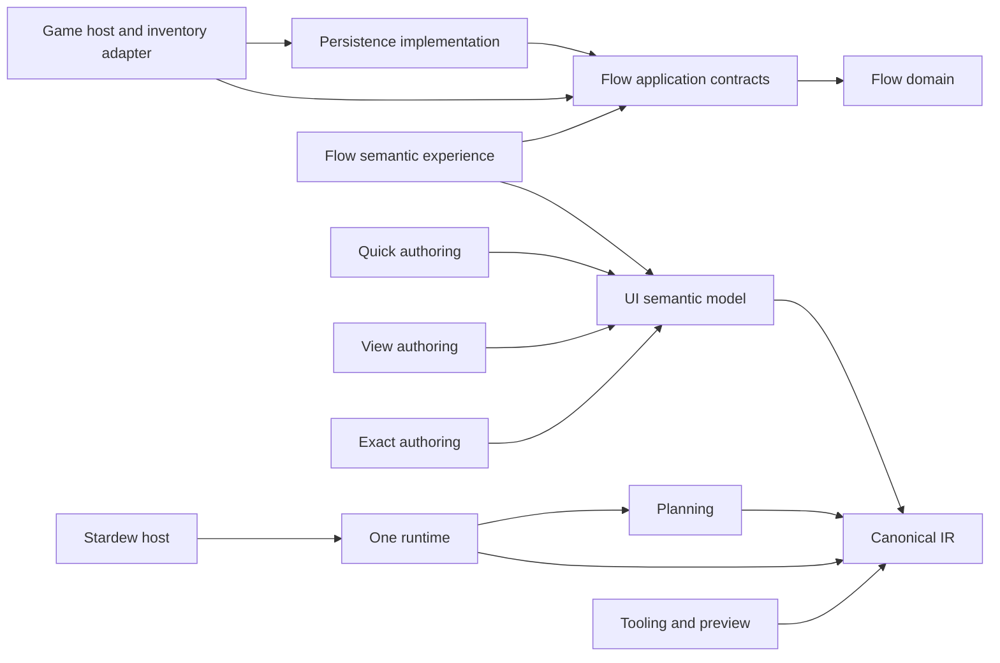
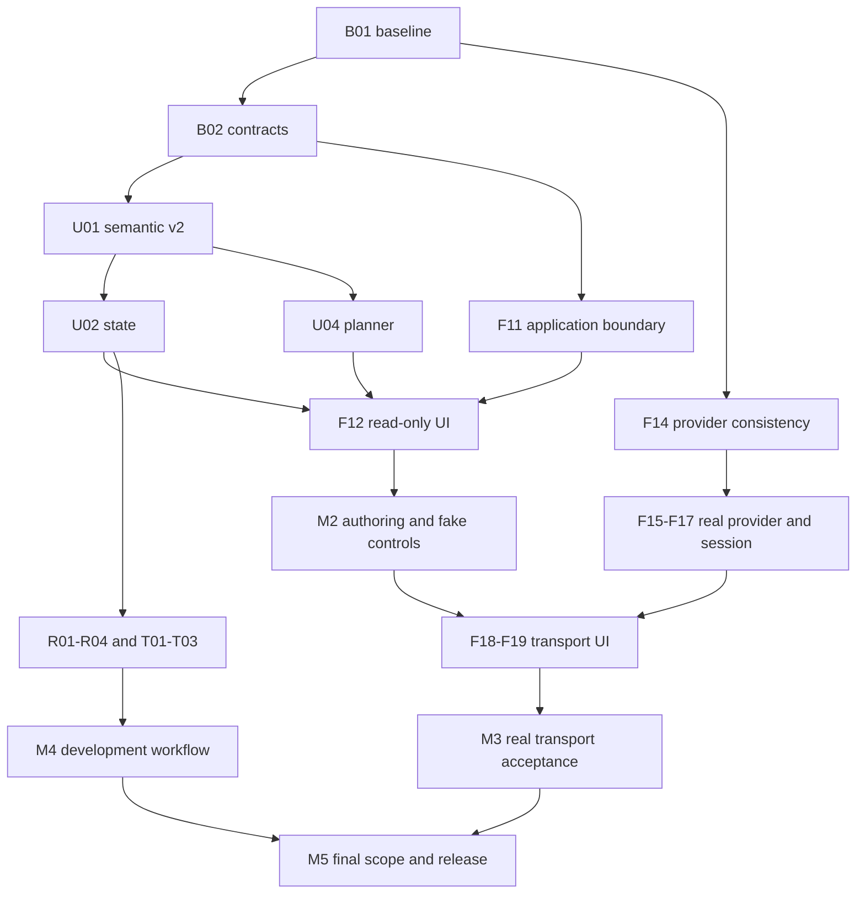

# Roadmap Hatifect: UI, Flowline и инструменты разработки

Дата: **2026-09-05**. Исходная база: `2f08a4f4db36ef0b1ba58e385fc0ab5044cae867` в монорепозитории Hatifect.

Это полный предлагаемый порядок развития сохранённой базы: от ближайшего сквозного изменения до модернизированного UI framework и первой ограниченной поставки реальных перевозок. Документ фиксирует направление и зависимости. Он не объявляет будущие API реализованными и не меняет действующие публичные контракты, форматы persistence, acceptance-файлы или настройки Codex. Такие изменения входят в явно поставленные задачи соответствующего этапа.

Roadmap утверждена пользователем для последовательной реализации до всех acceptance criteria. Переходы между срезами уже разрешены. На 2026-09-06 `B01` — **DONE**, commit `de766c5`: [аудит текущей базы](ROADMAP_BASELINE.md), C gate `artifacts/validation/run-u7blhl0v/summary.json` PASS (947 .NET + 296 Python). `B02` — **DONE**, commit `1fd9d57`: [минимальный semantic-v2 / D01](SEMANTIC_V2.md), C gate `artifacts/validation/run-vion_3x9/summary.json` PASS (947 .NET + 296 Python). `U01` — **DONE**, commit `856ff52`: typed graph, explicit identity/alias/label, v1/v2 wire и реальные Flow/CA fixtures; C 1 097 .NET + 301 Python, U 439, G 1 251 .NET + 301 Python, финальный P 81 CA tests на восьми alpha.32 packages. Evidence и границы в [ROADMAP-STATUS.md](ROADMAP-STATUS.md). `U02` — **DONE**, alpha.36: atomic multi-source publication и CA/Parcel/Network consumers, bounded typed deltas/reset/history, current selection/focus/scroll rendering и Update-only preparation подтверждены C/U/G/P/PERF. Стоимость structural/cold Reset остаётся O(N), root copy Update — O(N/128); это явно измеренные ограничения. Итоговые evidence и implementation commit приведены в [ROADMAP-STATUS.md](ROADMAP-STATUS.md#u02-e-bounded-update-preparation-and-u02-acceptance). `F11` — **DONE**, integration commit `5f2d10c`: C 1 014 .NET + 301 Python, G 1 174 .NET + 301 Python, свежий `flow.chest.roundtrip` PASS 8 (`7336456e-5400-4a77-aed6-4109aedc7c9f`); подробности в [отчёте Flow](ROADMAP-STATUS.md). Остальные UI ID пока **PLANNED**; Flow foundation `cdf9d2e` и оставшаяся acceptance F11–F20 перечислены в [отчёте Flow](ROADMAP-STATUS.md). Наличие частичной основы не означает DONE. Статус DONE появляется только со ссылкой на итоговый commit/PR и выполненную проверку. Календарные обещания и количество PR пока не установлены.

## 1. Результат, к которому идём

**Для автора мода:** типобезопасно описать состояние, действия и смысл интерфейса; быстро собрать простой диалог; при необходимости управлять композицией или точной геометрией; получить единые ввод, focus, lifecycle, темы и диагностику. Один semantic IR и один runtime обслуживают все способы авторства.

**Для игрока:** пользоваться предсказуемым интерфейсом на EN/RU, при разных масштабах и размерах окна, с мышью, клавиатурой и контроллером. Flowline показывает состояние транспорта, объясняет недоступные действия и позволяет управлять перевозками в пределах подтверждённых возможностей provider.

**Для разработчика Hatifect:** менять общий контракт вместе с владельцем и consumer; получать воспроизводимые проверки, preview и объяснение planner; обновлять UI с контролируемым переносом состояния; диагностировать отказ без потери принадлежности груза или смешивания сейвов.

Расширенная цель UI включает semantic-v2, несколько authoring API, общую библиотеку компонентов, transactional hot reload, editor tooling и документированный extension contract. Первый реальный маршрут Flowline может выйти раньше полного набора этих возможностей: точная компоновка, большой каталог компонентов и полноценный editor не являются предпосылкой двухстанционной перевозки.

## 2. Что уже есть и чего ещё нет

Текущие исходники, [архитектура](../ARCHITECTURE.md), [руководство разработки](DEVELOPMENT.md) и исполняемые проверки имеют приоритет над историческими планами. Таблица ниже описывает исходную базу `2f08a4f`; актуальные отличия `55b8360` и доказательства для каждого ID приведены в [B01](ROADMAP_BASELINE.md). В частности, уже появились optional standalone host API, публичная collection metadata, typed forms, три темы, парный live reload и расширенный LSP server; это не закрывает полный semantic-v2 и соответствующие acceptance criteria.

| Область | Сохранённая база | Следующее развитие |
|---|---|---|
| UI pipeline | Language → Semantics → Experience; Planning, Runtime, Stardew host, Tooling/Server и DevTools | Согласованный semantic-v2 и его использование всеми способами авторства |
| Данные UI | `IUiSemanticSource<T>`, `UiState<T>`, stable IDs; collection state с внутренней revision, replacement и сохранением selection | Публично определённая модель версий/дельт, типизированные связи, согласованное чтение нескольких источников |
| Действия UI | Синхронные `UiActionDefinition`, `CanExecute`, `TryExecute` | Типизированные вход/результат, ошибки, выполнение, отмена и защита от устаревшего завершения |
| Planning | Профили, capabilities, deterministic planning, provenance | Явные отношения, environment facets, проверка покрытия семантики и структурированное объяснение решений |
| Runtime | Layout, scenes/reconciliation, focus/input, portals, виртуализация, runtime Terminal hosts | Инкрементальная обработка нового контракта без повторного создания этих подсистем |
| Hot reload | `UiAssetSlot<TDefinition>`: атомарный Last Known Good для одного Presentation/Visual asset | Подготовка согласованного bundle, перенос состояния, переключение всех участвующих hosts и rollback |
| Публичный UI host | `IUiSemanticSurfaceApi` v1: overlay над конкретным активным native menu | Явно выбранный способ размещения самостоятельного Flowline UI; текущий overlay не объявляется универсальным window API |
| CA Overlay | Внешний consumer точных UI NuGet packages; отдельный адаптер стороннего API | Проверка и миграция consumer при развитии UI, сохранение package isolation |
| Flowline | Десять инкрементов Core/Persistence/host с deterministic fake provider и save isolation | Application boundary, рабочий UI, реальные inventory adapters и production session |
| UI Flowline | Отдельный read-only `ParcelExperience`, непосредственно проецирующий `Parcel` через constant sources | Snapshot projection, lifecycle, уведомления и команды через application boundary |
| Поставка | Три модуля, 13 runtime DLL: UI 8, Flowline 3, CA 2 | Явное обновление состава/зависимостей при включении Flow semantic UI |

В Flowline сохранены: (1) транспортная модель и deterministic scheduling; (2) atomic fake ports, cargo identity и receipts; (3) checkpoints и writer lease; (4) durable provider и журнал intent/receipt; (5) admission; (6) station registration; (7) cargo provisioning; (8) capacity updates; (9) host lifecycle и logical clock; (10) привязка сейва к PairId/NetworkId и fencing старой сессии. Продолжение нумеруется `F11`–`F20`; это новые работы, а не утверждение об их завершении.

Низкоуровневые `Revision`/`ProviderRevision` уже существуют. Недостаёт общего application contract для consumer. Наличие fake-provider recovery не доказывает согласованность произвольного игрового inventory с игровым сейвом после crash.

Опорные исходники и тесты:

- [Состояние и типизированные источники UI](<../Hatifect UI/Hatifect.UI.Experience/State/UiSemanticSource.cs>), [коллекции](<../Hatifect UI/Hatifect.UI.Experience/State/UiSemanticCollectionSource.cs>), [действия](<../Hatifect UI/Hatifect.UI.Experience/Actions/UiActionDefinition.cs>), [semantic builder](<../Hatifect UI/Hatifect.UI.Experience/UiExperienceBuilder.cs>).
- [Публичная игровая UI-граница](<../Hatifect UI/Hatifect.UI.Experience/Hosting/UiSemanticSurfaceContracts.cs>), [planner tests](<../Hatifect UI/tests/Hatifect.UI.Planning.Tests/PresentationPlannerTests.cs>), [Last Known Good slot](<../Hatifect UI/Hatifect.UI.Runtime/HotReload/UiAssetSlot.cs>).
- [Flow host](<../Hatifect Flow/Hatifect.Flow.Persistence/DurableFlowHost.cs>), [durable session](<../Hatifect Flow/Hatifect.Flow.Persistence/DurableFlowSession.cs>), [save isolation tests](<../Hatifect Flow/tests/Hatifect.Flow.Tests/DurableSaveSessionStoreTests.cs>), [host tests](<../Hatifect Flow/tests/Hatifect.Flow.Tests/DurableFlowHostTests.cs>), [ParcelExperience](<../Hatifect Flow/Hatifect.Flow.UI.Semantic/ParcelExperience.cs>).
- [UI package authority](../Hatifect.UI.Packages.json), [runtime inventory](../Hatifect.Release.json), [performance budgets](<../Hatifect UI/PERFORMANCE_BUDGETS.json>), [host acceptance](<../Hatifect UI/HOST_ACCEPTANCE_REQUIREMENTS.json>).

Исторические UI+CA runtime-отчёты относятся к прежнему имени и сборке. Они полезны как список сценариев, но не дают PASS новой поставке. Физический ввод, ручная визуальная приёмка и итоговый performance report должны подтверждаться для конкретного кандидата. Старые Storage/Bootstrap, отдельный продуктовый Terminal и pipe runtime в этот план не возвращаются; runtime Terminal hosts нынешнего UI сохраняются.

## 3. Архитектура следующего этапа

### Владельцы и направление зависимостей

| Владелец | Что ему принадлежит | Граница с соседями |
|---|---|---|
| Flow Core / Application | Доменные правила, запросы, результаты команд и immutable read model | Не зависит от UI, SMAPI, Stardew или CA |
| Flow Persistence | Durable execution, envelopes, recovery, save identity и lease | Реализует сохранение/восстановление; UI не получает доступ к journal/runtime mutation callbacks |
| Flow game host / adapters | Игровые события, main-thread access, inventory capabilities, начало/окончание сессии | Переводит игровой мир в domain/application contract |
| Flow semantic experience | Выбор данных, пользовательские намерения и локальное состояние представления | Читает snapshots, вызывает команды; не задаёт частные размеры/цвета для исправления framework |
| UI Language / Semantics / Experience | Идентичность, типы, источники, отношения, действия и authoring | Все способы авторства понижаются в общий IR |
| UI Planning / Runtime | Представление, visual policy, layout, input, focus, lifecycle, rendering | Один набор правил для Flowline, CA и сторонних consumer |
| UI Stardew host | Native menu/window/overlay integration, ресурсы платформы | Наружу выдаёт capability и непрозрачную session handle |
| Tooling / DevTools | Metadata, diagnostics, preview, объяснение planner, измерения | Использует тот же compiler/IR и не содержит второй реализации семантики |
| CA adapter | Совместимость CA, подписки и handoff native menu | Сторонний API остаётся в адаптере; UI поставляется отдельно |

Сначала расширяем существующие owning projects. Новый assembly нужен только при доказанной границе зависимости, поставки или публичного API. Не создаём отдельный проект для каждого DTO или команды.



Стрелка означает «использует». Схема показывает целевые логические зависимости, а не новый список `ProjectReference`. Application contracts принадлежат существующей Flow application-области, а не UI. Точный граф assemblies остаётся в solution и architecture checks.

### Связь Flowline и UI

Предлагаемый контракт `F11` должен определить следующие свойства; конкретные C# имена выбираются в его дизайне:

1. Snapshot содержит идентичность сессии/сейва, revision, необходимые представлению immutable значения, capabilities и причины недоступности действий. Вложенная коллекция `IReadOnlyList<T>` не считается глубоко immutable, если `T` изменяется после публикации.
2. Команда имеет типизированные параметры, адресата, идентичность сессии и определённое правило проверки ожидаемой revision. Политика повторного запроса зависит от эффекта: operation/request ID и durable idempotency вводятся там, где это требуется, а не имитируются флагом UI.
3. Результат различает выполненное действие, доменный отказ, конфликт/устаревшую сессию и инфраструктурный сбой. Snapshot/revision после действия отражает согласованное состояние владельца; pending intent не изображается как законченная перевозка.
4. Revision notification означает «доступно новое состояние». Подписка имеет владельца и освобождается при закрытии. Контракт исключает потерю обновления между initial read и subscribe: согласованная подписка со snapshot либо subscribe → read → recheck.
5. Изменения могут объединяться до одного UI update. Пропущенная дельта восстанавливается полным snapshot; очередь уведомлений ограничена. UI не сканирует весь persistence на каждом draw.
6. Save switch, fault и dispose делают старый session token недействительным. Старые callbacks и завершения команд не меняют новый экран. Ошибка UI observer не откатывает успешно сохранённую доменную операцию и не вызывает reentrant mutation.

Различаем три понятия: **Flow session/revision** определяют доменное состояние; **UI source version** определяет изменение проекции; **UI generation** определяет экземпляр runtime/bundle. Их нельзя объединять в один счётчик или переносить из старого сейва в новый.

### Миграция UI

`UiQuick`, `UiView`, `UiExact` и расширенный `UiExperience` — рабочие названия предложенных authoring-поверхностей. Сегодняшний `UiExperienceBuilder` и `IUiSemanticSurfaceApi` v1 остаются исходной точкой совместимости.

В `B02` сравниваем additive evolution и явно версионированный breaking contract. Предпочтительно сохранять рабочий consumer через ограниченный compatibility bridge в общий IR. Если bridge скрывает неоднозначность или размножает runtime, выбираем явную миграцию в одном сквозном изменении. Срок и условие удаления bridge фиксируются сразу; новые consumer не строятся на заведомо уходящей форме API.

Для `UiExact` требуется отдельное решение: текущие [UI instructions](<../Hatifect UI/AGENTS.md>) оставляют геометрию/visual policy framework и запрещают частную стилизацию в consumer C#. Предлагаемый exact authoring должен быть явным framework contract с общими input, hit testing, scale и accessibility правилами. До решения `D02` это направление не разрешает обойти действующую границу.

## 4. Вехи и порядок

Веха означает проверяемый результат. Работы одного потока могут идти параллельно независимому потоку, но зависимые изменения общего контракта интегрируются последовательно.

| Веха | Результат | Работы и условие выхода |
|---|---|---|
| M0 — согласованная основа | Есть актуальная карта поведения и решение о минимальном v2 | B01, B02; Q01 начинает новый runtime baseline |
| M1 — живой read-only Flow UI | Открытие экрана, актуальные данные и безопасное закрытие/смена сейва | U01, U02, U04, F11, F12; выполнен сценарий на новом build |
| M2 — удобное авторство и управление fake flow | Базовые Quick/View, общие компоненты, actions; CA работает на обновлённом контракте | U03, U05–U07, F13, I01; fake provider явно обозначен |
| M3 — ограниченная реальная перевозка | Две станции и один поддерживаемый provider; настройка, отправка, наблюдение и recovery | F14–F19, Q02; выбранные D03/D04, failure matrix и свежая runtime-приёмка |
| M4 — полный цикл разработки UI | Prepare/reload/rollback, перенос состояния, preview и editor feedback | R01–R04, T01–T03; может развиваться параллельно M3 |
| M5 — расширенный framework и готовая поставка | Exact, согласованный каталог и extension contract, подтверждённые эксплуатационные ограничения | U08–U10, F20, Q03; объём выбран через D02/D05/D06 |

**Ближайшая последовательность:** B01 → B02 → U01 → U02/U04 → F12, причём F11 начинается после B02 и становится второй обязательной входной зависимостью F12. Это первый сквозной результат, после которого уточняются удобство authoring и стоимость дальнейшей миграции. F14 можно исследовать после B01; реализация реальных inventory не блокирует M1.



Диаграмма укрупнённая; точные предпосылки находятся в таблице работ. Если работает один implementer, это очередь с возможностью переключения на независимый готовый пакет. Если работают несколько — у общего контракта один integration owner, пользовательские задачи живут в отдельных worktree. Постоянные ветки UI/Flowline не нужны.

## 5. Каталог работ

В таблице `D/I/R` — рекомендуемый reasoning для design, implementation и review. `M` = medium, `H` = high, `X` = xhigh. Проверки обозначены в разделе 7. Зависимость означает завершённый контракт/результат, пригодный для интеграции; само появление черновика не разблокирует production implementation.

| ID | Работа | Зависимости | Owning layer | D/I/R | Проверка |
|---|---|---|---|---|---|
| B01 | Актуальная карта базы и разрывов | — | Architecture, subsystem owners | H/M/H | C |
| B02 | Минимальный semantic-v2 и совместимость | B01 | UI Experience/Semantics + consumers | X/H/X | C, U, P при API-коде |
| U01 | Типы, identity и relation graph | B02 | UI Experience/Semantics | X/H/X | C, U, P |
| U02 | Версии состояния и collection deltas | U01 | UI Experience/Runtime | X/H/X | C, U, P, PERF |
| U03 | Типизированные действия и async lifecycle | U02 | UI Experience/Runtime/host | X/H/X | C, U, P, G, RUNTIME |
| U04 | Environment facets и объяснимый planner | U01 | UI Planning/Semantics | X/H/X | C, U, P, PERF |
| U05 | Инкрементальный runtime и общие состояния | U02, U04 | UI Runtime | H/H/X | C, U, G, RUNTIME, PERF |
| U06 | Tokens, темы и базовые компоненты | U04, U05 | UI Runtime/Planning/Stardew | H/H/H | C, U, G, RUNTIME, VISUAL |
| U07 | Quick/View authoring | U03, U06 | UI Experience/Language/Semantics | X/H/X | C, U, P, RUNTIME |
| U08 | Exact authoring | U07; D02 | UI Language/Planning/Runtime | X/H/X | C, U, P, G, VISUAL, PERF |
| U09 | Полный согласованный каталог компонентов | U07; D05 | UI framework | H/H/H | C, U, P, RUNTIME, VISUAL |
| U10 | Расширения framework | U03, U06, R04; D05 | UI contracts/Runtime | X/H/X | C, U, P, RUNTIME |
| R01 | Ownership и generations | U02, U03 | UI Runtime/host | X/H/X | C, U, G |
| R02 | Подготовка согласованного bundle | R01, U04 | Compiler/Runtime/Tooling | X/H/X | C, U |
| R03 | Перенос совместимого UI state | R02, U05 | UI Runtime | X/H/X | C, U, G, RUNTIME |
| R04 | Commit/rollback всех участвующих hosts | R03 | UI Runtime/Stardew | X/H/X | C, U, G, RUNTIME, PERF |
| T01 | Общая metadata и tooling protocol | U01, U04 | UI Tooling/Tooling.Server | H/H/H | C, U |
| T02 | Preview и матрица окружений | T01, U06, R02 | UI Tooling/DevTools/host | H/H/H | C, U, G, VISUAL |
| T03 | Editor workflow и примеры | T01, T02, U07 | UI Tooling + выбранный editor client | H/H/H | C, U, MANUAL |
| F11 | Snapshots, команды, revision boundary | B02 | Flow Application/Persistence/host | X/H/X | C, F |
| F12 | Read-only Flow experience в host | F11, U02, U04 | Flow UI + UI host | H/H/H | C, F, U, G, P, RUNTIME |
| F13 | Управление и диагностика fake session | F12, U03 | Flow Application/UI | H/H/X | C, F, U, G, RUNTIME |
| F14 | Provider contract и модель согласованности | B01 | Flow Application/Persistence/adapters | X/H/X | C, F; D03/D04 |
| F15 | Item semantics и read-only game adapter | F14 | Flow game adapter | X/H/X | C, F, G, RUNTIME |
| F16 | Реальные transfer effects и recovery | F15 | Flow Persistence + game adapter | X/H/X | C, F, G, RUNTIME |
| F17 | Production transport session | F11, F16 | Flow host/Persistence | X/H/X | C, F, G, RUNTIME, PERF |
| F18 | Настройка станций и маршрута через UI | F13, F17, U07 | Flow Application/UI + adapter | H/H/X | C, F, U, G, RUNTIME, VISUAL |
| F19 | Отправка, наблюдение и восстановление | F18 | Flow Application/UI | H/H/X | C, F, U, G, RUNTIME, VISUAL |
| F20 | Ограничения, диагностика и обслуживание | F17; D06 | Flow Core/Persistence/tools | X/H/X | C, F, G, PERF, RUNTIME |
| I01 | CA на обновлённом UI contract | U07, F12 | UI producer + CA adapter/experience | H/H/X | C, U, G, P, RUNTIME, VISUAL |
| Q01 | Свежая runtime-база Hatifect | B01 | UI/Flow/CA hosts + harness | H/M/H | G, P, RUNTIME, VISUAL, PERF |
| Q02 | Приёмка реального Flow MVP | F19, I01, Q01 | Flow/UI/CA + release tooling | H/H/X | C, G, P, RUNTIME, VISUAL, PERF |
| Q03 | Приёмка полной модернизации и поставка | Q02, U08, U09, U10, R04, T03, F20 | Все owners + release tooling | H/H/X | C, G, P, RUNTIME, VISUAL, PERF, MANUAL |

### B01–B02: исходная точка и контракты

**B01.** Сверить код, README, публичный baseline, package inventory, поведенческие тесты и доступные runtime evidence. Для каждого заявленного поведения указать реализовано/частично/отсутствует и конкретное доказательство. Проверить текущую базу канонической командой. Выход: согласованная таблица разрывов; исторические провалы и успехи не выдаются за результат нового build.

**B02.** Подготовить минимальную спецификацию semantic-v2: stable identity, типы и nullability, отношения, версии state, действия, migration path и первый Flow example. Зафиксировать решение `D01`, область public API, требования к CA и способ размещения первого Flow UI. Выход: конкретный пример модели и consumer mapping, по которым можно независимо реализовать U01 и F11. Не проектировать заранее все виджеты и все синтаксисы; расширение проверяется сквозным примером.

Результат B02: [SEMANTIC_V2.md](SEMANTIC_V2.md) фиксирует D01, все семь relation kinds, типизированные projection input slots, explicit identity / schema-v2 migration, atomic publication, action lifecycle и минимальный Flow application mapping с причинами availability. Независимый read-only review закрыл три замечания после исправлений. C: `./tools/hatifect-check`, `artifacts/validation/run-vion_3x9/summary.json` — PASS, 947 .NET + 296 Python. Предыдущий `run-mf2tlgrc` завершён как FAIL после диагностированного нативного ожидания dotnet (`build-hang.sample.txt`); он не является успешным evidence. C# API в B02 не меняется; U/P/G/RUNTIME/VISUAL/PERF будущих срезов этим результатом не подтверждаются. Следующий готовый UI срез — U01; независимый Flow owner реализует F11 по той же спецификации.

### U01–U04: semantic-v2

**U01.** Расширить существующие typed sources и identity до явно проверяемого semantic graph. Описать связи collection → selection → details, query/filter → collection, form → validation/action, action → target. Отличать стабильный ID от отображаемого alias и label. Неоднозначные ссылки, несовместимые типы, отсутствующие required capabilities и недопустимые циклы дают адресные diagnostics. Выход: один Flow read model и CA fixture проходят новый binding; негативные примеры отклоняются до activation. Совместимость consumer входит в этот же сквозной срез.

Результат U01: **DONE**, `856ff52`. Все семь отношений проходят binding; invalid graph, types, capabilities, provenance и циклы отклоняются до activation. Legacy canonical v1 wire сохранён, v2 сохраняет независимые ID/alias/labels и projection inputs. C/U/G/P и независимый review отражены в [отчёте](ROADMAP-STATUS.md#u01-typed-semantic-graph-and-lossless-binding). Runtime/visual следующих срезов этим результатом не заменяются.

**U02.** Определить source version, publication boundary, typed collection delta и полный reset. Согласовать insert/remove/move/update, item content version, selection/focus anchors, обработку устаревшей или пропущенной дельты. Обработать batch из нескольких связанных источников без смешанного кадра; ограничить буферизацию. Выход: reorder сохраняет выбранный stable ID, удаление выбранного элемента даёт определённый fallback, повторная delta не дублирует элемент, reset восстанавливает согласованность. Простая замена snapshot остаётся поддержанным путём для небольших данных.

Результат U02-a: проверенный implementation commit `c5db895`; полный U02 **IN_PROGRESS**. Experience/Runtime публикуют связанные sources одним immutable view; typed changes ограничены, capture не копирует коллекцию, CA использует запросы до mutation и единый commit. C — PASS (1 153 .NET + 315 Python), G — PASS (1 350 .NET + 315 Python), P — PASS (90 CA tests, восемь alpha.33 packages). [Подробные evidence и ограничения](ROADMAP-STATUS.md#u02-a-publication-collection-changes-and-atomic-ca). Полный U02 требует атомарного Flow read model, окончательных focus/scroll fallbacks и оставшихся update measurements.

U02-b, промежуточный Flow checkpoint `22f56fd`: ParcelExperience переводит backing read model и все поля в один commit, сохраняя следующий Pump для command result. C — PASS (1 168 .NET + 323 Python), включая 15 новых atomic/lifecycle cases. [Evidence](ROADMAP-STATUS.md#u02-b-atomic-parcel-projection-checkpoint). NetworkExperience и остальные критерии U02 продолжаются.

U02-b2, Network checkpoint `0fa2aa7`: единая публикация read model, history/details, route/recovery, cached inventory, forms/validation и command result; pending ввод сохраняется при новой доменной ревизии и отказе подготовки. C — PASS (1 212 .NET + 323 Python), включая 42 новых Network cases и два Parcel action fences. [Evidence](ROADMAP-STATUS.md#u02-b2-atomic-network-projection-and-preserved-request-intent). Остаются focus/scroll fallback и update measurements.

U02-c, checkpoint `4482856`: Runtime сохраняет logical focus и scroll anchor при обновлении коллекций, раскрывает target при явной навигации, обрабатывает empty/refill и внешние uniform sources без reverse lookup. C — PASS (1 248 .NET +326 Python), G — PASS (1 445 .NET +326 Python), P — PASS (90 CA tests, восемь alpha.34 packages);36 новых cases и замеры100/1000/10000. [Evidence и измеренные ограничения](ROADMAP-STATUS.md#u02-c-retained-collection-focus-scroll-anchors-and-measured-update-costs). Полный U02 **IN_PROGRESS**: Runtime follow-up U02-d исправляет render/accessibility при reuse layout; следующая оптимизация устраняет полную подготовку коллекции для единичной delta. Большие обновления пока не подтверждают общий performance budget.

U02-d, checkpoint `56c9e7f`, alpha.35: renderer/accessibility используют текущий captured selection и reconciled focus при сохранённом layout. Border без заливки виден при keyboard focus и empty/refill; prepared-state planner сохраняет совместимость. C — PASS (1263 .NET +330 Python), G — PASS (1460 .NET +330 Python), P — PASS (90 CA tests, восемь alpha.35 packages);15 новых cases. [Evidence](ROADMAP-STATUS.md#u02-d-current-collection-rendering-and-accessibility-on-retained-geometry). Следующий готовый шаг — оптимизация подготовки единичной typed delta; полный U02 остаётся **IN_PROGRESS**.

U02-e, alpha.36: **DONE** для полного U02. Update-only batch проверяет каждую операцию, проецирует final values затронутых индексов и копирует только private immutable blocks/root. Эквивалентная explicit delta сохраняет advancement version/history; old captures/selection/supporting metadata остаются согласованными. C — PASS1278 .NET +342 Python, U — PASS559, G — PASS1493 .NET +342 Python, P — PASS90 на восьми alpha.36 packages, ordinary-GC Runtime — PASS263 с600 samples на каждый размер/операцию. Для Update10k p95/p99 —0.004500/0.005458ms, средние allocations6264B. Reset10k —7.287292/7.929292ms и около2.76MB; это cold preparation, не общий PASS frame budget. [Acceptance trace, implementation и полные evidence](ROADMAP-STATUS.md#u02-e-bounded-update-preparation-and-u02-acceptance). Следующий UI ID — U03; U04 также готов по зависимости U01.

**U03.** Ввести typed request/result и состояния действия: доступно, выполняется, выполнено, отклонено/ошибка, отменено — в форме, согласованной контрактом. Определить concurrency policy каждого действия, повторный invoke, `CanExecute` и сообщения пользователю. UI cancellation отменяет ожидание/работу только в пределах контракта; уже committed доменный эффект не «откатывается» закрытием окна. Выход: позднее завершение после close, reload или save switch не меняет новую сессию; исключения наблюдаемы; callbacks возвращаются на owning thread; подписки освобождаются.

**U04.** Развить profiles/provenance в environment facets: viewport, scale, input mode, locale, theme и необходимые accessibility preferences. Planner детерминированно выбирает допустимое представление с проверкой покрытия обязательной семантики. Trace объясняет применённое правило, альтернативы/причины отказа и происхождение значения, а его сбор не создаёт неограниченную историю на каждом кадре. Выход: одна Experience работает в нескольких окружениях; невозможная комбинация даёт явную diagnostic/fallback policy, а не тихо теряет действие или поле.

### U05–U10: runtime, авторство и компоненты

**U05.** Подключить новые state/delta к существующим reconciliation, layout, input, focus и virtualization. Сохранить целевые invalidation effects: текст/measure, arrangement, drawing, semantic recomposition не подменяются общей перестройкой по любому событию. Выход: неизменный кадр не сканирует полную модель; collection change ограничен нужной областью; scroll/focus не скачут при обновлении соседнего элемента. Проверить bounded caches, скрытые hosts и lifecycle снятия обработчиков.

**U06.** Оформить общий token/theme contract: типографика, spacing/density, цвета смысловых состояний, surface layers, icons и input prompts. Предлагаемые семейства — Vanilla, нейтральная Vanilla, dark, light и high contrast; окончательная матрица выбирается в D05. Базовый набор для M2: layout/scroll, text, button, selection/list, field/form validation, tooltip и empty/loading/error/status. Выход: Flow и CA используют общую policy; EN/RU и scale проходят проверку без частных размеров в consumer. Accessibility semantics и controller traversal входят в контракт компонента с первого применения.

**U07.** Построить `UiQuick` recipes для alert/confirm/select/простого form/notification и `UiView` для небольшого декларативного layout с typed bindings/actions. Синтаксис может выводить отношения только когда вывод однозначен; явное описание остаётся доступным. Оба входа компилируются в тот же IR, что полная Experience. Выход: примеры простого диалога, формы и небольшого custom screen; одно и то же действие имеет одинаковый lifecycle во всех формах авторства. Сравнить объём и понятность authoring на реальных задачах, затем закрепить API.

**U08.** После D02 добавить `UiExact`: explicit geometry/layers/canvas и pixel scaling внутри framework. Определить measure/arrange, coordinate transform, clipping, render/hitbox agreement, focus order, semantic labels и fallback для compact/controller/accessibility. Выход: точное представление использует общие lifecycle/resources/input, а неподдерживаемое окружение получает явно заданное поведение. Не публиковать exact drawing как способ обходить hit testing или доступность.

**U09.** Закрыть согласованный каталог по отдельным семействам; один небольшой семейный срез имеет собственный consumer и acceptance. Предлагаемый полный набор: Stack/Grid/Frame/Layer/SplitPane/Scroll и виртуальные list/grid/tree; buttons/toggles/radio/slider/dropdown/segmented/tabs/text/number/keybind/color/search; игровые item slot/grid/tooltip/currency/portrait/prompts; semantic Form/Browser/Inspector/MasterDetail/CommandBar/Settings/progress/state composites. Сначала инвентаризировать существующее, затем дополнять пробелы. Выход: для каждого опубликованного компонента есть пример, input/locale/scale/theme/state/reload matrix и известные ограничения. Непроверенные семейства остаются experimental и не считаются выполненным каталогом.

**U10.** Определить typed extension contract: semantic source, capability, constraints, theme role, поддерживаемые draw primitives, intents и accessibility metadata. Generation owner контролирует registration/dispose; extension не получает private runtime, произвольные игровые подписки или право обновлять закрытую host session. Выход: пример внешнего расширения собирается только с packages, переживает reload и имеет диагностируемый отказ при несовместимой версии. Extension API не является обещанием sandbox для произвольного чужого C#.

### R01–R04: транзакционный hot reload

**R01.** Ввести ownership manifest активной generation: hosts, callbacks, subscriptions, async operations, caches и platform/GPU resources. Зафиксировать thread boundaries и терминальные состояния. Выход: resources имеют одного владельца; закрытая generation не принимает новые effects, а повторный dispose безопасен. UI generation не владеет Flow domain session и не пересоздаёт её при reload.

**R02.** Подготавливать candidate bundle целиком: resolve assets, compile/bind/validate, проверить dependencies и возможность activation до изменения активной generation. Bundle имеет согласованную identity/fingerprint и перечень участвующих hosts. Явно определить границу reload: declarative/semantic definitions и assets; замена уже загруженной .NET assembly и произвольного C# не обещается без отдельного исследования. Выход: синтаксическая, type или resource ошибка оставляет активный bundle работоспособным с адресной diagnostic.

**R03.** Составлять migration plan по stable IDs, роли и совместимости типа: query, selection, scroll anchor, focus, editing/caret/composition state там, где поддержано. Rename alias не меняет identity; исчезнувший или несовместимый элемент получает документированный fallback. Сначала проверить план, затем применять. Выход: тесты совместимого изменения и смены типа/удаления узла; save-specific state не переносится между Flow sessions. Не сериализовать произвольные runtime объекты ради «сохранить всё».

**R04.** Переключать участвующие hosts в одной определённой update boundary. Подготовленные hosts видят одну generation; ошибка до точки commit сохраняет старую, ошибка в допустимой rollback-фазе возвращает весь согласованный набор. Граница необратимых effects описывается отдельно: reload не запускает повторно доменные команды, а уже выполненные внешние effects не входят в UI rollback. Выход: fault injection по фазам prepare/migrate/commit/retire, две одновременно открытые поверхности, late async completion, многократный reload без роста ресурсов. Измеряются pause commit и peak memory; old resources освобождаются после безопасной передачи ownership.

### T01–T03: инструменты автора

**T01.** Развить имеющиеся metadata и stdio tooling protocol: symbols/types/capabilities, definitions/references, diagnostics, source spans и planner trace. Версионирование protocol отдельно от public runtime API. Выход: server и compiler согласны на валидных/невалидных fixtures; client понимает unsupported capability и не трактует partial response как успешную компиляцию.

**T02.** Создать воспроизводимый preview на том же compiler/planner/runtime с управляемыми fixture sources. Переключать locale, viewport, scale, input profile, theme, reduced motion, empty/loading/error и размер данных. После R02 preview может активировать изолированный candidate; переключение реальных открытых hosts опирается на R04. Выход: соответствие preview и in-game поведения проверено на выбранных примерах; ограничения платформенного preview явно обозначены. Снимки/golden assets не заменяются автоматически при визуальном несовпадении.

**T03.** Выбрать один первый editor client и довести completion, type hints, go-to-definition/references, rename alias без смены ID, inline diagnostics, quick fixes и format. Добавить запуск preview и переход к planner explanation. Выход: новый автор по инструкции создаёт panel, находит ошибку binding, исправляет её и проверяет несколько окружений. Документация включает Quick/View/Experience, migration guide и примеры Flow/CA; после U08 в Q03 добавляется Exact. Численные ergonomics targets фиксируются после наблюдения, не подгоняются счётчиком строк.

### F11–F13: первая связь Flowline с UI

**F11.** Реализовать описанный в разделе 3 application boundary поверх действующей модели. Минимум чтения: session state, доступные станции, parcels/shipments и состояния, необходимые первому экрану. Минимум команд — выбранная существующая операция с понятной durable семантикой; не публиковать generic `Action<FlowRuntime>` наружу. Выход: immutable snapshots, revision/subscription contract, typed results и ownership проверены без игры; stale revision, повторный запрос, observer failure и session close имеют определённый результат. Persistence envelopes не меняются ради UI; если durable request identity потребует изменения формата, это отдельное явно включённое решение/миграция.

Результат F11: `e31c1ef` и `ff43d0b` интегрированы в `5f2d10c` с общей SDK/editor базой. Проверены immutable cached snapshots, session/revision fences, повторные команды, observer failure/reentry, subscribe-before-read и восстановление после ошибки чтения, owner-derived availability и typed rejection reasons. C `run-9ryxhfgj` — PASS (1 014 .NET + 301 Python); G `run-wxasxwxo` — PASS (1 174 .NET + 301 Python), включая 657 Flow и 65 игровых Flow tests. Fresh isolated runtime `7336456e-5400-4a77-aed6-4109aedc7c9f` — PASS 8, без исключений. UI package/API и persistence format этим срезом не изменены. [Подробное evidence](ROADMAP-STATUS.md#f11-combined-integration-checks).

**F12.** Заменить прямое наблюдение domain `Parcel` snapshot-проекцией и подключить read-only Flow experience к поддержанному UI host. Выбрать конкретную точку открытия; при необходимости расширить public host capability вместе с реализацией/consumer. Включить semantic DLL и корректную UI dependency в release inventory, проверяя единственного поставщика UI DLL. Выход: экран открывается, обновляется после доменного изменения, показывает unavailable/empty/faulted state, закрывается и переживает A → B → A без старых данных и утечки подписок. Пока источник fake, экран обозначает диагностический режим.

**F13.** Добавить ограниченное управление fake transport: выбранные операции create/dispatch/cancel/retry и объяснение отказов в рамках существующей доменной семантики. Окончательный набор определяется в срезе; UI не обещает возврат груза после точки, где cancel запрещён. Выход: повторный click, устаревший экран, running operation и domain rejection отображаются корректно; изменение видно другим открытым projections. Harness создаёт fixtures в изолированной среде; тестовые команды provisioning не становятся production inventory API.

### F14–F17: реальный provider и production session

**F14.** Подготовить decision record о согласованности: кто владеет физическим inventory, когда его изменение попадает в game save, где фиксируются intent/receipt, как определяется custody и что происходит при crash/rollback одной стороны. Сопоставить текущие `ICargoPort`/durable provider contracts с реальным игровым API. Возможные направления для сравнения: save-coordinated операции, контролируемое Flow custody/escrow, provider с доказуемым atomic durable contract. Не выбирать по названию; привести timeline каждой границы отказа и маленький воспроизводимый spike. Выход: D03/D04, поддерживаемые guarantees, unsupported cases, протокол retry/reconciliation и условия, при которых transport прекращает работу с объяснимой ошибкой. Не обещать exactly-once для произвольного игрового inventory.

**F15.** Реализовать read-only adapter для одного выбранного типа inventory. Определить stable station/container identity, item identity, stack/quality/metadata, допустимые типы предметов, capacity/admission и owner-thread access. Проверить исчезновение/перемещение контейнера, внешнее изменение содержимого и отсутствие capability. Выход: game objects не пересекают Core/Persistence boundary; повторный snapshot детерминирован для неизменного состояния; неподдерживаемый item не принимается молча. Первый provider и item subset выбираются в D03.

**F16.** Ввести реальное извлечение/размещение по протоколу F14. Каждая стадия имеет operation identity, определённое custody и результат повторного вызова. Проверить частичный stack, изменение inventory между проверкой и effect, отсутствие capacity, повтор delivery и восстановление после каждой подтверждённой границы. Выход: на поддерживаемой failure matrix груз не теряется и не появляется дважды; неподдерживаемое/неоднозначное состояние сохраняет evidence и блокирует небезопасный effect. Crash tests и unit fault injection обозначаются раздельно: одно не доказывает другое.

**F17.** Подключить provider к реальной save-scoped transport session: load/save/title/dispose, logical clock, pause, due-work budget, lease и fencing. Согласовать порядок game-save hooks с persistence протоколом; повторное событие не запускает второй transport. Выход: реальный маршрут между двумя станциями, save/reload, A → B → A, повторное открытие и отказ provider проходят изолированные runtime-сценарии. Idle/paused state сохраняет ограниченную стоимость и не превращается в постоянный checkpoint loop.

Статус F17: **DONE** в пределах выбранного ordinary-chest single-player provider. Lifecycle/isolation `c9837fe` и PERF `ece74db` подтверждены исходными игровыми reports и fingerprint; pause/idle — по600 samples,0B, p95/p99 в фиксированных пределах, due work — max64/240 transitions/160 effects. Интеграция с UI alpha.35 прошла G1478 .NET +337 Python, C1263 .NET +338 Python; отдельный regression закрывает возможность ослабить manifest checks/requiredMods. Commit и evidence перечислены в [ROADMAP-STATUS.md](ROADMAP-STATUS.md#combined-alpha35-and-f17-b-performance). Новая игровая приёмка объединённого UI candidate этим не заявляется. Следующий независимый Flow шаг — F20; F18/F19 сохраняют UI dependencies.

### F18–F20: пользовательский продукт Flowline

**F18.** Дать игроку согласованный путь настройки первого маршрута: выбрать поддерживаемые контейнеры, зарегистрировать станции, связать их и увидеть доступность/ограничения. UI использует capabilities и typed commands; новые durable topology/configuration mutations сначала реализуются у владельца, включая retry/recovery. Выход: маршрут можно создать из чистого допустимого состояния без диагностических команд, сохранить и открыть снова; удаление/изменение используемой станции имеет явно выбранную политику. Нельзя подменить недостающую доменную операцию изменением snapshot.

**F19.** Завершить путь «выбрать груз → проверить возможность → отправить → наблюдать → получить результат/объяснение проблемы». Показывать station availability, cargo/parcel state, capacity/admission, причину ожидания/отказа и только разрешённые cancel/retry/reconcile actions. ETA отображается лишь при наличии определённой модели; диагностический logical tick не выдаётся за обещанное игровое время доставки. Выход: happy path и отказ проходят EN/RU, input/scale matrix; recovery UI не требует ручного редактирования journal/save.

**F20.** Измерить routing/dispatch/checkpoint costs, длины очередей, receipt growth и восстановление на выбранных масштабах. Добавить ограниченную диагностику и документировать ресурсные пределы. Решить D06: если существующих bounded limits достаточно для MVP, сначала явно показываем backpressure и предел; если нужно удалять receipts/compacting journal, отдельно доказываем безопасный recovery horizon и вводим совместимую миграцию. Выход: длительная сессия не растёт бесконтрольно, переполнение имеет корректный результат, отчёт позволяет воспроизвести проблему. Агрессивная compaction не считается обязательной без подтверждённой потребности.

### I01 и Q01–Q03: интеграция и приёмка

**I01.** Использовать новый semantic/authoring contract в CA, сохранив смысл navigator, handoff и native menu restoration. Ранние U01–U07 уже поддерживают собираемость affected consumer; эта работа завершает продуктовую миграцию и удаляет согласованный временный bridge там, где выполнено его условие. Выход: exact package restore, build без UI source tree, один владелец runtime DLL, положительные и отрицательные CA configurations, close/reopen и input restoration. Не оставлять migration debt скрытым в adapter reflection.

**Q01.** Снять baseline текущего Hatifect runtime с fingerprint, версиями игры/SMAPI/CA, architecture/runtime, locale, scale и измерениями. Проверить текущие UI/CA scenarios и Flow fake lifecycle; отдельно зафиксировать физический ввод и ручные наблюдения. Выход: исходная измеренная база и список актуальных дефектов. Найденный дефект имеет отдельный bounded fix, а не автоматически считается частью переписывания semantic-v2.

**Q02.** Собрать и проверить ограниченный M3 candidate. Acceptance включает путь настройки/перевозки, реальный adapter failure matrix, game save/reload, session isolation, coexistence Flow UI/CA, locale/input/scale и performance. Выход: свежие evidence для конкретных runtime DLL, release inventory, installation/dependency check и описание известных ограничений. Без реальной inventory проверки статус «fake transport demo», а не готовый Flow MVP.

**Q03.** Проверить полный согласованный объём модернизации: authoring forms, component catalog, extension contract, editor/preview, multi-host reload/rollback, ресурсы и performance. Согласовать versions и migration guide, собрать локальный release archive и проверить установку в изоляции. Выход: воспроизводимая поставка с known issues и support matrix. Merge в общую ветку, публикация и release выполняются отдельным явно авторизованным действием; готовность архива не означает публикацию.

## 6. Решения, которые нельзя спрятать в реализации

Это будущие decision gates, а не запрос подтверждений при чтении roadmap. До соответствующей implementation-задачи нужно подготовить конкретный контракт, consumer example и evidence; имеющаяся явная авторизация задачи учитывается и повторно не запрашивается.

| ID | Решение | Рекомендуемая исходная позиция | Что требуется для выбора |
|---|---|---|---|
| D01 | Совместимость semantic-v2 и host API | Эволюция существующего IR/runtime; небольшой bridge только при однозначной семантике | API diff, Flow example, CA migration, package/version plan, удаление bridge |
| D02 | Exact geometry и граница visual policy | Отдельный framework authoring mode с общими input/accessibility правилами | Примеры pixel layout, compact/controller fallback и изменение связанных инструкций/контракта в явно заданной задаче |
| D03 | Объём первого реального Flow MVP | Single-player, два поддерживаемых stationary inventories, ограниченный item subset; только после проверки осуществимости | Inventory API evidence, пользовательский путь, типы предметов, политика перемещения/удаления контейнера |
| D04 | Game save ↔ Flow durable consistency | Guarantees в пределах проверяемой failure matrix | Commit timeline, crash/reload experiment, custody rules, обработка неоднозначности |
| D05 | Объём первого публичного UI release | Сначала набор, нужный Flow/CA и учебным примерам; расширенный каталог по отдельным slices | Component matrix, theme/accessibility scope, authoring observations, список stable/experimental APIs |
| D06 | Throughput, retention и compaction | Сначала измерения, bounded limits и понятный backpressure | Long-run profile, recovery horizon и migration proof при изменении persistence |

Финальные API names, смена major version, численные дополнительные acceptance-пороги и конкретный editor client остаются решениями своих задач. В roadmap не меняются существующие budget/acceptance JSON ради соответствия предложению.

## 7. Проверки и доказательства

| Код | Команда / вид проверки | Когда обязателен |
|---|---|---|
| C | `./tools/hatifect-check` | Каноническая общая проверка: instructions/config, architecture, Python tests, build и .NET без игры |
| U | `./tools/hatifect-test ui` | Затронуто поведение UI; targeted feedback до общего check |
| F | `./tools/hatifect-test flow` | Затронуты Flow Core/Persistence/application contracts |
| G | `./tools/hatifect-check --platform`; для CA также `./tools/hatifect-test ca --platform` | Изменён игровой adapter/host или полный граф |
| P | `./tools/hatifect-isolated-ui-ca` из текущих packages | Изменён UI package boundary, публичный producer contract или CA consumer |
| RUNTIME | Изолированный harness и сценарии текущей сборки | Заявлено новое runtime/lifecycle/input/transport поведение или release acceptance |
| VISUAL | Наблюдение в игре/preview, размеры, hitboxes, локализация, scale, focus | UI representation, themes, components и финальная визуальная приёмка |
| PERF | Замер на фиксированном окружении + отчёт о hot paths | Изменены update/draw/layout/dispatch, ресурсы, большие коллекции или reload |
| MANUAL | Воспроизводимый пользовательский/editor сценарий | Authoring usability, физический ввод и неподдающаяся текущей автоматизации часть acceptance |

Таблица работ задаёт minimum intended evidence; applicability уточняется по фактическому diff. Не надо повторять весь общий check после каждого короткого targeted test без новых изменений. Любая затронутая package/host-граница добавляет соответствующую проверку, даже если её не было в начальной карточке. После изменения Codex/skills отдельно выполняется `./tools/hatifect-agent-check --host`.

Действующие UI бюджеты находятся в JSON: 600 measurement frames; UI-thread p95 ≤ 2 ms, p99 ≤ 4 ms; steady allocation ≤ 16 384 bytes/frame; measure/arrange cache miss ratio ≤ 0,2. Это существующая authority, а не новые цели roadmap. Новые measurements cold/warm open, reload prepare/commit/peak memory, lists 100/1 000/10 000 и Flow throughput предлагаются как расширение измерений; сначала фиксируются условия и baseline, затем отдельно утверждаются дополнительные пороги.

Матрица UI: EN/RU; scales 75/100/125/150%; выбранные viewports; pointer/keyboard/controller/text entry; supported themes; empty/loading/error/disabled/pending/success; open/close/reopen; save switch; reload при активном вводе. Не требуется полный декартов перебор всего каталога: выбираются представительные комбинации, все критические переходы и явно заданные release requirements.

Матрица Flow: happy path; duplicate request; stale revision/session; provider rejection; capacity/admission change; save A → B → A; fault до/после каждого durable boundary; восстановление; исчезновение inventory; внешнее изменение item stack; game-save rollback; long-running bounded behavior. Поддерживаемая подматрица фиксируется в D03/D04, а ограничения отражаются в capability и UI.

Для сквозной задачи evidence содержит commit/tree и runtime fingerprint, команды/exit codes, фактические nonzero test counts, версии окружения, сценарии и наблюдаемый результат. **PASS** — выполнено успешно; **FAIL** — нарушено требование; **BLOCKED** — требуемая стадия недоступна; **NOT_APPLICABLE** — стадия не относится к данному изменению. Новому документу roadmap runtime/visual дают NOT_APPLICABLE; будущему runtime feature отсутствие игровой проверки не даёт PASS.

Тесты проверяют observable transitions и инварианты: сохранение/принадлежность груза, актуальность данных, lifecycle, отсутствие stale effects, layout/hitbox agreement. Не добавляем тесты, которые фиксируют текст roadmap, число строк или повторяют implementation. Reviewer делает второй проход по контрактам/исходникам и итоговому diff; независимый reviewer сообщает findings отдельно и не исправляет код в своей read-only роли.

## 8. Как вести разработку и выбирать reasoning

Основная единица работы — **небольшой сквозной результат**: contract → owning implementation → consumer → verification → handoff. Каталог выше содержит и bounded slices, и семейства работ; U09, T03, F16 и Q03 особенно вероятно потребуют нескольких PR. Число строк каталога не является оценкой количества PR или времени.

| Уровень | Подходящие задачи Hatifect | Когда повышать |
|---|---|---|
| low | Механические переименования, ссылки, небольшие однотипные правки при уже определённом решении | Если обнаружилась новая семантика, API/lifecycle зависимость или неоднозначный результат |
| medium | Локальная projection, небольшой компонент по готовому контракту, запуск и чтение успешных проверок, обновление документации | Если требуется выбрать архитектуру, объяснить нетривиальный отказ или менять несколько владельцев |
| high | Основной уровень implementation: сквозной UI/Flow slice, runtime поведение, адаптер по согласованному протоколу | Если остаются несколько конкурентных моделей, сложная совместимость или failure ordering |
| xhigh | Shared API/IR, state consistency, async lifecycle, save recovery, provider protocol, транзакционный reload; независимое review этих изменений | Если после сужения вопроса остаётся конкретное трудное противоречие, требующее более глубокого анализа |
| max | Ограниченное исследование сложного race/crash, доказательство recovery protocol, диагностика воспроизводимого противоречия | Останавливать углубление при достаточном решении; не использовать как постоянный режим всех задач |
| ultra | Крупная задача с полезными независимыми направлениями исследования/review, когда параллельные агенты разрешены | Использовать после декомпозиции и назначения владельцев; наличие уровня не отменяет ограничения активной сессии |

Практическая настройка: main implementation — **high**, design и review наиболее рискованных границ — **xhigh**, локальные работы и исполнение проверок — **medium**. Уровень выбирается по неопределённости и цене ошибки. Запуск команды не выигрывает от xhigh; анализ её сложного провала может выиграть. Это рекомендация, которую нужно корректировать по стоимости, задержке, переделкам и пропущенным дефектам, а не утверждение о гарантированной точности.

Официальное описание связывает повышение reasoning с дополнительными затратами времени/токенов и сложностью задачи; ultra также предполагает подходящую параллельную работу. Здесь применяется принцип минимально достаточного уровня. Доступные уровни зависят от модели/клиента, и их следует проверять при запуске. Источник: [OpenAI — выбор reasoning effort](https://learn.chatgpt.com/docs/models#pick-a-reasoning-effort). Порядок использования ограниченных агентов: [OpenAI — subagents](https://learn.chatgpt.com/docs/agent-configuration/subagents).

Модель выбирается отдельно от reasoning. Для сложных контрактов можно использовать наиболее способную доступную модель, для узких задач — более экономную после проверки качества на похожем срезе. Roadmap не закрепляет конкретную модель в `.codex/config.toml`, не меняет личные settings и не требует максимального reasoning для каждого теста.

Основной агент держит архитектурное решение, integration и итоговую проверку. Разрешённое независимое исследование `hatifect_explorer` получает конкретный вопрос, область и ожидаемое доказательство; `hatifect_reviewer` — готовый bounded diff и actual validation evidence. Они полезны, когда основной агент одновременно продвигает другую работу. Если независимой полезной части нет, задача выполняется одним агентом. Общие файлы и контракт имеют одного implementer; никакой автоматической цепочки агентов.

## 9. Риски и управление объёмом

| Риск | Ранний признак | Действие |
|---|---|---|
| Два расходящихся UI runtime | Quick/Exact вводят собственные focus/layout/hosts | Остановить разделение, понизить authoring в общий IR; разделять syntax, а не runtime ownership |
| Слишком большой «v2 сразу» | Первый Flow screen ждёт весь каталог/editor | Ограничить B02/U01 реальным M1 consumer; расширять после измерения |
| Скрытая mutable связь Flow/UI | Snapshot хранит живой runtime/Parcel graph, action зовёт persistence callback | Исправить F11 ownership и контракт; projection остаётся consumer |
| Потеря обновления или stale async effect | Экран отстаёт после subscribe/save switch/reload | Проверить session token, read/subscribe handshake, version reset и generation fencing |
| Ложная гарантия реального provider | Fake receipt назван доказательством game-save atomicity | Заблокировать production write до F14/F16 evidence; показать capability/ограничение |
| Неполный reload rollback | Часть hosts новая, часть старая, effects повторились | Пересмотреть commit boundary и ownership; доменные effects вынести из UI reload |
| CA работает только рядом с UI source | ProjectReference или случайные DLL маскируют API mismatch | Проверить exact packages и isolated consumer; исправить owner/dependency inventory |
| Performance заметили в конце | Полный snapshot/layout на draw, неограниченные receipts/caches | Измерять U02/U05/F17 и сохранять bounded budgets с первого среза |
| Stale roadmap | DONE без commit/evidence, API в тексте отсутствует в коде | Обновлять status и next slice в том же PR; историю не превращать в текущую authority |

За пределами первого Flow MVP: multiplayer authority/synchronization, offline catch-up, клонирование/ветвление сейвов, произвольные modded inventories/items, сложные транспортные классы и большие пользовательские network editors. Их дизайн начинается после устойчивой production session и отдельного scope. Если single-player нельзя надёжно отличить в host, ограничение должно проверяться capability/активацией, а не только предупреждением в README.

За пределами гарантии UI hot reload: произвольная замена загруженных .NET assemblies, rollback сторонних внешних effects и автоматическая миграция любых C# объектов. Поддержку screen readers/assistive platform bridge нельзя объявлять только по наличию semantic labels; фактическая поддержка платформы входит в выбранный accessibility scope и его проверку.

Переезд на другой .NET/SMAPI runtime, новые значительные зависимости, облачная оркестрация и возвращение удалённых продуктов не следуют автоматически из этого roadmap. Текущие compatibility targets остаются действующими до отдельной задачи.

## 10. Память проекта, handoff и начало следующей задачи

Этот документ — долгоживущая карта работ. [ARCHITECTURE.md](../ARCHITECTURE.md) описывает реализованные границы; [DEVELOPMENT.md](DEVELOPMENT.md) — действующий процесс и команды. Конкретные принятые решения добавляются отдельными небольшими документами рядом с roadmap только по мере появления; archive/chat не являются единственным местом хранения нового решения.

В завершённом PR обновляются: статус затронутого ID, actual result, decision link, affected contracts/consumers, validation evidence и следующий готовый slice. Для отложенной работы указывается причина и зависимость. Не менять все будущие статусы при одном успешном эксперименте.

Шаблон задания:

```text
Roadmap ID и результат для пользователя:
Исходный commit/branch и область владения:
Предпосылки и связанные решения:
Owning contract/implementation и affected consumers:
Разрешённая область API/persistence изменений:
Конкретные observable acceptance cases:
Команды и runtime/visual evidence, применимые к этому slice:
Что явно отложено:
Reasoning для design / implementation / review:
```

Шаблон handoff:

```text
ID: PLANNED / IN_PROGRESS / DONE / BLOCKED
Commit/PR:
Что теперь работает и на каком consumer:
Изменённые контракты и migration impact:
Проверки: команда, exit, counts, artifact/fingerprint, PASS/FAIL/BLOCKED/N/A
Оставшиеся ограничения и decision gates:
Следующий готовый ID и почему его зависимости выполнены:
```

Первое implementation-задание после сверки B01/B02: **минимальный semantic-v2 contract и независимый Flow application boundary, достаточные для read-only экрана со stable identity, обновлениями и безопасным lifecycle**. Оно разбивается на U01/U02/U04/F11 и затем F12, с общим integration owner. Предварительный provider design F14 может идти отдельно. Это даёт проверяемую основу для дальнейшей модернизации UI и реального Flowline.

## 11. Происхождение плана

Roadmap объединяет текущую Hatifect baseline и сохранённое обсуждение модернизации UI из задачи «Сравни HATIFECT и StardewUI»: semantic-v2, Quick/View/Exact/Experience, единый IR/runtime, generations, editor/preview и каталог компонентов. Эти направления были предложениями; старые оценки в 24–28/35–50 задач не перенесены как актуальная оценка.

Исторические материалы доступны в локальном архиве миграции `Hatifect-archive/20260905`, включая `session-history/snapshots/ui-final.zip` и `flowline-final.zip`. Это справочная история. Старые рекомендации о разделении репозиториев и приоритете удалённого Storage заменены нынешней монорепозиторной архитектурой. План не делает непроверенного заявления, что framework уже удобнее или быстрее стороннего UI: такое сравнение требует согласованных сценариев и измерений.
